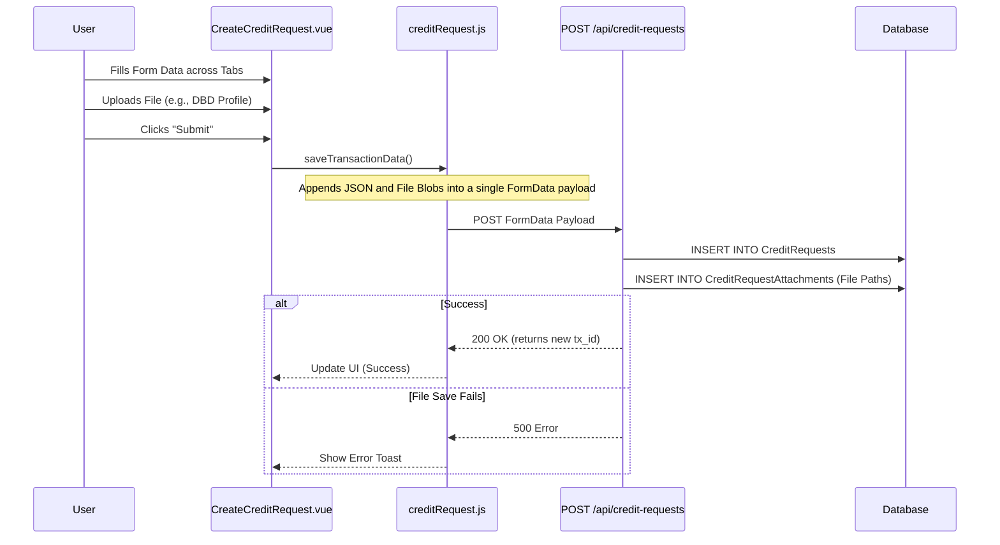
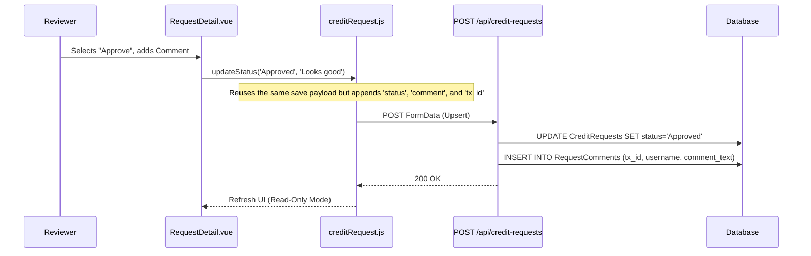
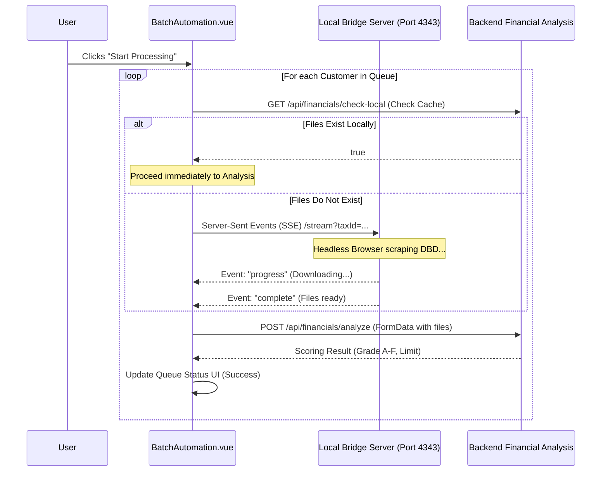

# Code Walkthrough Guide: Technical Architecture & Workflows

This document is an in-depth technical walkthrough designed to present the system's architecture to the reviewing professor. It details the system architecture, core design patterns, and provides sequence diagrams for key features.

---

## 0. System Architecture Overview

The system is designed with a clear separation of concerns, employing a modular, state-driven frontend and a transactional backend.

### Tech Stack
*   **Frontend:** Vue.js 3, Vite, Pinia (State Management), Axios (API Client).
*   **Backend:** Node.js, Express (Routing), SQLite/MSSQL (Database).
*   **Integration:** Local Bridge Server via Server-Sent Events (SSE) for external scraping.

### Key Design Patterns
1.  **Centralized State Management (Pinia):** Form data across multiple UI tabs is gathered into a single reactive store, preventing data loss during navigation and ensuring a unified payload upon submission.
2.  **Database Transactions (Atomicity):** Operations that span multiple tables (e.g., creating a request and saving file paths) are executed sequentially to ensure data integrity.
3.  **Unified API Endpoints:** State transitions (creating, updating, approving) reuse a single robust endpoint (`POST /` acting as an upsert/update depending on the presence of a Transaction ID).
4.  **Resilient Polling & Bridging:** Interactions with slow, external data sources utilize retry loops and fallback mechanisms to prevent process blocking.

---

## 1. Feature: Create Credit Request

**The Goal:** Demonstrate how form state is gathered across multiple components and persisted transactionally on the server.

### Sequence Diagram (Mermaid)



### Data Payload Construction (Frontend)
The frontend constructs a `FormData` object capable of holding both textual data and binary file data.

<details>
<summary><b>View Source Code: Frontend Payload Construction</b></summary>

```javascript
// src/stores/creditRequest.js
async saveTransactionData() {
  if (!this.customer || !this.customer.id) return;
  try {
    const formData = new FormData();
    formData.append("customer_no", this.customer.id);
    formData.append("customer_name", this.customer.name);
    formData.append("request_amount", this.transactionData.amount || "");
    formData.append("request_reason", this.transactionData.reason || "");
    formData.append("request_credit_term", this.transactionData.creditTerm || "");
    formData.append("term_gs", this.transactionData.termGS || "");
    formData.append("term_ae", this.transactionData.termAE || "");
    formData.append("term_yc", this.transactionData.termYC || "");
    formData.append("request_type", this.transactionData.requestType || "เครดิตใหม่");

    formData.append("snapshot_data", JSON.stringify(this.getSnapshot()));

    formData.append("is_submit", "true");

    if (this.requestId) {
      formData.append("tx_id", this.requestId);
    }

    await CreditRequestService.createCreditRequest(formData);
  } catch (e) {
    console.error("Failed to save transaction data", e);
  }
}
```
</details>

### Error Handling & Atomicity (Backend)
In the backend (`creditRequestController.js`), saving a request and its associated files must be handled carefully. If processing files or inserting attachments fails after the main `CreditRequests` row is inserted or updated, the system relies on the database's foreign key constraints and sequential error catching to prevent orphaned files. When finalizing a draft, a complex clone-and-relink pattern is utilized.

<details>
<summary><b>View Source Code: Database Transaction (Finalize Draft)</b></summary>

```javascript
// backend/controllers/creditRequestController.js

// 2. Clone Parent Record with New ID (to satisfy FK constraints in MSSQL)
// We insert a new record, move children, then delete the old record.
const insertSql = `INSERT INTO CreditRequests (
      tx_id, customer_no, customer_name, status,
      request_amount, request_reason, request_credit_term,
      term_gs, term_ae, term_yc, request_type, snapshot_data, created_at, created_by, updated_by
  ) VALUES (?, ?, ?, ?, ?, ?, ?, ?, ?, ?, ?, ?, ?, ?, ?)`;

const insertResult = await db.runAsync(insertSql, [
  newRealTxId,
  existing.customer_no,
  existing.customer_name,
  existing.status,
  // ... (fields omitted for brevity)
  existing.created_at,
  existing.created_by || "Unknown",
  req.body.uploaded_by || req.user?.username || "Unknown",
]);

const newRequestId = insertResult.id;

// 3. Update DB Attachments Paths (Move Children)
// Path format: customer_no/TXID/file.ext
const cleanOldTxIdUpdate = oldTxId.replace(/\//g, "_");
const cleanNewTxIdUpdate = newRealTxId.replace(/\//g, "_");
const oldPathSegment = `${cleanOldTxIdUpdate}/`;
const newPathSegment = `${cleanNewTxIdUpdate}/`;

await db.runAsync(
  `UPDATE CreditRequestAttachments SET tx_id = ?, file_path = REPLACE(file_path, ?, ?) WHERE tx_id = ?`,
  [newRealTxId, oldPathSegment, newPathSegment, oldTxId],
);

// 4. Update Comments (Move Children)
await db.runAsync(
  `UPDATE RequestComments SET tx_id = ? WHERE tx_id = ?`,
  [newRealTxId, oldTxId],
);

// 5. Delete Old Parent Record
await db.runAsync("DELETE FROM CreditRequests WHERE id = ?", [
  oldRequestId,
]);
```
</details>


---

## 2. Feature: Approve Credit Request (Workflow Progression)

**The Goal:** Demonstrate how role-based state changes and audit logging are handled using the unified update flow.

### Sequence Diagram (Mermaid)



### Audit Tracking
When a request is updated, the backend implicitly captures the user making the change, creating an immutable timeline of workflow transitions.

<details>
<summary><b>View Source Code: Immutable Audit Logging</b></summary>

```javascript
// backend/controllers/creditRequestController.js

// Extracting username from the authenticated SSO token
const username = req.user?.username || req.body.uploaded_by || "System";

// Handling Workflow Transition Status Update
const updatedAt = new Date().toISOString();
await db.runAsync(
  "UPDATE CreditRequests SET tx_id = ?, request_amount = ?, snapshot_data = ?, status = ?, updated_at = ? WHERE id = ?",
  [txId, request_amount, snapshot_data, status, updatedAt, requestId]
);

// Inserting an immutable audit log entry
if (req.body.comment && req.body.actor_role) {
  await db.runAsync(
    "INSERT INTO RequestComments (tx_id, actor_role, comment_text, username) VALUES (?, ?, ?, ?)",
    [txId, req.body.actor_role, req.body.comment, username]
  );
}
```
</details>


---

## 3. Feature: Batch Automation (External API Integration)

**The Goal:** Showcase the system's ability to orchestrate complex background tasks, manage rate limits, and bridge to external Python scraping services.

### Sequence Diagram (Mermaid)



### Resiliency via Server-Sent Events (SSE)
The system uses an SSE connection (`EventSource`) to communicate with a local scraping service, allowing the UI to remain responsive while waiting for slow, external downloads.

<details>
<summary><b>View Source Code: Bridge Connection Logic</b></summary>

```javascript
// src/views/BatchAutomation.vue
const connectToBridge = (taxId, customerCode) => {
  return new Promise((resolve, reject) => {
    const bridgeBaseUrl = `http://${bridgeHost.value}:4343`;
    const queryParams = new URLSearchParams({
      taxId: taxId,
      customerCode: customerCode || "",
    });
    const url = `${bridgeBaseUrl}/stream?${queryParams.toString()}`;

    // Establish Server-Sent Events connection
    const evtSource = new EventSource(url);
    let resultFiles = {};
    let yearsInBusiness = 0;

    evtSource.onmessage = (event) => {
      try {
        const data = JSON.parse(event.data);
        if (data.status === "progress") {
          // Optional: update detail log to show progress to user
        } else if (data.status === "complete") {
          evtSource.close();
          // Extract downloaded file payloads and metadata
          let registeredCapital = data.data.registeredCapital || 0;
          let registrationDate = data.data.registrationDate || null;
          let dbdCompanyName = data.data.dbdCompanyName || null;

          if (data.data) {
            resultFiles = {
              profile: data.data.profile,
              balanceSheet: data.data.balanceSheet,
              incomeStatement: data.data.incomeStatement,
              financialRatios: data.data.financialRatios,
            };
          }
          const noFinancialData = data.noFinancialData || false;

          resolve({
            files: resultFiles,
            yearsInBusiness,
            registeredCapital,
            registrationDate,
            dbdCompanyName,
            noFinancialData,
          });
        } else if (data.status === "error") {
          evtSource.close();
          reject(new Error(data.message || "Bridge Error"));
        }
      } catch (e) {
        evtSource.close();
        reject(new Error("Failed to parse bridge response"));
      }
    };
  });
};
```
</details>

If a customer fails processing, the orchestrator implements retry logic. It logs the specific error message, marks the row as "Error", and continues to the next customer in the queue without crashing the overall job.