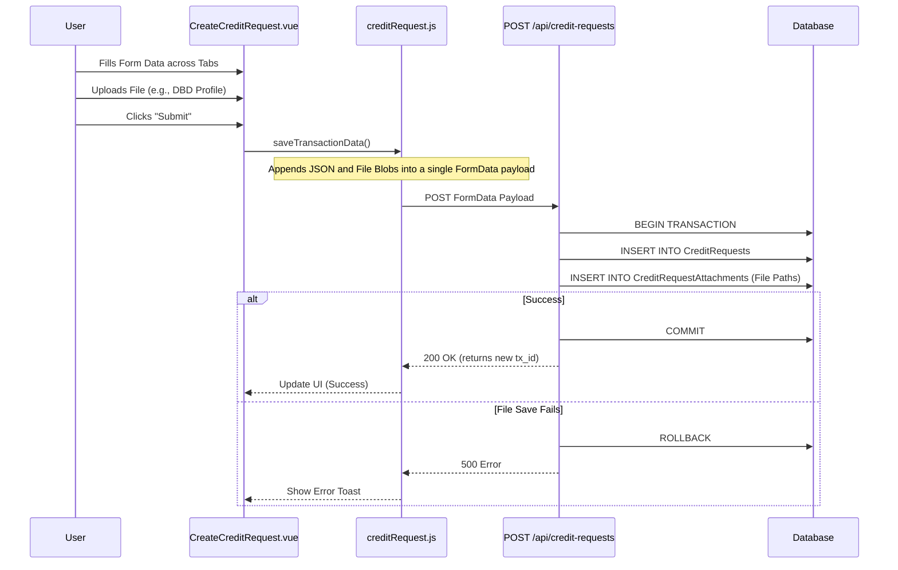
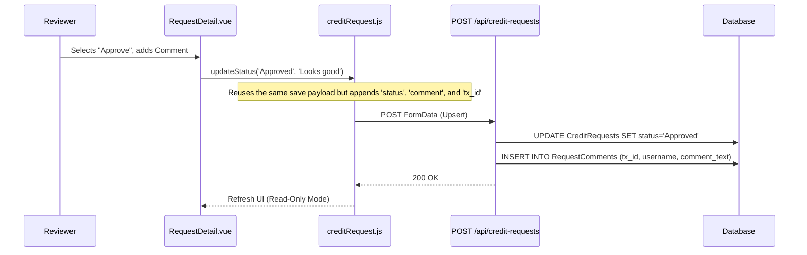
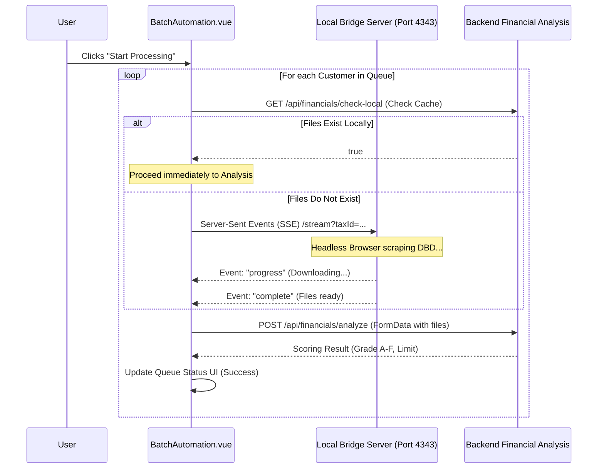

# Code Walkthrough Guide: Technical Architecture & Workflows

This document is an in-depth technical walkthrough designed to present the system's architecture to the reviewing professor. It details the system architecture, core design patterns, and provides sequence diagrams for key features.

---

## 0. System Architecture Overview

The system is designed with a clear separation of concerns, employing a modular, state-driven frontend and a transactional backend.

### Tech Stack
*   **Frontend:** Vue.js 3, Vite, Pinia (State Management), Axios (API Client).
*   **Backend:** Node.js, Express (Routing), SQLite/MSSQL (Database).
*   **Integration:** Local Bridge Server via Server-Sent Events (SSE) for external scraping.

### Key Design Patterns
1.  **Centralized State Management (Pinia):** Form data across multiple UI tabs is gathered into a single reactive store, preventing data loss during navigation and ensuring a unified payload upon submission.
2.  **Database Transactions (Atomicity):** Operations that span multiple tables (e.g., creating a request and saving file paths) are wrapped in `BEGIN TRANSACTION` / `COMMIT` blocks to ensure data integrity.
3.  **Unified API Endpoints:** State transitions (creating, updating, approving) reuse a single robust endpoint (`POST /` acting as an upsert/update depending on the presence of a Transaction ID).
4.  **Resilient Polling & Bridging:** Interactions with slow, external data sources utilize retry loops and fallback mechanisms to prevent process blocking.

---

## 1. Feature: Create Credit Request

**The Goal:** Demonstrate how form state is gathered across multiple components and persisted transactionally on the server.

### Sequence Diagram (Mermaid)



### Data Payload Example
The frontend constructs a `FormData` object capable of holding both textual data and binary file data.

```javascript
// src/stores/creditRequest.js
const formData = new FormData();
formData.append("customer_no", this.customer.id);
formData.append("request_amount", this.transactionData.amount || "");
formData.append("snapshot_data", JSON.stringify(this.getSnapshot()));
formData.append("is_submit", "true");
// If editing an existing request:
// formData.append("tx_id", this.requestId);
```

### Error Handling & Atomicity
In the backend (`creditRequestController.js`), saving a request and its associated files is an all-or-nothing operation. If file processing fails after the `CreditRequests` row is inserted, the database transaction is rolled back, preventing orphaned records.

---

## 2. Feature: Approve Credit Request (Workflow Progression)

**The Goal:** Demonstrate how role-based state changes and audit logging are handled using the unified update flow.

### Sequence Diagram (Mermaid)



### Audit Tracking
When a request is updated, the backend implicitly captures the user making the change.

```javascript
// backend/controllers/creditRequestController.js
// Extracting username from the authenticated SSO token
const username = req.user?.username || req.body.uploaded_by || "System";

// Inserting an immutable audit log entry
await db.runAsync(
  "INSERT INTO RequestComments (tx_id, actor_role, comment_text, username) VALUES (?, ?, ?, ?)",
  [txId, req.body.actor_role, req.body.comment, username]
);
```

---

## 3. Feature: Batch Automation (External API Integration)

**The Goal:** Showcase the system's ability to orchestrate complex background tasks, manage rate limits, and bridge to external Python scraping services.

### Sequence Diagram (Mermaid)



### Resiliency & Error Handling
The `BatchAutomation.vue` orchestrator implements retry logic when connecting to the external bridge.

```javascript
// src/views/BatchAutomation.vue
let retries = 0;
const maxRetries = 2;

while (retries <= maxRetries && !downloadResult) {
  try {
    downloadResult = await connectToBridge(item.taxId, item.customerId);
  } catch (e) {
    retries++;
    if (retries > maxRetries) {
      console.warn("Bridge failed, proceeding with fallback");
    } else {
      item.log = `ลองใหม่ DBD (${retries}/${maxRetries})...`;
      await new Promise((r) => setTimeout(r, 2000));
    }
  }
}
```
If a customer fails processing, the orchestrator logs the specific error message (e.g., "DBD ไม่ครบ: ขาดงบดุล"), marks the row as "Error", and continues to the next customer in the queue without crashing the overall job.