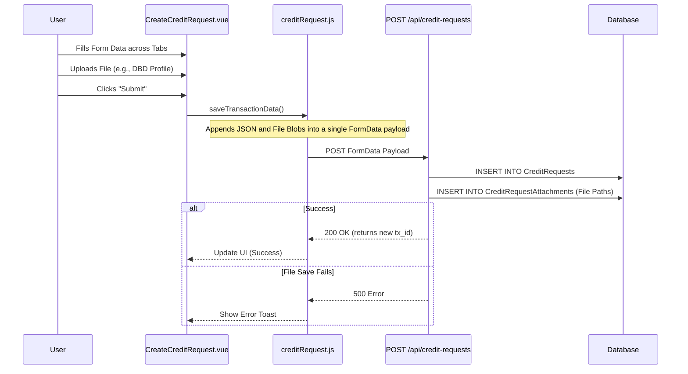
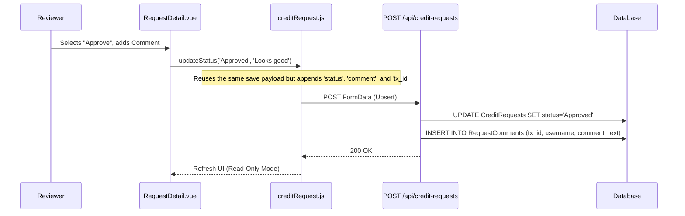
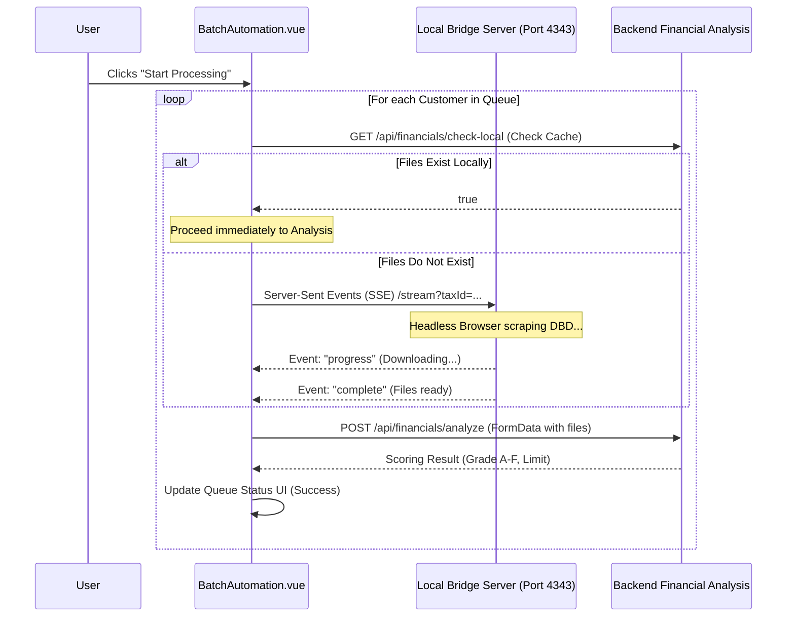

# Code Walkthrough Guide: Technical Architecture & Workflows

This document is an in-depth technical walkthrough designed to present the system's architecture to the reviewing professor. It details the system architecture, core design patterns, and provides sequence diagrams for key features.

---

## 🎙️ Presentation Script: System Architecture Overview

**[คำกล่าวเปิด / Intro (5 นาที)]**
"Architecture และ Workflow หลักของระบบที่เราได้พัฒนาขึ้นมาครับ ระบบของเราออกแบบโดยแยกส่วน Frontend และ Backend ออกจากกันอย่างชัดเจนครับ"

**[อธิบาย Tech Stack]**
"สำหรับ Tech Stack ฝั่ง Frontend เราใช้ Vue.js 3 ร่วมกับ Vite และใช้ Pinia สำหรับจัดการ State Management ครับ

โดย **Vue.js** จะเป็น Framework หลักที่ใช้สร้างหน้าจอ UI แบบ Component-based ช่วยให้การจัดการหน้าเว็บมีความยืดหยุ่นและนำโค้ดกลับมาใช้ใหม่ได้ง่าย ส่วน **Vite** เป็น Build Tool ที่ช่วยให้เรารันและคอมไพล์โค้ดในระหว่างพัฒนาได้อย่างรวดเร็วครับ และ **Pinia** คือเครื่องมือสำหรับจัดการ State หรือข้อมูลส่วนกลางของแอปพลิเคชัน เพื่อให้แต่ละ Component สามารถแชร์ข้อมูลกันได้อย่างเป็นระบบครับ

ส่วนฝั่ง Backend เราใช้ Node.js รันด้วย Express ทำหน้าที่เป็น REST API และเชื่อมต่อกับ Database (SQLite/MSSQL) ครับ นอกจากนี้ยังมี Local Bridge Server ที่เขียนเชื่อมต่อผ่าน Server-Sent Events (SSE) เพื่อใช้ทำ Web Scraping ดึงข้อมูลจากภายนอกแบบ Asynchronous ครับ"

**[อธิบาย Design Patterns]**
"Design Patterns หลักที่เรานำมาใช้มี 2 ส่วนครับ:
1. **Centralized State Management:** เราใช้ Pinia รวบรวมข้อมูลฟอร์มจากหลายๆ แท็บไว้ที่เดียว
2. **Sequential Data Processing (Atomicity Concept):** การบันทึกข้อมูลที่มีความเกี่ยวเนื่องกันหลายตาราง เราจัดการผ่านโค้ดใน Backend ให้ทำงานแบบเรียงลำดับ (Sequential Await) เพื่อรับประกันความถูกต้องสมบูรณ์และสอดคล้องกันของข้อมูล (Data Integrity) โดยควบคุมกระบวนการทั้งหมดให้เสร็จสิ้นเป็นชุดคำสั่งเดียวกันครับ"

---

## 1. Feature: Create Credit Request

**The Goal:** Demonstrate how form state is gathered across multiple components and persisted transactionally on the server.

### 🎙️ Presentation Script: Create Credit Request
"ฟีเจอร์แรกและถือเป็นจุดเริ่มต้นหลักของระบบ คือการสร้างคำขอเครดิตครับ จุดประสงค์ของหน้านี้คือต้องการให้พนักงานขายสามารถรวบรวมข้อมูลลูกค้า ทั้งข้อมูลทั่วไปและข้อมูลทางการเงิน เพื่อส่งให้ฝ่ายสินเชื่อพิจารณาได้อย่างครบถ้วนและเป็นระบบครับ

**[อธิบาย User Flow และการออกแบบ UI]**
ในมุมมองของ User Journey ทันทีที่เข้ามาในหน้านี้ ผู้ใช้จะต้องค้นหาลูกค้าก่อนครับ จากนั้นระบบจะสร้างฟอร์มขึ้นมาให้กรอกข้อมูล โดยเราออกแบบ UI ให้เป็นแบบ Tabs (เช่น ข้อมูลทั่วไป, ที่อยู่, ข้อมูลทางการเงิน) เพื่อไม่ให้หน้าจอดูรกจนเกินไป และในแต่ละ Tab ก็จะมีช่องสำหรับอัปโหลดเอกสารที่เกี่ยวข้องแนบไปด้วยครับ

**[อธิบายตรรกะและ Logic ภายใน]**
ในเชิงเทคนิคเบื้องหลัง เราได้เขียน Logic ควบคุมไว้หลายจุดครับ เช่น การทำ Form Validation ดักจับข้อมูลที่ไม่ถูกต้อง, การเขียนเงื่อนไขเพื่อซ่อนหรือแสดงฟิลด์ต่างๆ ให้แปรผันตามประเภทของลูกค้าแบบ Dynamic ซึ่งความท้าทายหลักตรงนี้คือ ข้อมูลมันกระจัดกระจายอยู่ตาม Tabs ต่างๆ ครับ ถ้าเราส่งข้อมูลไปบันทึกทีละหน้า ข้อมูลอาจจะไม่สมบูรณ์หรือสูญหายระหว่างทางได้ครับ"

**[เปิดรูป Sequence Diagram ด้านล่างให้ดู]**
"และนี่คือวิธีการแก้ปัญหาของเราครับ จาก Sequence Diagram อาจารย์จะเห็นว่าเมื่อ User กรอกข้อมูลตาม Flow จนเสร็จสมบูรณ์ และกดปุ่ม Submit ตัว Vue Component จะไม่ยิง API ไปหา Database โดยตรงเลยครับ แต่จะเรียกฟังก์ชันผ่าน Pinia Store แทน"

```javascript
// src/views/CreateCreditRequest.vue
const handleStartRequest = async () => {
  // Save to backend immediately so the Draft correctly reflects the chosen type
  if (store.requestId) {
    await store.saveTransactionData();
  }
};
```

"จากนั้นเราใช้ฟังก์ชันนี้เพื่อแพ็คข้อมูล JSON และ File Blobs รวมกันเป็นก้อน `FormData` เดียว แล้วส่งไปที่ Backend ทีเดียวครับ"

**[คลิกขยาย "View Source Code: Frontend Payload Construction"]**
"อาจารย์ลองดูโค้ดตรงนี้ครับ เราใช้ `FormData.append()` เพื่อรวมข้อมูลทุกอย่าง รวมถึงไฟล์และการตั้งค่าต่างๆ (Snapshot) เข้าด้วยกันครับ"

```javascript
// src/stores/creditRequest.js
async saveTransactionData() {
  if (!this.customer || !this.customer.id) return;
  try {
    const formData = new FormData();
    formData.append("customer_no", this.customer.id);
    formData.append("request_amount", this.transactionData.amount || "");

    // Convert reactive object state into a JSON string
    formData.append("snapshot_data", JSON.stringify(this.getSnapshot()));

    // Attach File Blobs and unified state...
    await CreditRequestService.createCreditRequest(formData);
  } catch (e) {
    console.error("Failed to save transaction data", e);
  }
}
```

**[คลิกขยาย "View Source Code: Sequential Data Processing"]**
"และนี่คือโค้ดฝั่ง Backend ครับ เมื่อข้อมูลมาถึง เราให้ความสำคัญกับ Atomicity ของข้อมูล แม้ว่าเราจะไม่ได้เขียน SQL TRANSACTION ครอบโดยตรง แต่เราออกแบบลอจิกเป็น Sequential Await ให้ทำงานต่อเนื่องกันอย่างเข้มงวด ตัวอย่างเช่นตอนที่เราจะเลื่อนสถานะจาก Draft เป็นคำขอจริง (Opened) เราต้องสร้าง ID (tx_id) แบบทางการขึ้นมาใหม่, Insert โคลน Record เข้าไป, อัปเดตตารางไฟล์ให้ชี้ไปที่ ID ใหม่, แล้วถึงลบ Draft เก่าทิ้ง ทั้งหมดนี้ถูกแพ็ครวมไว้ใน Controller ชุดเดียว เพื่อป้องกันข้อมูลขยะค้างในระบบครับ"

```javascript
// backend/controllers/creditRequestController.js
// ตัวอย่างการทำ Sequential Await เพื่อความต่อเนื่องของข้อมูล (Data Integrity)

// 1. Insert New Record with Generated Official ID
const insertResult = await db.runAsync(insertSql, [
  newRealTxId, existing.customer_no, existing.status /*...omitted parameters*/
]);

// 2. Update DB Attachments Paths (Move Children to point to new official ID)
await db.runAsync(
  `UPDATE CreditRequestAttachments SET tx_id = ?, file_path = REPLACE(file_path, ?, ?) WHERE tx_id = ?`,
  [newRealTxId, oldPathSegment, newPathSegment, oldTxId],
);

// 3. Delete Old Parent Record (Clean up the draft)
await db.runAsync("DELETE FROM CreditRequests WHERE id = ?", [ oldRequestId ]);
```

---

### Sequence Diagram (Mermaid)



### Data Payload Construction (Frontend)
The frontend constructs a `FormData` object capable of holding both textual data and binary file data.

<details>
<summary><b>View Source Code: Frontend Payload Construction</b></summary>

```javascript
// src/stores/creditRequest.js
async saveTransactionData() {
  if (!this.customer || !this.customer.id) return;
  try {
    const formData = new FormData();
    formData.append("customer_no", this.customer.id);
    formData.append("customer_name", this.customer.name);
    formData.append("request_amount", this.transactionData.amount || "");
    formData.append("request_reason", this.transactionData.reason || "");
    formData.append("request_credit_term", this.transactionData.creditTerm || "");
    formData.append("term_gs", this.transactionData.termGS || "");
    formData.append("term_ae", this.transactionData.termAE || "");
    formData.append("term_yc", this.transactionData.termYC || "");
    formData.append("request_type", this.transactionData.requestType || "เครดิตใหม่");

    formData.append("snapshot_data", JSON.stringify(this.getSnapshot()));

    formData.append("is_submit", "true");

    if (this.requestId) {
      formData.append("tx_id", this.requestId);
    }

    await CreditRequestService.createCreditRequest(formData);
  } catch (e) {
    console.error("Failed to save transaction data", e);
  }
}
```
</details>

### Error Handling & Atomicity (Backend)
In the backend (`creditRequestController.js`), saving a request and its associated files must be handled carefully. If processing files or inserting attachments fails after the main `CreditRequests` row is inserted or updated, the system relies on the database's foreign key constraints and sequential error catching to prevent orphaned files. When finalizing a draft, a complex clone-and-relink pattern is utilized.

<details>
<summary><b>View Source Code: Database Transaction (Finalize Draft)</b></summary>

```javascript
// backend/controllers/creditRequestController.js

// 2. Clone Parent Record with New ID (to satisfy FK constraints in MSSQL)
// We insert a new record, move children, then delete the old record.
const insertSql = `INSERT INTO CreditRequests (
      tx_id, customer_no, customer_name, status,
      request_amount, request_reason, request_credit_term,
      term_gs, term_ae, term_yc, request_type, snapshot_data, created_at, created_by, updated_by
  ) VALUES (?, ?, ?, ?, ?, ?, ?, ?, ?, ?, ?, ?, ?, ?, ?)`;

const insertResult = await db.runAsync(insertSql, [
  newRealTxId,
  existing.customer_no,
  existing.customer_name,
  existing.status,
  // ... (fields omitted for brevity)
  existing.created_at,
  existing.created_by || "Unknown",
  req.body.uploaded_by || req.user?.username || "Unknown",
]);

const newRequestId = insertResult.id;

// 3. Update DB Attachments Paths (Move Children)
// Path format: customer_no/TXID/file.ext
const cleanOldTxIdUpdate = oldTxId.replace(/\//g, "_");
const cleanNewTxIdUpdate = newRealTxId.replace(/\//g, "_");
const oldPathSegment = `${cleanOldTxIdUpdate}/`;
const newPathSegment = `${cleanNewTxIdUpdate}/`;

await db.runAsync(
  `UPDATE CreditRequestAttachments SET tx_id = ?, file_path = REPLACE(file_path, ?, ?) WHERE tx_id = ?`,
  [newRealTxId, oldPathSegment, newPathSegment, oldTxId],
);

// 4. Update Comments (Move Children)
await db.runAsync(
  `UPDATE RequestComments SET tx_id = ? WHERE tx_id = ?`,
  [newRealTxId, oldTxId],
);

// 5. Delete Old Parent Record
await db.runAsync("DELETE FROM CreditRequests WHERE id = ?", [
  oldRequestId,
]);
```
</details>


---

## 2. Feature: Approve Credit Request (Workflow Progression)

**The Goal:** Demonstrate how role-based state changes and audit logging are handled using the unified update flow.

### 🎙️ Presentation Script: Approve Credit Request
"ฟีเจอร์ถัดมาคือการทำงานของ Workflow อนุมัติเอกสารครับ เวลาที่ Manager หรือคณะกรรมการกดอนุมัติ ระบบจะไม่มี Endpoint แยกสำหรับ Approve โดยเฉพาะครับ"

**[เปิดรูป Sequence Diagram ด้านล่างให้ดู]**
"เราออกแบบให้เป็น 'Unified Endpoint' ครับ ตัว Frontend จะเรียกใช้ฟังก์ชันเดิมเลย แต่จะแนบ `status` ใหม่และ `comment` เข้าไปด้วย Backend ก็จะทำหน้าที่เป็น Upsert คือถ้าเห็นว่ามี `tx_id` ส่งมาด้วย ก็จะสั่ง `UPDATE` สถานะแทนที่จะ `INSERT` ใหม่ครับ"

**[คลิกขยาย "View Source Code: Immutable Audit Logging"]**
"และเรื่องของ Security / Audit Log ระบบเราจะไม่อนุญาตให้แก้ Log ครับ โค้ดตรงนี้จะเห็นว่า Backend จะสกัด `username` ออกมาจาก Token ของระบบ SSO เพื่อยืนยันตัวตนเสมอ ไม่ได้เชื่อข้อมูลจาก Frontend 100% จากนั้นจะบันทึกลงตาราง `RequestComments` ทันที พร้อม Time Stamp ที่แก้ไขไม่ได้ครับ ทำให้เรามี Audit Trail ที่ครบถ้วนสมบูรณ์"

---

### Sequence Diagram (Mermaid)



### Audit Tracking
When a request is updated, the backend implicitly captures the user making the change, creating an immutable timeline of workflow transitions.

<details>
<summary><b>View Source Code: Immutable Audit Logging</b></summary>

```javascript
// backend/controllers/creditRequestController.js

// Extracting username from the authenticated SSO token
const username = req.user?.username || req.body.uploaded_by || "System";

// Handling Workflow Transition Status Update
const updatedAt = new Date().toISOString();
await db.runAsync(
  "UPDATE CreditRequests SET tx_id = ?, request_amount = ?, snapshot_data = ?, status = ?, updated_at = ? WHERE id = ?",
  [txId, request_amount, snapshot_data, status, updatedAt, requestId]
);

// Inserting an immutable audit log entry
if (req.body.comment && req.body.actor_role) {
  await db.runAsync(
    "INSERT INTO RequestComments (tx_id, actor_role, comment_text, username) VALUES (?, ?, ?, ?)",
    [txId, req.body.actor_role, req.body.comment, username]
  );
}
```
</details>


---

## 3. Feature: Batch Automation (External API Integration)

**The Goal:** Showcase the system's ability to orchestrate complex background tasks, manage rate limits, and bridge to external Python scraping services.

### 🎙️ Presentation Script: Batch Automation
"และฟีเจอร์สุดท้ายที่เป็นไฮไลท์คือ Batch Automation ครับ ฟีเจอร์นี้ใช้สำหรับจัดการข้อมูลลูกค้าแบบกลุ่ม (Queue) เพื่อไปดึงงบการเงินจากกรมพัฒนาธุรกิจการค้า (DBD) มาวิเคราะห์อัตโนมัติ"

**[เปิดรูป Sequence Diagram ด้านล่างให้ดู]**
"เนื่องจากการดึงข้อมูลจากเว็บนอกมีความไม่แน่นอนและใช้เวลานาน ถ้าเราเขียน API ปกติ เซิร์ฟเวอร์จะ Time Out แน่นอนครับ เราเลยดีไซน์สถาปัตยกรรมใหม่ โดยสร้าง **Python Bridge Server** ขึ้นมาทำงานแยกต่างหาก"

**[คลิกขยาย "View Source Code: Bridge Connection Logic"]**
"ในโค้ดตรงส่วนนี้ อาจารย์จะเห็นว่า Frontend Vue ของเราเชื่อมต่อกับ Bridge Server ผ่านเทคโนโลยี **Server-Sent Events (SSE)** (`EventSource`) ครับ ข้อดีคือมันเป็นการเปิด Connection ค้างไว้เพื่อรอรับ Event กลับมาทีละชิ้น (Streaming) ไม่ต้องบล็อก UI ทำให้ User ยังคงเห็น Progress Bar วิ่งอยู่ได้ครับ

นอกจากนี้เรายังมีระบบ Retry Logic ด้วยครับ ถ้าโหลดไฟล์จาก Bridge พลาดกี่รอบ ระบบก็จะไม่ล่ม (Crash) แต่จะขึ้น Error Log ในแถวนั้น แล้วข้ามไปทำลูกค้าคนถัดไปในคิวต่อได้ทันทีครับ"

**[สรุปปิดท้าย / Conclusion]**
"และนี่ก็คือภาพรวม Architecture ของระบบครับ ทั้งหมดนี้ทำให้ระบบเรามีความเป็น Modular สูง, Data ไม่สูญหาย, และสเกลระบบเพื่อรองรับงานหนักๆ (Batch) ได้โดยไม่กระทบ User ครับ... อาจารย์มีคำถามตรงไหนเพิ่มเติมไหมครับ?"

---

### Sequence Diagram (Mermaid)



### Resiliency via Server-Sent Events (SSE)
The system uses an SSE connection (`EventSource`) to communicate with a local scraping service, allowing the UI to remain responsive while waiting for slow, external downloads.

<details>
<summary><b>View Source Code: Bridge Connection Logic</b></summary>

```javascript
// src/views/BatchAutomation.vue
const connectToBridge = (taxId, customerCode) => {
  return new Promise((resolve, reject) => {
    const bridgeBaseUrl = `http://${bridgeHost.value}:4343`;
    const queryParams = new URLSearchParams({
      taxId: taxId,
      customerCode: customerCode || "",
    });
    const url = `${bridgeBaseUrl}/stream?${queryParams.toString()}`;

    // Establish Server-Sent Events connection
    const evtSource = new EventSource(url);
    let resultFiles = {};
    let yearsInBusiness = 0;

    evtSource.onmessage = (event) => {
      try {
        const data = JSON.parse(event.data);
        if (data.status === "progress") {
          // Optional: update detail log to show progress to user
        } else if (data.status === "complete") {
          evtSource.close();
          // Extract downloaded file payloads and metadata
          let registeredCapital = data.data.registeredCapital || 0;
          let registrationDate = data.data.registrationDate || null;
          let dbdCompanyName = data.data.dbdCompanyName || null;

          if (data.data) {
            resultFiles = {
              profile: data.data.profile,
              balanceSheet: data.data.balanceSheet,
              incomeStatement: data.data.incomeStatement,
              financialRatios: data.data.financialRatios,
            };
          }
          const noFinancialData = data.noFinancialData || false;

          resolve({
            files: resultFiles,
            yearsInBusiness,
            registeredCapital,
            registrationDate,
            dbdCompanyName,
            noFinancialData,
          });
        } else if (data.status === "error") {
          evtSource.close();
          reject(new Error(data.message || "Bridge Error"));
        }
      } catch (e) {
        evtSource.close();
        reject(new Error("Failed to parse bridge response"));
      }
    };
  });
};
```
</details>

If a customer fails processing, the orchestrator implements retry logic. It logs the specific error message, marks the row as "Error", and continues to the next customer in the queue without crashing the overall job.