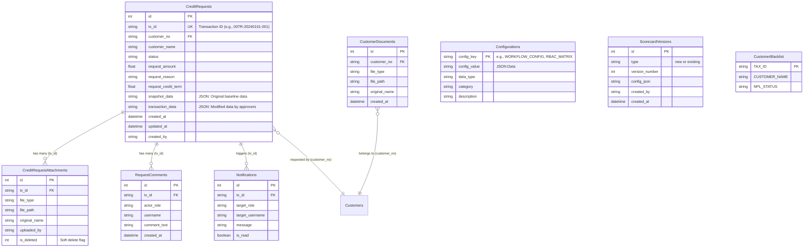

## 3.X โครงสร้างฐานข้อมูลของระบบ (Database Schema & ER Diagram)

ในการพัฒนาระบบ CreditInsight โครงสร้างฐานข้อมูลถูกออกแบบมาเพื่อรองรับความยืดหยุ่นในการเก็บข้อมูลคำขออนุมัติเครดิต การบันทึกประวัติ (Audit Trail) และการตั้งค่าระบบด้วย JSON โดยมี Entity-Relationship Diagram และพจนานุกรมข้อมูลดังต่อไปนี้

### 3.X.1 Entity-Relationship (ER) Diagram

*หมายเหตุ: สามารถนำโค้ดด้านล่างนี้ไปวางในโปรแกรมสร้าง Diagram ที่รองรับ Mermaid.js เช่น [Mermaid Live Editor](https://mermaid.live/) เพื่อบันทึกเป็นรูปภาพสำหรับนำไปใช้งานต่อได้*

 

### 3.X.2 พจนานุกรมข้อมูล (Data Dictionary)

#### 1. ตาราง `CreditRequests`
เก็บข้อมูลหลักของคำขออนุมัติเครดิตในแต่ละรายการ รวมถึงสถานะและข้อมูลการขอเครดิต

| ชื่อฟิลด์ (Column) | ชนิดข้อมูล (Data Type) | คีย์ (Key) | คำอธิบาย (Description) |
| :--- | :--- | :---: | :--- |
| `id` | INT | PK | รหัสอ้างอิงลำดับ (Auto Increment) |
| `tx_id` | NVARCHAR(255) | UK | รหัสธุรกรรม (Transaction ID) สร้างจากรหัสสาขาและวันที่ |
| `customer_no` | NVARCHAR(255) | FK | รหัสลูกค้า อ้างอิงระบบภายนอก |
| `customer_name` | NVARCHAR(255) | - | ชื่อลูกค้า |
| `status` | NVARCHAR(50) | - | สถานะปัจจุบันของคำขอ (เช่น Draft, Pending, Approved) |
| `request_amount` | REAL | - | วงเงินเครดิตที่ร้องขอ |
| `request_credit_term` | REAL | - | ระยะเวลาเครดิตที่ร้องขอ (วัน) |
| `snapshot_data` | NVARCHAR(MAX) | - | ข้อมูลต้นฉบับขณะสร้างคำขอ (เก็บในรูปแบบ JSON) |
| `transaction_data`| NVARCHAR(MAX) | - | ข้อมูลที่ถูกแก้ไขระหว่างกระบวนการอนุมัติ (เก็บในรูปแบบ JSON) |
| `created_by` | NVARCHAR(255) | - | รหัสพนักงานผู้สร้างคำขอ |
| `created_at` | DATETIME | - | วันเวลาที่สร้างข้อมูล |

#### 2. ตาราง `CreditRequestAttachments`
เก็บประวัติการแนบไฟล์เอกสารที่เกี่ยวข้องกับ "คำขออนุมัติเครดิต" เฉพาะรายการนั้นๆ

| ชื่อฟิลด์ (Column) | ชนิดข้อมูล (Data Type) | คีย์ (Key) | คำอธิบาย (Description) |
| :--- | :--- | :---: | :--- |
| `id` | INT | PK | รหัสอ้างอิงลำดับ |
| `tx_id` | NVARCHAR(255) | FK | รหัสธุรกรรมที่เอกสารนี้แนบอยู่ (อ้างอิง CreditRequests) |
| `file_type` | NVARCHAR(255) | - | ประเภทเอกสาร (เช่น ใบแจ้งหนี้, สัญญา) |
| `file_path` | NVARCHAR(MAX) | - | ที่อยู่ของไฟล์บนเซิร์ฟเวอร์ |
| `original_name` | NVARCHAR(255) | - | ชื่อไฟล์ต้นฉบับก่อนถูกเปลี่ยนชื่อโดยระบบ |
| `is_deleted` | INT | - | สถานะการลบเอกสารชั่วคราว (Soft Delete) 1=ลบ, 0=ใช้งาน |

#### 3. ตาราง `RequestComments`
เก็บประวัติการแสดงความคิดเห็นและร่องรอยการตรวจสอบ (Audit Trail) ในแต่ละขั้นตอน

| ชื่อฟิลด์ (Column) | ชนิดข้อมูล (Data Type) | คีย์ (Key) | คำอธิบาย (Description) |
| :--- | :--- | :---: | :--- |
| `id` | INT | PK | รหัสอ้างอิงลำดับ |
| `tx_id` | NVARCHAR(255) | FK | รหัสธุรกรรมที่เกี่ยวข้อง |
| `actor_role` | NVARCHAR(255) | - | บทบาทผู้ใช้งานขณะทำการคอมเมนต์ |
| `username` | NVARCHAR(255) | - | รหัสพนักงานผู้คอมเมนต์ |
| `comment_text` | NVARCHAR(MAX) | - | ข้อความความคิดเห็นหรือข้อความระบบ (Audit Log) |

#### 4. ตาราง `CustomerDocuments`
เก็บข้อมูลไฟล์เอกสารสำคัญที่ผูกติดกับ "ตัวลูกค้า" โดยตรง (เช่น งบการเงินประจำปี) ซึ่งสามารถนำไปใช้ซ้ำในคำขออื่นๆ ได้

| ชื่อฟิลด์ (Column) | ชนิดข้อมูล (Data Type) | คีย์ (Key) | คำอธิบาย (Description) |
| :--- | :--- | :---: | :--- |
| `id` | INT | PK | รหัสอ้างอิงลำดับ |
| `customer_no` | NVARCHAR(255) | FK | รหัสลูกค้า |
| `file_type` | NVARCHAR(255) | - | ประเภทของไฟล์ |
| `file_path` | NVARCHAR(MAX) | - | ที่จัดเก็บไฟล์บนเซิร์ฟเวอร์ |

#### 5. ตาราง `Configurations`
ตารางศูนย์กลางสำหรับเก็บการตั้งค่าของระบบในรูปแบบตัวอักษรและ JSON (JSON-Based Configuration)

| ชื่อฟิลด์ (Column) | ชนิดข้อมูล (Data Type) | คีย์ (Key) | คำอธิบาย (Description) |
| :--- | :--- | :---: | :--- |
| `config_key` | NVARCHAR(255) | PK | รหัสการตั้งค่า (เช่น WORKFLOW_CONFIG) |
| `config_value`| NVARCHAR(MAX) | - | ข้อมูลการตั้งค่า (มักจะเก็บเป็น JSON Object) |
| `data_type` | NVARCHAR(50) | - | ประเภทข้อมูล (เช่น json, string, boolean) |
| `category` | NVARCHAR(100) | - | หมวดหมู่สำหรับการแสดงผลในหน้าจอตั้งค่า |

#### 6. ตาราง `ScorecardVersions`
เก็บประวัติและการควบคุมเวอร์ชันของแบบจำลองการให้คะแนน (Scorecard)

| ชื่อฟิลด์ (Column) | ชนิดข้อมูล (Data Type) | คีย์ (Key) | คำอธิบาย (Description) |
| :--- | :--- | :---: | :--- |
| `id` | INT | PK | รหัสอ้างอิงลำดับ |
| `type` | NVARCHAR(50) | - | ประเภทโมเดล (new หรือ existing) |
| `version_number`| INT | - | หมายเลขเวอร์ชัน |
| `config_json` | NVARCHAR(MAX) | - | กฎเกณฑ์และน้ำหนักคะแนนทั้งระบบในรูปแบบ JSON |
| `is_active` | BIT | - | สถานะระบุว่าเป็นเวอร์ชันที่กำลังใช้งานอยู่หรือไม่ (1/0) |

#### 7. ตาราง `CustomerBlacklist`
เก็บข้อมูลลูกค้ารายชื่อเฝ้าระวัง (Watchlist) และหนี้เสีย (NPL)

| ชื่อฟิลด์ (Column) | ชนิดข้อมูล (Data Type) | คีย์ (Key) | คำอธิบาย (Description) |
| :--- | :--- | :---: | :--- |
| `TAX_ID` | NVARCHAR(255) | PK | หมายเลขประจำตัวผู้เสียภาษี (ใช้เป็นคีย์หลัก) |
| `CUSTOMER_NAME`| NVARCHAR(255) | - | ชื่อลูกค้านิติบุคคล หรือชื่อบุคคลธรรมดา |
| `NPL_STATUS` | NVARCHAR(255) | - | สถานะหนี้เสีย (Yes/No) หรือระดับความเสี่ยง |

#### 8. ตาราง `Notifications`
เก็บข้อมูลการแจ้งเตือนต่างๆ ในระบบส่งถึงผู้ใช้งานแบบเจาะจงบุคคลหรือกลุ่ม

| ชื่อฟิลด์ (Column) | ชนิดข้อมูล (Data Type) | คีย์ (Key) | คำอธิบาย (Description) |
| :--- | :--- | :---: | :--- |
| `id` | INT | PK | รหัสอ้างอิงลำดับ |
| `tx_id` | NVARCHAR(255) | FK | รหัสคำขอที่เกี่ยวข้องกับการแจ้งเตือน |
| `target_role` | NVARCHAR(255) | - | กลุ่มบทบาทเป้าหมายที่จะได้รับแจ้งเตือน |
| `target_username`| NVARCHAR(255) | - | ชื่อผู้ใช้งานเป้าหมายที่จะได้รับแจ้งเตือน (กรณีเจาะจง) |
| `message` | NVARCHAR(MAX) | - | ข้อความการแจ้งเตือน |
| `is_read` | BIT | - | สถานะการเปิดอ่าน (0 = ยังไม่เปิดอ่าน, 1 = เปิดอ่านแล้ว) |
