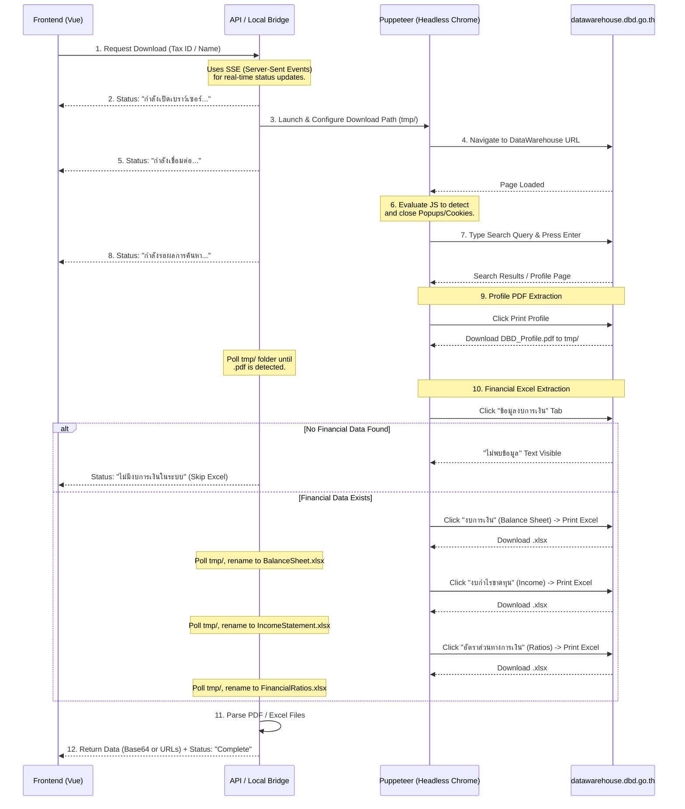

# DBD Scraping & Data Extraction Workflow

This document details the technical, step-by-step process of how the Credit Management System automates the downloading and parsing of Department of Business Development (DBD) financial documents.

> **Note:** For a high-level overview of the feature's architecture (including Server-side vs. Local Bridge modes), please refer to [`DBD_AUTO_IMPORT.md`](./DBD_AUTO_IMPORT.md).

---

## 1. Sequence Diagram: Overall Interaction

The following sequence diagram illustrates the communication flow between the Frontend, the Scraper (either the Backend Server or the Local Bridge), Puppeteer, and the external DBD website.

---

## 2. Step-by-Step Technical Workflow

Both the Server-side fallback (`externalController.js`) and the Local Bridge (`bridge-server/server.js`) share the exact same Puppeteer automation logic.

### 2.1 Browser Configuration
Puppeteer is launched in headless mode. Crucially, the download behavior is intercepted via the Chrome DevTools Protocol (`Page.setDownloadBehavior`). This forces all downloaded files to bypass the standard browser download prompt and save directly into a dynamically generated, unique temporary directory (`/tmp/dbd-[timestamp]-[random]/`).

### 2.2 Navigation & Popup Handling
1. The browser navigates to `https://datawarehouse.dbd.go.th/`.
2. **Popup Mitigation:** The site frequently displays promotional banners or cookie consent overlays. A utility function (`handlePopups`) simulates pressing the `Escape` key and uses `page.evaluate()` to scan the DOM for common close buttons (text containing "Close", "ปิด", "X") or consent buttons ("ยอมรับทั้งหมด"), clicking them programmatically.

### 2.3 Search Execution
The automation locates the search bar using CSS selectors (`input[placeholder*="ค้นหาด้วยชื่อ"]`). To ensure reliability:
* It clicks the input three times and presses `Backspace` to clear any existing text.
* It types the search query (Tax ID or Name) with a slight delay (`delay: 100ms`) to mimic human input.
* It verifies the input value matches the query before pressing `Enter`.

### 2.4 File Download Verification (Polling Mechanism)
Because file downloads are asynchronous and network-dependent, the system cannot simply "wait 5 seconds" after clicking a download button. Instead, it uses a **file system polling loop**:
1. After a download is triggered, a `while` loop starts with a maximum timeout (e.g., 60 seconds).
2. Inside the loop, `fs.readdir` checks the temporary directory every 500 milliseconds.
3. The system looks for files matching the expected extension (e.g., `f.toLowerCase().endsWith('.xlsx')`).
4. **Renaming Strategy:** Since the DBD website generates arbitrary filenames for Excel files, the scraper immediately renames the first detected `.xlsx` file (e.g., to `BalanceSheet.xlsx`). When downloading the next file (Income Statement), the loop specifically looks for a *new* `.xlsx` file that does *not* include the previously renamed string.
5. If the timeout is reached before the file appears, an error is thrown and propagated to the UI.

### 2.5 Data Parsing Mechanics

Once files are secured on the local disk, the system extracts structural data.

#### PDF Parsing (`pdfExtractor.js` / `externalController.js`)
* The PDF is read into memory, and `pdf-parse` extracts the raw text.
* The system uses **Regular Expressions (Regex)** to locate specific anchors. For example, it searches for `วันที่จดทะเบียนจัดตั้ง` (Registration Date).
* Once the anchor is found, it uses capturing groups to extract the adjacent data string (e.g., the date format `dd/mm/yyyy` or the numeric string for Registered Capital).

#### Excel Parsing (`dbdExcelParser.js`)
* The `.xlsx` files are read into a Node.js `Buffer` using `fs.readFileSync(filePath)`. This specific approach prevents ZIP corruption errors (`end of central directory record signature not found`) that occur when the `xlsx` library attempts to stream raw paths on certain OS environments.
* **Dynamic Header Resolution:** The parser converts the sheet to a JSON array. It scans the first 15 rows using a Regex pattern (`/(25\d{2}|20\d{2})/`) to find the row containing the years (e.g., 2564, 2565).
* **Data Mapping:** It iterates through the subsequent rows. It uses the first column (`row[0]`) or second column (`row[1]`) to determine the "Metric Name" (e.g., "สินทรัพย์รวม"). It then maps the values in adjacent columns back to the years identified in the header row.
