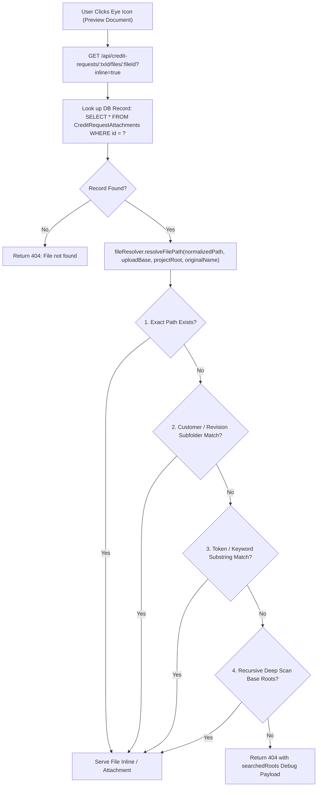

# Attachment File Path Resolution & Cross-Revision Document Preview Architecture

## Overview

In the iNsightDocs Credit Workflow, users upload financial and supporting documents (`company_profile_doc`, `balance_sheet_doc`, `profit_loss_doc`, `financial_ratios_doc`, `id_card`, `company_photo`, `vat_document`, etc.) which are attached to credit requests (`CreditRequests`). When requests undergo revision (e.g. `TLCA6908/01` -> `TLCA6908/01-R1` -> `TLCA6908/01-R2`), attachments are copied across revisions.

This document details the multi-level file path resolution architecture implemented in `fileResolver.js` and `creditRequestController.js` to ensure 100% reliable document previewing and downloading across all server deployment configurations and revision states.

---

## Key Challenges Solved

1. **Persistent Shared Storage Architecture (`uploads/` & `customers/` Outside Release Directory):**
   In production deployment, the server runs packaged release versions (e.g. `C:\Users\kongd\Desktop\SP682\SP682_1_6_36\release\backend`). The persistent uploads (`SP682\uploads`) and DBD customer cache (`SP682\customers`) reside **outside the versioned release folders at the parent persistent root** (`C:\Users\kongd\Desktop\SP682`).
   All backend services (`creditRequestController.js`, `upload.js`, `financialController.js`, `pdfController.js`, `dbdExcelParser.js`) resolve `projectRoot` to `path.resolve(__dirname, '../../../../')` first (with fallback to `../../` for local development), ensuring that uploading, deleting, and downloading documents seamlessly targets the persistent shared `uploads/` and `customers/` directory across all release version deployments.

2. **Cross-Revision Attachment Lookups:**
   When a request revision is created, attachment records retain relative paths or create new revision path segments (e.g. `40088RY/TLCA6908_01-R2/...`). `getAttachmentFile` queries `CreditRequestAttachments` by primary key `id` (`WHERE id = ?`) to support preview URLs regardless of whether base TxID or revision TxID was passed in the request route.

3. **3-Part Timestamp Filename Variations:**
   Uploaded files stored in DB often contain 3-part timestamps (e.g. `40088RY_Company_Profile สหวัฒน์_20260805_152253_969.pdf`), whereas files on disk may be saved under original names (`Company_Profile สหวัฒน์.pdf`) or customer-prefixed names without timestamps. `fileResolver` cleans 3-part timestamps (`(_\d+){2,4}\.\w+$`) and generates candidate token sets for fuzzy matching.

4. **Recursive Multi-Root Fallback & Strict File-Type Guard:**
   When exact relative path matching fails, `fileResolver.js` scans:
   - Direct `customerDirPath/txIdDir` subfolders (e.g. `uploads/25002CB/CBCA6908_01/`)
   - Direct `txIdDir` subfolders (e.g. `uploads/TLCA6908_01-R2/`)
   - All subfolders under `customerDirPath` (e.g. `uploads/40088RY/*`)
   - 4-level deep recursive scans across all candidate base upload roots (`uploadBase`, `root/uploads`, `root/backend/uploads`, `cwd/uploads`, `cwd/../uploads`).
   - **Regular File Guard:** In all steps, `fileResolver.js` strictly validates `stat.isFile()` (ignoring directories such as DBD date subfolders `20260811`) to prevent `EISDIR` errors when reading or streaming files.

5. **Stream Error Resilience:**
   `creditRequestController.js` validates `stat.isFile()` before piping and attaches standard `fileStream.on('error', ...)` handlers to prevent unhandled stream errors from terminating the Node.js process.

---

## Architecture Flow



---

## Debug Payload Structure

When a file cannot be resolved on physical server disk, `getAttachmentFile` returns a 404 JSON response with diagnostic metadata to pinpoint environment discrepancies:

```json
{
  "error": "File not found on server",
  "debug": {
    "fileId": "5898",
    "txId": "TLCA6908/01-R2",
    "dbFilePath": "40088RY/TLCA6908_01-R2/40088RY_Company_Profile สหวัฒน์_20260805_152253_969.pdf",
    "normalizedPath": "40088RY/TLCA6908_01-R2/40088RY_Company_Profile สหวัฒน์_20260805_152253_969.pdf",
    "originalName": "Company_Profile สหวัฒน์.pdf",
    "uploadBase": "C:\\Users\\...\\release\\uploads",
    "projectRoot": "C:\\Users\\...\\release",
    "cwd": "C:\\Users\\...\\release\\backend",
    "searchedRoots": {
      "C:\\Users\\...\\release\\uploads": {
        "exists": true,
        "topEntries": ["40088RY", "temp"],
        "customer_40088RY": {
          "TLCA6908_01": ["40088RY_Company_Profile สหวัฒน์_20260805_152253_969.pdf"]
        }
      }
    }
  }
}
```

---

## Maintained Files

- [`backend/utils/fileResolver.js`](file:///c:/Users/Jinna/Desktop/Test/iNsightDocs/backend/utils/fileResolver.js): Contains `resolveFilePath` and `getSearchedRootsInfo` resolution logic.
- [`backend/controllers/creditRequestController.js`](file:///c:/Users/Jinna/Desktop/Test/iNsightDocs/backend/controllers/creditRequestController.js): Serves `/api/credit-requests/:id/files/:fileId` and resolves `projectRoot`/`UPLOAD_BASE`.
