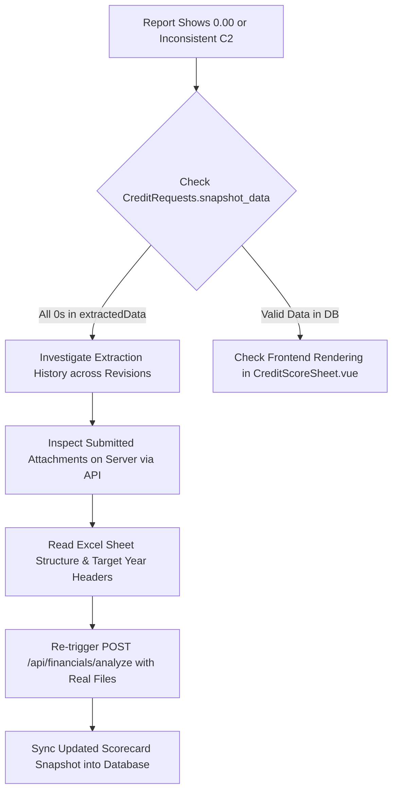

# Financial Extraction Diagnostics & API Re-Trigger Playbook

## 1. Executive Summary

This guide outlines the systematic methodology for investigating, diagnosing, and remediating financial statement parsing issues, C2 scorecard anomalies (e.g. false-positive 11-point D/E scores), and re-triggering analysis against live server APIs.

---

## 2. Root Cause Patterns & Diagnostic Checklist

When financial statement numbers appear as `0.00`, missing, or inconsistent on the `/report/financial-analysis` page or PDF export, investigate the following sequence:



### Common Failure Modes:
1. **Inverted Ratio False Positives**:
   - For ratios where lower is better (e.g. D/E Ratio $\le 1.0$), missing/zeroed data (`de = 0.00`) evaluates to true and awards maximum 11.00 points if unguarded.
   - **Guard Rule**: The scoring engine must verify `shareholdersEquity > 0` or `totalLiabilities > 0` before awarding D/E points. If data is absent, assign `0` points with rule `"N/A (ไม่มีข้อมูลงบการเงิน)"`.
2. **Revision Snapshot Inheritance**:
   - Cloned revisions (`TLCA6908/01` $\rightarrow$ `-R1` $\rightarrow$ `-R2`) inherit parent snapshots. If an intermediate revision suffered a file resolution outage or empty extraction, all downstream revisions inherit the zeroed snapshot.
3. **Property Key / String Formatting Mismatch in UI**:
   - `monthlyHistory` stored purchase figures under `m.value` as formatted strings (`"986,969.81"`), while Vue templates referenced `m.amount`. Ensure `getMonthlyAmount(m)` helper and comma-sanitizing `formatMoney()` are utilized.

---

## 3. Remote Server Inspection & Attachment Retrieval

When working in environments where local physical files are stored on remote servers (e.g. `http://192.192.0.37:3000`), download and inspect the submitted attachments using the authenticated API:

### 3.1 Generating a Bearer Token
```javascript
const jwt = require('jsonwebtoken');

const token = jwt.sign({
    userId: 1,
    username: 'admin',
    roles: [{ app: 'Smart Credit Application', role: 'Credit Committee' }],
    branchCode: '00TR',
    exp: Math.floor(Date.now() / 1000) + 3600
}, 'secret');
```

### 3.2 Fetching Request Detail & Downloading Attachments
```javascript
const axios = require('axios');
const fs = require('fs-extra');
const path = require('path');

async function downloadAttachments(txId, serverUrl) {
    const encodedTx = encodeURIComponent(txId);
    
    // 1. Fetch Request Details (wrapped under res.data.data)
    const detailRes = await axios.get(`${serverUrl}/api/credit-requests/${encodedTx}/detail`, {
        headers: { Authorization: `Bearer ${token}` }
    });
    
    const attachments = detailRes.data.data?.attachments || detailRes.data.attachments || [];
    const downloadDir = path.join(__dirname, '../downloads');
    await fs.ensureDir(downloadDir);

    for (const att of attachments) {
        if (att.file_type.includes('balance') || att.file_type.includes('profit') || att.file_type.includes('financial')) {
            const fileRes = await axios.get(`${serverUrl}/api/credit-requests/${encodedTx}/files/${att.id}`, {
                headers: { Authorization: `Bearer ${token}` },
                responseType: 'arraybuffer'
            });
            const outPath = path.join(downloadDir, `${att.file_type}_${att.original_name}`);
            await fs.writeFile(outPath, fileRes.data);
            console.log(`Saved ${outPath} (${fileRes.data.length} bytes)`);
        }
    }
}
```

---

## 4. Excel Sheet Structure & Keyword Parser Mechanics

The backend Excel parser (`findValue` in [financialController.js](file:///c:/Users/Jinna/Desktop/Test/iNsightDocs/backend/controllers/financialController.js)) uses specific strategies:

### 4.1 Target Year Resolution (Strategy: `RATIO`)
- Searches the first 10 rows for 4-digit years (e.g. `2564`, `2565`, `2566`, `2567`, `2568`).
- Identifies the maximum year column (e.g. `2568` $\rightarrow$ **Column G**).

### 4.2 Keyword Match & Latest Value Extraction
```javascript
// D/E Ratio: matches 'อัตราส่วนหนี้สินรวมต่อส่วนของผู้ถือหุ้น'
results.deRatio = findValue(sheet, 'อัตราส่วนหนี้สินรวมต่อส่วนของผู้ถือหุ้น', 'RATIO');

// Inventory Turnover: matches both 'อัตราการหมุนเวียน' AND 'สินค้าคงเหลือ'
results.inventoryTurnover = findValue(sheet, ['อัตราการหมุนเวียน', 'สินค้าคงเหลือ'], 'RATIO');
```

> [!NOTE]
> If the latest fiscal year (2568) has `0.00` in the customer's sheet (even if previous years like 2567 had `24.92`), the parser accurately extracts `0.00` for the current year.

---

## 5. Triggering API Recalculation Without UI Dependencies

To re-evaluate credit scoring against actual submitted Excel files and update database snapshots programmatically:

### 5.1 Calling `POST /api/financials/analyze` via Node.js
```javascript
const FormData = require('form-data');
const axios = require('axios');
const fs = require('fs');

async function triggerFinancialAnalysis(serverUrl, customerNo, requestAmount, term, files) {
    const form = new FormData();
    form.append('customer_no', customerNo);
    form.append('request_amount', requestAmount);
    form.append('request_credit_term', term);
    form.append('model_type', 'existing');
    form.append('is_company', 'true');

    form.append('balance_sheet', fs.createReadStream(files.balanceSheet));
    form.append('profit_loss', fs.createReadStream(files.profitLoss));
    form.append('financial_ratios', fs.createReadStream(files.financialRatios));

    const res = await axios.post(`${serverUrl}/api/financials/analyze`, form, {
        headers: {
            ...form.getHeaders(),
            Authorization: `Bearer ${token}`
        }
    });

    return res.data;
}
```

### 5.2 Merging Results into `snapshot_data`
```javascript
// Merge extractedData, calculations, and re-run ScoringEngine.score() with customer profile & accumData
const scoringResult = ScoringEngine.score(scoringContext);

snap.financial_summary.analysis_result = {
    success: true,
    hasExtractedMetrics: true,
    extractedData: resData.extractedData,
    calculations: resData.calculations,
    scoringResult: scoringResult,
    financialSummary: snap.financial_summary,
    debugData: scoringResult.debug,
    finalInputs: resData.finalInputs
};

snap.credit_score = scoringResult;

await db.runAsync(
    `UPDATE CreditRequests SET snapshot_data = ? WHERE tx_id = ?`,
    [JSON.stringify(snap), txId]
);
```

---

## 6. Verification Protocol

After re-analysis:
1. Verify `CreditRequests.snapshot_data`:
   - `analysis_result.extractedData` contains actual liabilities, equity, and revenue.
   - `financial_summary.monthlyHistory` contains full 6-month purchasing data with both `amount` (float) and `value` (string).
2. Open `/report/financial-analysis` and `/api/credit-requests/:id/pdf` to confirm that all sections (Left inputs, Revenue history, CashFlow ratios, Purchase table) display accurate numbers without dashes or zero fallbacks.
