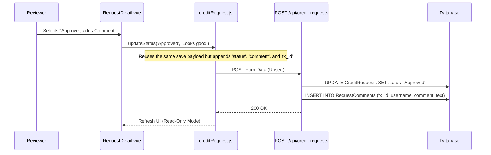

# Code Walkthrough Guide: Approve Credit Request

## 2. Feature: Approve Credit Request (Workflow Progression)

**The Goal:** Demonstrate how role-based state changes and audit logging are handled using the unified update flow.

### 🎙️ Presentation Script: Approve Credit Request
"ฟีเจอร์ถัดมาคือการทำงานของ Workflow อนุมัติเอกสารครับ เวลาที่ Manager หรือคณะกรรมการกดอนุมัติ ระบบจะไม่มี Endpoint แยกสำหรับ Approve โดยเฉพาะครับ"

**[เปิดรูป Sequence Diagram ด้านล่างให้ดู]**
"เราออกแบบให้เป็น 'Unified Endpoint' ครับ ตัว Frontend จะเรียกใช้ฟังก์ชันเดิมเลย แต่จะแนบ `status` ใหม่และ `comment` เข้าไปด้วย Backend ก็จะทำหน้าที่เป็น Upsert คือถ้าเห็นว่ามี `tx_id` ส่งมาด้วย ก็จะสั่ง `UPDATE` สถานะแทนที่จะ `INSERT` ใหม่ครับ"

**[คลิกขยาย "View Source Code: Immutable Audit Logging"]**
"และเรื่องของ Security / Audit Log ระบบเราจะไม่อนุญาตให้แก้ Log ครับ โค้ดตรงนี้จะเห็นว่า Backend จะสกัด `username` ออกมาจาก Token ของระบบ SSO เพื่อยืนยันตัวตนเสมอ ไม่ได้เชื่อข้อมูลจาก Frontend 100% จากนั้นจะบันทึกลงตาราง `RequestComments` ทันที พร้อม Time Stamp ที่แก้ไขไม่ได้ครับ ทำให้เรามี Audit Trail ที่ครบถ้วนสมบูรณ์"

---

### Sequence Diagram (Mermaid)



### Audit Tracking
When a request is updated, the backend implicitly captures the user making the change, creating an immutable timeline of workflow transitions.

<details>
<summary><b>View Source Code: Immutable Audit Logging</b></summary>

```javascript
// backend/controllers/creditRequestController.js

// Extracting username from the authenticated SSO token
const username = req.user?.username || req.body.uploaded_by || "System";

// Handling Workflow Transition Status Update
const updatedAt = new Date().toISOString();
await db.runAsync(
  "UPDATE CreditRequests SET tx_id = ?, request_amount = ?, snapshot_data = ?, status = ?, updated_at = ? WHERE id = ?",
  [txId, request_amount, snapshot_data, status, updatedAt, requestId]
);

// Inserting an immutable audit log entry
if (req.body.comment && req.body.actor_role) {
  await db.runAsync(
    "INSERT INTO RequestComments (tx_id, actor_role, comment_text, username) VALUES (?, ?, ?, ?)",
    [txId, req.body.actor_role, req.body.comment, username]
  );
}
```
</details>
