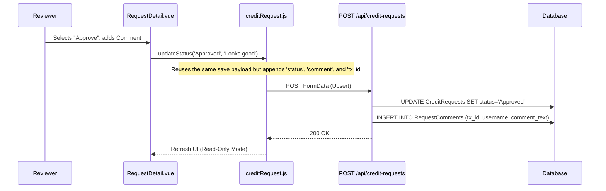
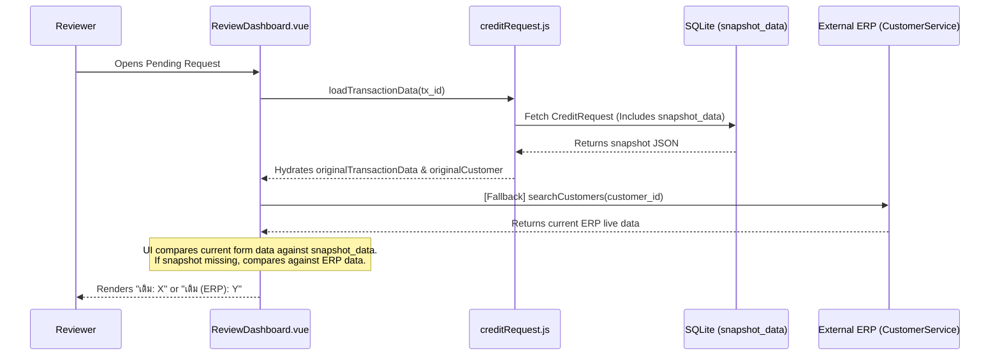

# Code Walkthrough Guide: Approve Credit Request

## 2. Feature: Approve Credit Request (Workflow Progression)

**The Goal:** Demonstrate how role-based state changes and audit logging are handled using the unified update flow.

### 🎙️ Presentation Script: Approve Credit Request
"ฟีเจอร์ถัดมาคือการทำงานของ Workflow อนุมัติเอกสารครับ เวลาที่ Manager หรือคณะกรรมการกดอนุมัติ ระบบจะไม่มี Endpoint แยกสำหรับ Approve โดยเฉพาะครับ"

**[เปิดรูป Sequence Diagram ด้านล่างให้ดู]**
"เราออกแบบให้เป็น 'Unified Endpoint' ครับ ตัว Frontend จะเรียกใช้ฟังก์ชันเดิมเลย แต่จะแนบ `status` ใหม่และ `comment` เข้าไปด้วย Backend ก็จะทำหน้าที่เป็น Upsert คือถ้าเห็นว่ามี `tx_id` ส่งมาด้วย ก็จะสั่ง `UPDATE` สถานะแทนที่จะ `INSERT` ใหม่ครับ"

**[คลิกขยาย "View Source Code: Immutable Audit Logging"]**
"และเรื่องของ Security / Audit Log ระบบเราจะไม่อนุญาตให้แก้ Log ครับ โค้ดตรงนี้จะเห็นว่า Backend จะสกัด `username` ออกมาจาก Token ของระบบ SSO เพื่อยืนยันตัวตนเสมอ ไม่ได้เชื่อข้อมูลจาก Frontend 100% จากนั้นจะบันทึกลงตาราง `RequestComments` ทันที พร้อม Time Stamp ที่แก้ไขไม่ได้ครับ ทำให้เรามี Audit Trail ที่ครบถ้วนสมบูรณ์"

---

### Sequence Diagram (Mermaid)



### Audit Tracking
When a request is updated, the backend implicitly captures the user making the change, creating an immutable timeline of workflow transitions.

<details>
<summary><b>View Source Code: Immutable Audit Logging</b></summary>

```javascript
// backend/controllers/creditRequestController.js

// Extracting username from the authenticated SSO token
const username = req.user?.username || req.body.uploaded_by || "System";

// Handling Workflow Transition Status Update
const updatedAt = new Date().toISOString();
await db.runAsync(
  "UPDATE CreditRequests SET tx_id = ?, request_amount = ?, snapshot_data = ?, status = ?, updated_at = ? WHERE id = ?",
  [txId, request_amount, snapshot_data, status, updatedAt, requestId]
);

// Inserting an immutable audit log entry
if (req.body.comment && req.body.actor_role) {
  await db.runAsync(
    "INSERT INTO RequestComments (tx_id, actor_role, comment_text, username) VALUES (?, ?, ?, ?)",
    [txId, req.body.actor_role, req.body.comment, username]
  );
}
```
</details>

---

## 3. Feature: Historical Data Tracking & Comparison (Review Dashboard)

**The Goal:** Show how the system compares requested changes against original customer baseline data or fallback ERP data so reviewers immediately see what is being altered.

### 🎙️ Presentation Script: Review Dashboard Comparison
"ในมุมของผู้อนุมัติ (Reviewer) เวลาดูข้อมูลคำขอในหน้า `ReviewDashboard` สิ่งสำคัญคือต้องรู้ว่าลูกค้า 'ขอเปลี่ยนจากอะไร เป็นอะไร' ครับ"

**[เปิดรูป Sequence Diagram ด้านล่างให้ดู]**
"ระบบของเรามีการทำ Snapshot เก็บข้อมูลเดิมตั้งแต่ตอนที่เซลส์ดึงข้อมูลลูกค้าขึ้นมาสร้างคำขอ (เก็บลงใน `snapshot_data.originalTransactionData`) เมื่อเข้ามาที่หน้าอนุมัติ UI จะเปรียบเทียบค่าที่ขอใหม่กับ Snapshot เดิมทันทีครับ ถ้าวงเงิน เครดิตเทอม หรือวิธีการชำระเงินไม่ตรงกัน ระบบจะแสดงป้าย 'เดิม: [ค่าเก่า]' ขึ้นมาให้เห็นชัดเจน"

**[คลิกขยาย "View Source Code: ERP Fallback Logic"]**
"และในกรณีที่เป็นเคสเก่าหรือไม่มี Snapshot Data ในระบบ (Legacy requests) เรามี Fallback Mechanism ที่จะไปดึงข้อมูลปัจจุบันจาก ERP โดยตรงมาเปรียบเทียบให้ด้วยครับ โดยจะแสดงผลเป็น 'เดิม (ERP): [ค่าเก่า]' เพื่อให้ผู้อนุมัติไม่ขาดข้อมูลในการตัดสินใจครับ"

---

### Sequence Diagram (Mermaid)



### Fallback Logic Implementation

When rendering the requested amount or credit terms, the system gracefully falls back to ERP data if the original database snapshot is unavailable.

<details>
<summary><b>View Source Code: ERP Fallback Logic (Vue.js)</b></summary>

```html
<!-- src/components/credit/dashboard/ReviewDashboard.vue -->

<div class="deal-item highlight">
    <label>วงเงินที่ขอ</label>

    <!-- Display requested amount -->
    <div class="value amount">
        {{ formatNumber(store.transactionData.amount) }} บาท
    </div>

    <!-- Primary: Compare with DB Snapshot -->
    <div v-if="store.originalTransactionData?.amount && store.transactionData.amount != store.originalTransactionData.amount" class="original-value-label">
        เดิม: {{ formatNumber(store.originalTransactionData.amount) }} บาท
    </div>

    <!-- Fallback: Compare with live ERP data -->
    <div v-else-if="erpFallbackData?.current_credit_limit && store.transactionData.amount != erpFallbackData.current_credit_limit" class="original-value-label">
        เดิม (ERP): {{ formatNumber(erpFallbackData.current_credit_limit) }} บาท
    </div>
</div>
```
</details>
