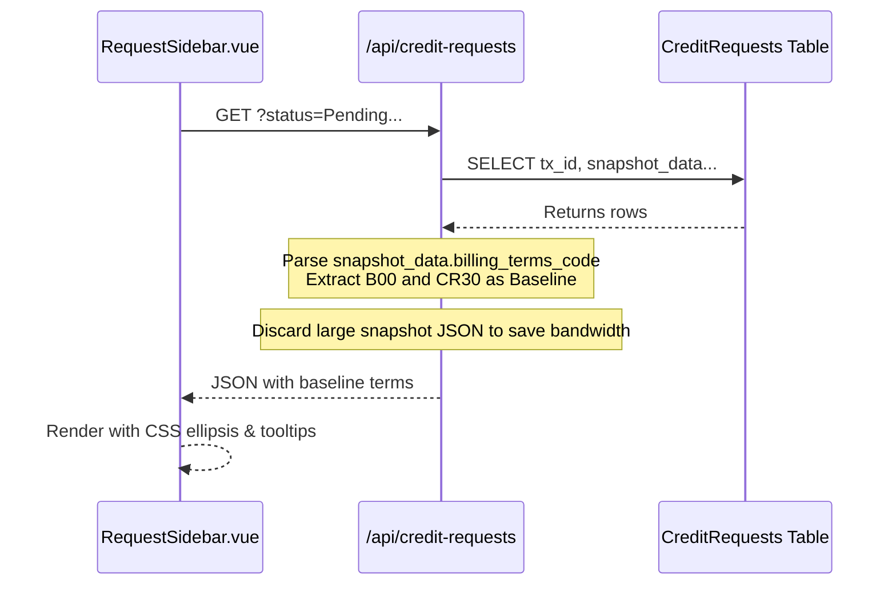
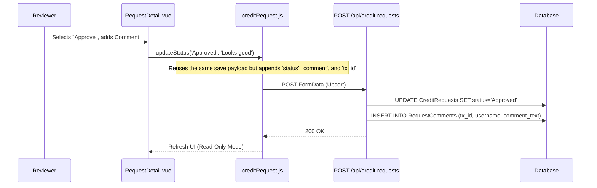
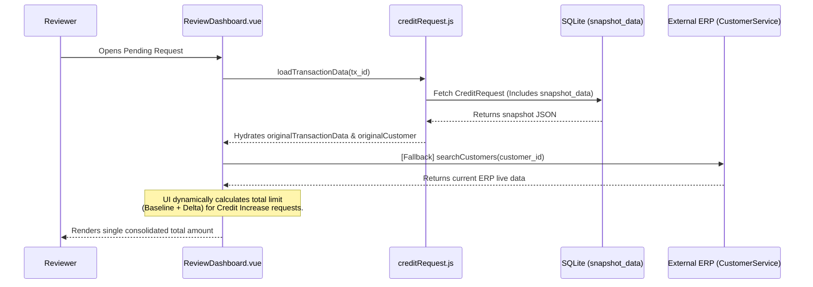

# Code Walkthrough Guide: Approve Credit Request

## 1. Feature: Pending Requests List & Data Integrity

**The Goal:** Demonstrate how the system lists pending requests, handles compact UI layouts, and strictly separates baseline data from requested data.

### 🎙️ Presentation Script: Pending Requests List
"ก่อนที่เราจะเข้าไปดูรายละเอียดคำขอ ลองดูที่หน้ารายการคำขอ (Pending Requests) ทางด้านซ้ายนี้ครับ จะเห็นว่ามีรหัสคำขอและรายละเอียดวงเงินกับเงื่อนไขแสดงอยู่บรรทัดเดียวกัน เช่น `300,000 บาท (B00, CR30/30/30)`"

**[ชี้ไปที่แถบรายการคำขอทางด้านซ้าย]**
"ในหน้าจอนี้ เราออกแบบ UI ให้ตอบโจทย์พื้นที่จำกัดครับ ถ้าหน้าจอเล็กเกินไป ข้อความจะถูกตัดเป็น `...` โดยอัตโนมัติ (Single-Line Truncation) แต่ผู้ใช้งานสามารถเอาเมาส์ไปชี้เพื่อดู Tooltip แบบเต็มได้ครับ"

**[คลิกขยาย "View Source Code: Baseline Data Parsing"]**
"และในมุมของ Data Integrity ตาม Industry Standard เราจะไม่นำ 'เงื่อนไขที่กำลังขอใหม่' มาแสดงในหน้านี้ครับ เพราะคำขอยังไม่อนุมัติ Backend จะไปดึง `snapshot_data` ที่เป็นข้อมูลดั้งเดิม (Baseline) ของลูกค้ามาแสดงแทน เพื่อให้ผู้อนุมัติเห็นสถานะตั้งต้นที่ถูกต้อง ไม่สับสนครับ"

---

### Sequence Diagram: Baseline Data Fetching



---

## 2. Feature: Approve Credit Request (Workflow Progression)

**The Goal:** Demonstrate how role-based state changes and audit logging are handled using the unified update flow.

### 🎙️ Presentation Script: Approve Credit Request
"ฟีเจอร์ถัดมาคือการทำงานของ Workflow อนุมัติเอกสารครับ เวลาที่ Manager หรือคณะกรรมการกดอนุมัติ ระบบจะไม่มี Endpoint แยกสำหรับ Approve โดยเฉพาะครับ"

**[เปิดรูป Sequence Diagram ด้านล่างให้ดู]**
"เราออกแบบให้เป็น 'Unified Endpoint' ครับ ตัว Frontend จะเรียกใช้ฟังก์ชันเดิมเลย แต่จะแนบ `status` ใหม่และ `comment` เข้าไปด้วย Backend ก็จะทำหน้าที่เป็น Upsert คือถ้าเห็นว่ามี `tx_id` ส่งมาด้วย ก็จะสั่ง `UPDATE` สถานะแทนที่จะ `INSERT` ใหม่ครับ"

**[คลิกขยาย "View Source Code: Immutable Audit Logging"]**
"และเรื่องของ Security / Audit Log ระบบเราจะไม่อนุญาตให้แก้ Log ครับ โค้ดตรงนี้จะเห็นว่า Backend จะสกัด `username` ออกมาจาก Token ของระบบ SSO เพื่อยืนยันตัวตนเสมอ ไม่ได้เชื่อข้อมูลจาก Frontend 100% จากนั้นจะบันทึกลงตาราง `RequestComments` ทันที พร้อม Time Stamp ที่แก้ไขไม่ได้ครับ ทำให้เรามี Audit Trail ที่ครบถ้วนสมบูรณ์"

---

### Sequence Diagram (Mermaid)



### Audit Tracking
When a request is updated, the backend implicitly captures the user making the change, creating an immutable timeline of workflow transitions.

<details>
<summary><b>View Source Code: Immutable Audit Logging</b></summary>

```javascript
// backend/controllers/creditRequestController.js

// Extracting username from the authenticated SSO token
const username = req.user?.username || req.body.uploaded_by || "System";

// Handling Workflow Transition Status Update
const updatedAt = new Date().toISOString();
await db.runAsync(
  "UPDATE CreditRequests SET tx_id = ?, request_amount = ?, snapshot_data = ?, status = ?, updated_at = ? WHERE id = ?",
  [txId, request_amount, snapshot_data, status, updatedAt, requestId]
);

// Inserting an immutable audit log entry
if (req.body.comment && req.body.actor_role) {
  await db.runAsync(
    "INSERT INTO RequestComments (tx_id, actor_role, comment_text, username) VALUES (?, ?, ?, ?)",
    [txId, req.body.actor_role, req.body.comment, username]
  );
}
```
</details>

---

## 3. Feature: Focused Credit Display & Implicit Calculation (Review Dashboard)

**The Goal:** Show how the system prioritizes a clean, minimalist UI for reviewers by automatically calculating and displaying the final requested credit amount, eliminating the need to manually compare current and requested values on screen.

### 🎙️ Presentation Script: Review Dashboard Comparison
"ในมุมของผู้อนุมัติ (Reviewer) เวลาดูข้อมูลคำขอในหน้า `ReviewDashboard` สิ่งสำคัญคือการเห็น 'ยอดรวมสุทธิ' ที่ลูกค้ากำลังขออนุมัติครับ"

**[เปิดรูป Sequence Diagram ด้านล่างให้ดู]**
"เพื่อให้หน้าจอสะอาดและดูง่ายที่สุดตามหลัก Minimalist UI เราได้นำข้อความเปรียบเทียบข้อมูลเดิม (ERP) ออกจากหน้า Summary Card ครับ และให้ระบบทำการคำนวณเบื้องหลังแทน โดยนำวงเงินตั้งต้น (Baseline) มารวมกับส่วนต่างที่ขอเพิ่ม (Delta) อัตโนมัติ ทำให้ผู้อนุมัติเห็น 'ยอดรวมสุทธิ' ตรงกลางจอได้อย่างชัดเจนและตัดสินใจได้ทันทีครับ"

**[คลิกขยาย "View Source Code: Implicit Sum Calculation"]**
"และในกรณีที่เป็นเคสการขอเครดิตเพิ่ม ระบบจะทำการคำนวณผลรวมของวงเงินปัจจุบันจาก ERP หรือ Snapshot กับวงเงินที่ขอเพิ่ม เพื่อนำมาแสดงผลเพียงค่าเดียว ลดความซ้ำซ้อนของข้อมูลบนหน้าจอครับ"

---

### Sequence Diagram (Mermaid)



### Sum Calculation Implementation

For credit increase requests, the system dynamically calculates the total requested limit by summing the original credit limit (or ERP fallback) with the requested increment, presenting a single, clear value to the reviewer.

<details>
<summary><b>View Source Code: Implicit Sum Calculation (Vue.js)</b></summary>

```html
<!-- src/components/credit/dashboard/ReviewDashboard.vue -->

<div class="deal-item highlight">
    <label>วงเงินที่ขอ</label>
    
    <!-- Display calculated sum for credit increases -->
    <div v-if="isCreditIncrease" class="value amount">
        {{ formatNumber(totalCreditAmount) }} บาท
    </div>
    
    <!-- Display standard amount otherwise -->
    <div v-else class="value amount">
        {{ formatNumber(store.transactionData.amount) }} บาท
    </div>
</div>
```

```javascript
// Computed property dynamically aggregating baseline and delta
const totalCreditAmount = computed(() => {
    const requestAmount = parseFloat(String(store.transactionData.amount || '0').replace(/,/g, ''));
    let baseAmount = 0;

    if (store.originalTransactionData?.amount !== undefined && store.originalTransactionData?.amount !== null) {
        baseAmount = parseFloat(String(store.originalTransactionData.amount).replace(/,/g, ''));
    } else if (erpFallbackData.value && erpFallbackData.value.current_credit_limit !== undefined) {
        baseAmount = parseFloat(String(erpFallbackData.value.current_credit_limit).replace(/,/g, ''));
    }

    return isNaN(requestAmount) ? baseAmount : (baseAmount + requestAmount);
});
```
</details>
