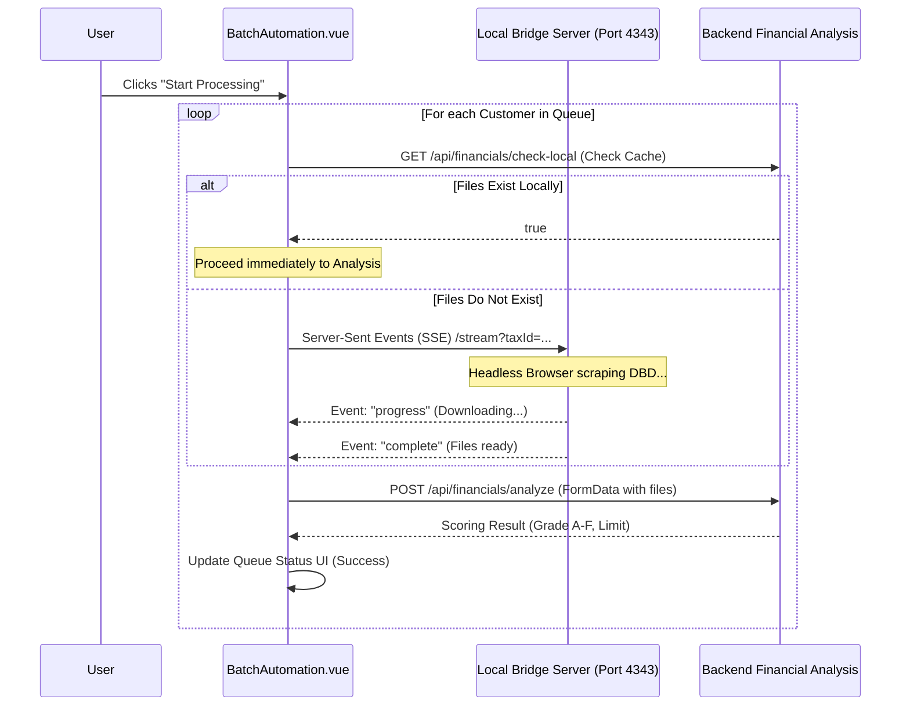

# Code Walkthrough Guide: Batch Automation

## 3. Feature: Batch Automation (External API Integration)

**The Goal:** Showcase the system's ability to orchestrate complex background tasks, manage rate limits, and bridge to external Python scraping services.

### 🎙️ Presentation Script: Batch Automation
"และฟีเจอร์สุดท้ายที่เป็นไฮไลท์คือ Batch Automation ครับ ฟีเจอร์นี้ใช้สำหรับจัดการข้อมูลลูกค้าแบบกลุ่ม (Queue) เพื่อไปดึงงบการเงินจากกรมพัฒนาธุรกิจการค้า (DBD) มาวิเคราะห์อัตโนมัติ"

**[เปิดรูป Sequence Diagram ด้านล่างให้ดู]**
"เนื่องจากการดึงข้อมูลจากเว็บนอกมีความไม่แน่นอนและใช้เวลานาน ถ้าเราเขียน API ปกติ เซิร์ฟเวอร์จะ Time Out แน่นอนครับ เราเลยดีไซน์สถาปัตยกรรมใหม่ โดยสร้าง **Python Bridge Server** ขึ้นมาทำงานแยกต่างหาก"

**[คลิกขยาย "View Source Code: Bridge Connection Logic"]**
"ในโค้ดตรงส่วนนี้ อาจารย์จะเห็นว่า Frontend Vue ของเราเชื่อมต่อกับ Bridge Server ผ่านเทคโนโลยี **Server-Sent Events (SSE)** (`EventSource`) ครับ ข้อดีคือมันเป็นการเปิด Connection ค้างไว้เพื่อรอรับ Event กลับมาทีละชิ้น (Streaming) ไม่ต้องบล็อก UI ทำให้ User ยังคงเห็น Progress Bar วิ่งอยู่ได้ครับ

นอกจากนี้เรายังมีระบบ Retry Logic ด้วยครับ ถ้าโหลดไฟล์จาก Bridge พลาดกี่รอบ ระบบก็จะไม่ล่ม (Crash) แต่จะขึ้น Error Log ในแถวนั้น แล้วข้ามไปทำลูกค้าคนถัดไปในคิวต่อได้ทันทีครับ"

**[สรุปปิดท้าย / Conclusion]**
"และนี่ก็คือภาพรวม Architecture ของระบบครับ ทั้งหมดนี้ทำให้ระบบเรามีความเป็น Modular สูง, Data ไม่สูญหาย, และสเกลระบบเพื่อรองรับงานหนักๆ (Batch) ได้โดยไม่กระทบ User ครับ... อาจารย์มีคำถามตรงไหนเพิ่มเติมไหมครับ?"

---

### Sequence Diagram (Mermaid)



### Resiliency via Server-Sent Events (SSE)
The system uses an SSE connection (`EventSource`) to communicate with a local scraping service, allowing the UI to remain responsive while waiting for slow, external downloads.

<details>
<summary><b>View Source Code: Bridge Connection Logic</b></summary>

```javascript
// src/views/BatchAutomation.vue
const connectToBridge = (taxId, customerCode) => {
  return new Promise((resolve, reject) => {
    const bridgeBaseUrl = `http://${bridgeHost.value}:4343`;
    const queryParams = new URLSearchParams({
      taxId: taxId,
      customerCode: customerCode || "",
    });
    const url = `${bridgeBaseUrl}/stream?${queryParams.toString()}`;

    // Establish Server-Sent Events connection
    const evtSource = new EventSource(url);
    let resultFiles = {};
    let yearsInBusiness = 0;

    evtSource.onmessage = (event) => {
      try {
        const data = JSON.parse(event.data);
        if (data.status === "progress") {
          // Optional: update detail log to show progress to user
        } else if (data.status === "complete") {
          evtSource.close();
          // Extract downloaded file payloads and metadata
          let registeredCapital = data.data.registeredCapital || 0;
          let registrationDate = data.data.registrationDate || null;
          let dbdCompanyName = data.data.dbdCompanyName || null;

          if (data.data) {
            resultFiles = {
              profile: data.data.profile,
              balanceSheet: data.data.balanceSheet,
              incomeStatement: data.data.incomeStatement,
              financialRatios: data.data.financialRatios,
            };
          }
          const noFinancialData = data.noFinancialData || false;

          resolve({
            files: resultFiles,
            yearsInBusiness,
            registeredCapital,
            registrationDate,
            dbdCompanyName,
            noFinancialData,
          });
        } else if (data.status === "error") {
          evtSource.close();
          reject(new Error(data.message || "Bridge Error"));
        }
      } catch (e) {
        evtSource.close();
        reject(new Error("Failed to parse bridge response"));
      }
    };
  });
};
```
</details>

If a customer fails processing, the orchestrator implements retry logic. It logs the specific error message, marks the row as "Error", and continues to the next customer in the queue without crashing the overall job.
