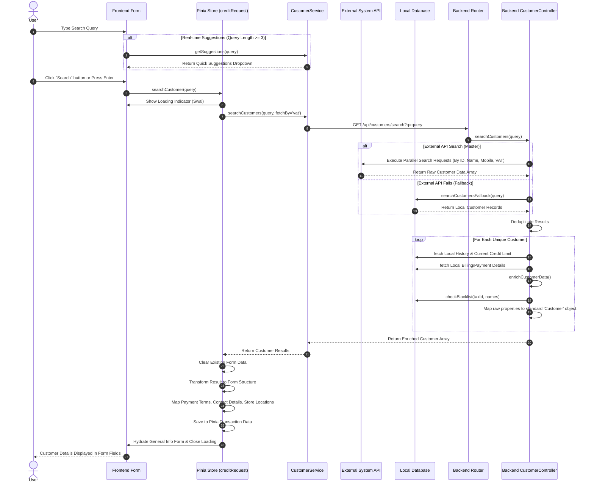

# Customer Search Process

This document explains the end-to-end customer search process in the Credit Request application, detailing how the system receives the user's search key, processes it through multiple services, and maps the resulting data back into the frontend form.

## Mermaid Sequence Diagram

## Detailed Process Breakdown

### 1. Frontend Interaction
- **Input & Suggestions:** As the user types into the search box, the `onInput` event handler debounces requests. If the query string reaches at least 3 characters, it calls a lightweight suggestions endpoint to populate a quick dropdown.
- **Triggering the Search:** The user executes the full search by either selecting a dropdown item, pressing 'Enter', or clicking the "Search" button.
- **Loading State:** The Pinia store (`creditRequest.js`) intercepts the search request, blocking the UI with a `Swal` loading modal to prevent concurrent interactions.

### 2. Backend Search Orchestration
- **API Request:** The `CustomerService` dispatches a GET request to `GET /api/customers/search?q=query`.
- **Parallel API Searches:** By default, the `customerController` executes four external API calls in parallel (to Navision/Business Central API) searching the provided query against `ID`, `Name`, `Mobile`, and `VAT Number` fields to ensure comprehensive coverage.
- **Resilience / Fallback:** If all parallel external requests fail (e.g., due to an API outage), the controller catches the error and invokes `searchCustomersFallback`, which executes an equivalent `LIKE` query directly against the local `Customers` SQL database.

### 3. Data Transformation and Enrichment
- **Deduplication:** Because parallel requests might return overlapping records, the backend deduplicates the raw array based on the customer `No_`.
- **Enrichment (`enrichCustomerData`):** For each valid record, the system queries the local database to attach missing historical context. This includes fetching the current credit limit, historic credit requests (e.g., last 3-6 months), and specific billing/payment configurations missing from the external ERP.
- **Blacklist Validation:** The system queries internal blacklists using the `VAT Registration No_` and associated authorized person names to flag risky profiles early.
- **Mapping:** The disparate fields are normalized into a predictable `customer` JSON structure to maintain a unified contract with the frontend.

### 4. Hydrating the Application State
- **Form Clearing:** Before mapping new data, the Pinia store explicitly resets the existing form data to prevent stale data bleed.
- **Data Mapping:** The `store.customer` object is populated. Specialized logic separates Individual profiles from Corporate profiles (identifying keywords like "บริษัท", "หจก."). For corporate profiles, addresses and contact logic follow corporate rules, mapping specific fields like `store_address`, `payment_method`, `billing_requirement`, and `years_in_business`.
- **UI Update:** The Vue components react to the Pinia state updates, visually populating the General Info tab fields. The loading spinner is removed, returning control to the user.
