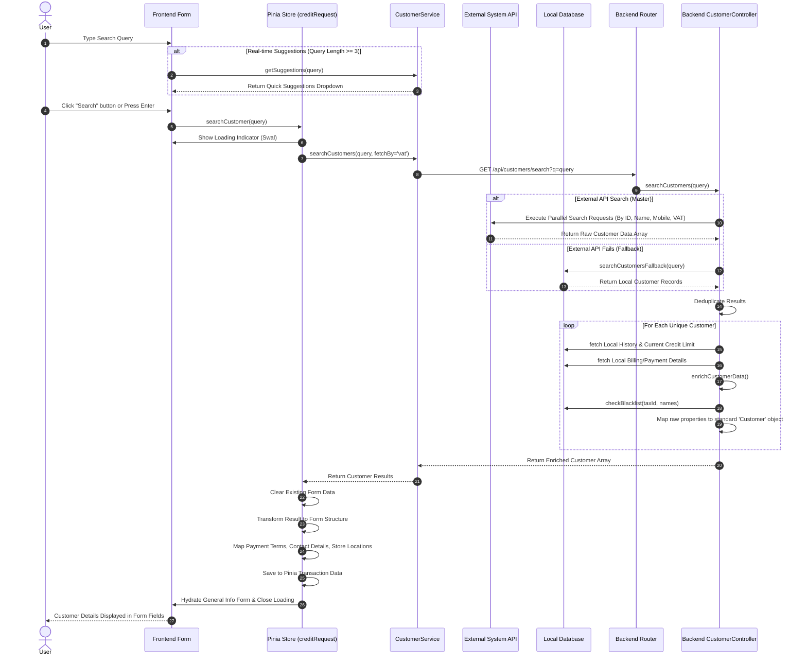

# Customer Search Process

This document explains the end-to-end customer search process in the Credit Request application, detailing how the system receives the user's search key, processes it through multiple services, and maps the resulting data back into the frontend form.

## Mermaid Sequence Diagram



## Step-by-Step Explanation

### 1. You type in the search box (Frontend)
When you type in the search field, the system is listening to your input. If what you've typed is at least 3 characters long, the frontend sends a quick request in the background to get "suggestions" and shows them to you in a dropdown.

**Relevant File:** `src/components/credit/tabs/GeneralInfoTab.vue`
```javascript
function onInput() {
    if (searchQuery.value.length >= 3) {
        debouncedFetchSuggestions();
    } else {
        showDropdown.value = false;
        suggestions.value = [];
    }
}
```

### 2. The Frontend requests full data
Once you trigger the full search (by clicking a suggestion, clicking the search button, or pressing Enter), the frontend shows a "Loading" popup so you know it's working. It then sends your search text to the backend API.

**Relevant File:** `src/stores/creditRequest.js`
```javascript
async searchCustomer(query) {
    if (!query) return;
    this.loading = true;

    // Show loading popup
    Swal.fire({
        title: "กำลังค้นหาข้อมูลลูกค้า",
        allowOutsideClick: false,
        didOpen: () => { Swal.showLoading(); },
    });

    // Call backend API
    const results = await CustomerService.searchCustomers(query);
    // ...
}
```

### 3. The Backend connects to the External API (Navision/ERP)
The backend doesn't just search the local database; it goes to the main external ERP system to get the most up-to-date data. It performs **4 parallel searches at the same time** using your text. It searches by ID, Name, Mobile Phone Number, and VAT Registration Number. This ensures that no matter what you typed, if there's a match, the system will find it quickly.

**Relevant File:** `backend/controllers/customerController.js`
```javascript
const searchApiCustomers = async (query) => {
    // Define fields for Split & Merge
    const searchRequests = [
        { label: "By ID",   payload: { "No_": { "$like": `%${query}%` } } },
        { label: "By Name", payload: { "Name": { "$like": `%${query}%` } } },
        { label: "By Mobile", payload: { "Mobile Phone No_": { "$like": `%${query}%` } } },
        { label: "By VAT", payload: { "VAT Registration No_": { "$like": `%${query}%` } } }
    ];

    // Execute all 4 searches in parallel
    const promises = searchRequests.map(reqData =>
         axios.post(API_URL, { page: 1, size: 10, ...reqData.payload }, {
          headers: { "apikey": API_KEY },
          timeout: 5000 // 5s timeout
        }).then(response => response.data.data || [])
    );
    // ...
};
```

### 4. Fallback if the External API is down
If the external API is completely down or doesn't respond in time (it has a 5-second timeout), the backend won't just fail. Instead, it automatically falls back to searching the local SQL Database to see if it has the customer saved from a previous request.

**Relevant File:** `backend/controllers/customerController.js`
```javascript
    // Check if all external API requests failed
    const allFailed = resultsArrays.every(r => r.status === 'rejected');
    if (allFailed) {
        // ... log error
        // If external API fails, use local DB search fallback
        return await searchCustomersFallback(req, res, query);
    }
```

### 5. Data Processing & Enrichment (Backend)
Because it searched 4 ways, it might get duplicate records. The backend cleans this up so there is only one record per customer. Then, the backend **"enriches"** the data by looking up extra local information that the external API might not have, such as their current Credit Limit, history of Credit Requests, and specific billing conditions. It also runs a **Blacklist Check** on their Tax ID. Finally, it formats all this data and sends it back to the frontend.

**Relevant File:** `backend/controllers/customerController.js`
```javascript
exports.searchCustomers = async (req, res) => {
    // ...
    // Map & Enrich
    const mappedResults = await Promise.all(uniqueCustomers.map(async (row) => {
        const currentCreditLimit = parseFloat(row["Fixed Credit Limit"]) || 0;

        // Fetch Local History & Financials
        const enriched = await enrichCustomerData(row["No_"], currentCreditLimit, row["VAT Registration No_"], fetchPurchaseBy);

        // Blacklist Check
        const blacklistInfo = await checkBlacklist({
            taxId: row["VAT Registration No_"],
            personNames: [row["Contact"], row["Name"]],
            companyNames: [row["Name"]]
        });

        // Return structured format to frontend
        return { customer: { id: row["No_"], name: row["Name"], ... }, ...enriched };
    }));
    // ...
};
```

### 6. Mapping the data to the Form (Frontend)
The frontend receives this rich data package. It clears out any old data to start fresh. Then, it looks at the customer's name. If it contains words like "บริษัท" (Company) or "หจก." (Limited Partnership), it knows this is a corporate profile. Depending on whether it's a corporate or individual profile, it automatically maps the address, phone number, and other details into the correct input boxes in the "General Info" tab. The loading popup disappears, and the form is ready to use!

**Relevant File:** `src/stores/creditRequest.js`
```javascript
    const results = await CustomerService.searchCustomers(query);

    if (results && results.length > 0) {
        this.clearFormData(); // Clear old data
        const data = results[0];

        // Check if Company or Individual
        const name = data.customer.name || "";
        const keywords = ["บริษัท", "ห้างหุ้นส่วนจำกัด", "บ.", "หจก."];
        const isCompany = keywords.some((keyword) => name.includes(keyword));

        // Map data differently based on customer type
        if (!isCompany) {
            data.customer.store_address = data.customer.address;
            data.customer.address = ""; // Clear main address to force store mapping
            // ... map other fields
        }

        this.customer = data.customer;
        // Map remaining fields to transaction data for the form inputs
        this.transactionData.amount = String(this.customer.current_credit_limit || 0);
        // ...
    }
```
