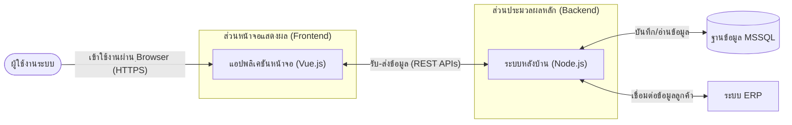
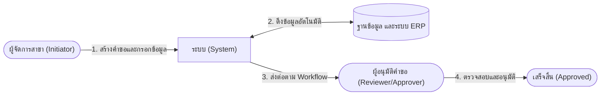
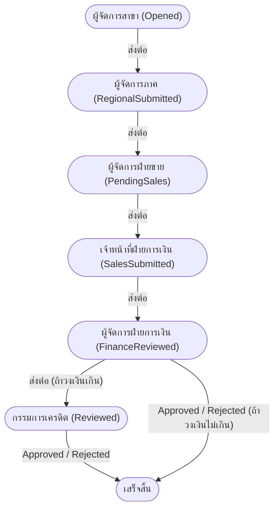

# IT Support & Operations Handover - Slide Storyboard

This document serves as a slide storyboard for creating the presentation deck for the IT Support and Operations Handover Session. It outlines the visual elements, text to be displayed on each slide, and the speaker notes (using English technical terms with Thai explanations).

*Note: This presentation is designed for a 60-minute session, assuming approximately 2 minutes per slide.*

---

## Part 1: Introduction (5 Minutes)

### Slide 1: Title Slide
**[Visual]**: Company Logo / Project Logo on a clean background.
**[Slide Text]**:
- **IT Support & Operations Handover**
- Credit Request Application System
- Presenter Name | Date
**[Speaker Notes]**: "สวัสดีครับทุกท่าน ยินดีต้อนรับเข้าสู่ช่วง IT Support & Operations Handover ของระบบ Credit Request Application ครับ วันนี้เป้าหมายของเราคือการส่งมอบความรู้ เพื่อให้ทีม Operation สามารถดูแลระบบได้อย่างมั่นใจครับ"

### Slide 2: Objectives of this Session
**[Visual]**: Target/Bullseye Icon.
**[Slide Text]**:
- เข้าใจแนวคิดการออกแบบของระบบ และการทำงานเบื้องต้น
- เข้าใจรูปแบบเอกสาร และที่มาของเอกสารในระบบ
- เข้าใจโครงสร้างของระบบ และการจัดเก็บไฟล์ในระบบ
- สามารถรับมือและแก้ไขปัญหาในการใช้งานได้อย่างมีประสิทธิภาพ
**[Speaker Notes]**: "วัตถุประสงค์ (Objectives) หลักของ Session ในวันนี้มี 4 ข้อครับ: 1. เข้าใจ Architecture 2. รู้แหล่งเก็บ Document 3. เข้าใจขั้นตอน Deployment และ 4. สามารถรับมือกับ Incidents ระดับ L1/L2 ได้อย่างมีประสิทธิภาพครับ"

### Slide 3: Agenda
**[Visual]**: Bulleted list with distinct icons.
**[Slide Text]**:
- แนวคิดการออกแบบของระบบ และการทำงานเบื้องต้น
- รูปแบบเอกสาร และที่มาของเอกสารในระบบ
- โครงสร้างของระบบ และการจัดเก็บไฟล์ในระบบ
- การรับมือและแก้ไขปัญหาในการใช้งานเบื้องต้น
- Q&A ถามตอบ
**[Speaker Notes]**: "สำหรับ Agenda 1 ชั่วโมงในวันนี้ เราจะแบ่งตามนี้ครับ: เริ่มจาก Overview, ตามด้วย Documentation, Deployment Process, และจะใช้เวลาส่วนใหญ่เจาะลึกที่ Troubleshooting Scenarios ก่อนจะปิดท้ายด้วย Q&A ครับ"

---

## Part 2: System Overview & Architecture (10 Minutes)

### Slide 4: High-Level Architecture & Tech Stack
**[Visual]**:

**[Slide Text]**:
- **Purpose:** Digitize & streamline credit limit requests.
- **Frontend:** Vue.js (UI & Validation)
- **Backend:** Node.js / Express (Business Logic & External APIs)
- **Database:** MSSQL / SQLite
**[Speaker Notes]**: "เพื่อปูพื้นฐาน ภาพรวมของระบบนี้คือการทำ Digital Transformation ให้กระบวนการขออนุมัติวงเงินเครดิตครับ ระบบเราแบ่งเป็น 2-Tier ชัดเจน คือ Frontend ที่พัฒนาด้วย Vue.js รับผิดชอบหน้าจอ และ Backend ที่พัฒนาด้วย Node.js ควบคุม Logic ทั้งหมด โดยเก็บข้อมูลลงบน MSSQL ครับ"

### Slide 5: The User Journey (What Users Do)
**[Visual]**:

**[Slide Text]**:
- **1. Initiation:** ผู้จัดการสาขาสร้างคำขอและกรอกข้อมูล.
- **2. Validation:** ระบบดึงข้อมูลอัตโนมัติจากฐานข้อมูล และระบบ ERP.
- **3. Review & Approval:** ผู้อนุมัติคำขอตรวจสอบและอนุมัติตาม Workflow.
**[Speaker Notes]**: "หากเรามองเจาะลงมาในฝั่งของ User Journey กระบวนการหลักจะเริ่มจากผู้จัดการสาขาที่เป็นผู้ริเริ่มสร้างคำขอ จากนั้นระบบจะไปดึงข้อมูลประกอบจากฐานข้อมูลและ ERP เมื่อข้อมูลครบถ้วน คำขอจะถูกส่งต่อให้ผู้อนุมัติตามสายงานครับ"

### Slide 6: User Journey Step 1 - สร้างคำขอและกรอกข้อมูล
**[Visual]**: Screenshot of the `/create-credit-request` form (Search Customer & Input Data).
**[Slide Text]**:
- ผู้จัดการสาขาทำการค้นหาลูกค้าจากฐานข้อมูล
- กรอกข้อมูลวงเงินและเครดิตเทอมที่ต้องการขอ
- แนบเอกสารประกอบการพิจารณาเบื้องต้น
**[Speaker Notes]**: "ขั้นตอนแรกสุดเลย ผู้จัดการสาขาจะเข้ามาที่หน้านี้ครับ เพื่อค้นหาชื่อลูกค้าแล้วระบบจะดึง Baseline Data มาให้ หลังจากนั้นก็กรอกวงเงินใหม่ที่ต้องการขอ แล้วก็แนบเอกสารครับ จุดนี้ L1/L2 มักจะเจอคำถามเรื่องอัปโหลดไฟล์ไม่ผ่านบ่อยที่สุด"

### Slide 7: User Journey Step 2 - ดึงข้อมูลอัตโนมัติ
**[Visual]**: Screenshot of the UI showing loading indicators or the populated financial documents section.
**[Slide Text]**:
- ระบบเชื่อมต่อ API ไปยังระบบ ERP (Navision)
- ดึงข้อมูลงบการเงินจากกรมพัฒนาธุรกิจฯ (DBD Services)
- ระบบตรวจสอบความถูกต้องของ VAT Number
**[Speaker Notes]**: "พอผู้ใช้งานกดต่อไป ระบบจะวิ่งมาทำงานเบื้องหลังใน Step ที่ 2 ครับ คือไปดึงข้อมูลจาก ERP และดึงงบการเงินจาก DBD จุดที่ IT ต้องระวังคือ ถ้า Navision หรือ DBD ล่ม หน้าจอนี้จะโหลดนานผิดปกติ ซึ่งเรามี Fallback Logic รองรับไว้แล้วครับ"

### Slide 8: User Journey Step 3 - ส่งต่อตาม Workflow
**[Visual]**:

**[Slide Text]**:
- สร้าง Transaction ID (txId) ในระบบ
- บันทึกข้อมูลลง Snapshot Data สำหรับทำ Audit Trail
- คำขอไปปรากฏในคิวรออนุมัติของหัวหน้า
**[Speaker Notes]**: "เมื่อส่งคำขอสำเร็จ ระบบจะสร้างเลข Transaction (txId) และบันทึก Snapshot ไว้ แล้วคำขอนี้ก็จะเด้งไปอยู่ในคิว Pending Requests ของผู้ที่มีสิทธิ์อนุมัติครับ ถ้าผู้จัดการบอกว่าไม่เห็นคำขอ ทีม IT ต้องมาเช็คเรื่อง Role Management ในขั้นตอนนี้ครับ"

### Slide 9: User Journey Step 4 - ตรวจสอบและอนุมัติ
**[Visual]**: Screenshot of the `Review Dashboard` showing the Approve/Reject buttons and original vs requested comparison.
**[Slide Text]**:
- ผู้อนุมัติเข้าดูข้อมูลทั้งหมดแบบ Read-only
- ดูข้อมูลเปรียบเทียบวงเงินเดิม และวงเงินที่ขอใหม่
- ทำการอนุมัติ (Approve) หรือ ปฏิเสธ (Reject)
**[Speaker Notes]**: "และขั้นตอนสุดท้าย ผู้อนุมัติจะเข้ามาที่หน้า Review Dashboard ซึ่งจะเป็นโหมด Read-only ครับ เพื่อดูวงเงินเดิมเทียบกับวงเงินที่ขอใหม่ แล้วกด Approve ระบบก็จะแจ้งเตือนสถานะกลับไปยังคนขอ ถือว่าจบ Flow การทำงานหลักครับ"

### Slide 10: IT Operations Role (How IT Supports Users)
**[Visual]**: IT Support Icon overlooking logs and UI dashboards.
**[Slide Text]**:
- **Monitoring:** Checking Application Logs for external API timeouts.
- **Configuration:** Adjusting Dynamic RBAC (Role permissions) via UI.
- **Intervention:** Fallback activations & resolving file upload constraints.
**[Speaker Notes]**: "และจุดที่สำคัญที่สุดสำหรับทีม IT Operations ในกระบวนการนี้คือ การ Monitor ครับ เมื่อ User Journey สะดุด เช่นค้นหาลูกค้าไม่เจอ ทีม IT ต้องเข้ามาดู Logs ว่าเกิด API Timeout หรือไม่ หรือหากผู้ใช้งานติดปัญหาเรื่องสิทธิ์ ทีมก็ต้องเข้ามาช่วยปรับ Role Management ผ่านหน้า UI ครับ"

## Part 3: Project Library & Documentation (10 Minutes)

### Slide 11: Where is Everything?
**[Visual]**: Screenshot of Git repository focusing on the `docs/` folder.
**[Slide Text]**:
- **The "Project Library"**
- Hosted alongside source code in `docs/` directory.
- Version-controlled documentation.
**[Speaker Notes]**: "สำหรับ Documentation ทั้งหมดของระบบ เราเรียกมันว่า 'Project Library' ครับ ซึ่งจะถูกเก็บรวบรวมไว้ที่โฟลเดอร์ `docs/` ใน Repository เดียวกับ Source Code ข้อดีคือ Document จะถูก Version-control ไปพร้อมๆ กับการอัปเดตระบบครับ"

### Slide 12: Production Readiness
**[Visual]**: Clipboard / Checklist icon.
**[Slide Text]**:
- **`PRODUCTION_READINESS_CHECKLIST.md`**
- Essential Pre-flight checks.
- Verifying Environment variables, DB connections, and Folder permissions.
**[Speaker Notes]**: "เอกสารตัวแรกที่สำคัญคือ Checklist ก่อนขึ้นระบบครับ มันจะรวบรวมรายการตรวจเช็ค (Pre-flight checks) เช่น การตรวจสอบตัวแปร Environment, ทดสอบ DB Connection และการเช็ค Folder Permissions เพื่อป้องกันปัญหาตอน Go-live"

### Slide 13: Release Processes
**[Visual]**: Gear icon / Automation.
**[Slide Text]**:
- **`RELEASE_PROCESS.md`**
- How to package the application.
- Automation scripts (`create_release.bat`).
**[Speaker Notes]**: "หากมี Patch หรือ Version ใหม่ ทีมสามารถอ้างอิงวิธี Build ระบบได้จาก `RELEASE_PROCESS.md` ครับ ในนั้นจะอธิบายขั้นตอนการใช้ Script อัตโนมัติที่เราเตรียมไว้ให้ ซึ่งจะลดข้อผิดพลาดจากการทำ Manual Build ได้มาก"

### Slide 14: Managing Permissions (RACI)
**[Visual]**: Matrix table graphic.
**[Slide Text]**:
- **`RACI_MATRIX.md`**
- Defines Who can Do What.
- Base configurations for Dynamic RBAC Matrix.
**[Speaker Notes]**: "เวลาที่ User ถามว่า 'ทำไมถึงไม่เห็นเมนูนี้' เอกสารที่คุณต้องเปิดคือ `RACI_MATRIX.md` ครับ เอกสารนี้คือ Reference มาตรฐาน (Base configurations) สำหรับตรวจสอบว่า Role ไหนมีสิทธิ์ในการทำ Action ใดในระบบบ้าง"

### Slide 15: Keeping Docs Updated
**[Visual]**: Pen/Paper writing icon.
**[Slide Text]**:
- Documentation is a living entity.
- Please commit updates if SOPs change.
- Formatted in standard Markdown (.md).
**[Speaker Notes]**: "ขอฝากไว้ว่า Document เหล่านี้ไม่ใช่ของตายตัว (Living entity) ครับ หากในอนาคตทีม Operation มีการปรับ Standard Operating Procedure (SOP) ใหม่ สามารถอัปเดตไฟล์ Markdown (.md) แล้ว Commit เข้ามาได้เลยครับ"

---

## Part 4: Deployment & Environment (10 Minutes)

### Slide 16: Deployment Strategy
**[Visual]**: Box icon (Standalone application).
**[Slide Text]**:
- **Zero-Dependency Deployment.**
- No need to globally install Node.js on Production Servers.
- Everything packaged via `create_release.bat`.
**[Speaker Notes]**: "เข้าสู่เรื่อง Deployment ครับ Strategy ที่เราใช้คือ 'Zero-Dependency' หมายความว่าทีมสามารถนำ Artifact ที่ถูก Build แพ็ครวมกันแล้วไปวางบน Windows Server ได้เลย โดยไม่จำเป็นต้อง Install Node.js ทิ้งไว้ในเครื่อง Server ให้ยุ่งยากครับ"

### Slide 17: The `.env` File (The Brain)
**[Visual]**: Code snippet of `.env` file (masking passwords).
**[Slide Text]**:
- Application settings reside in `.env`.
- Database Strings, API Endpoints, Feature Toggles.
- **Rule:** Never commit `.env` to Git.
**[Speaker Notes]**: "ตัวควบคุมพฤติกรรมของแอป (The Brain) คือไฟล์ `.env` ครับ ค่าต่างๆ เช่น Database Credentials หรือ URL ของ API จะถูกตั้งค่าที่นี่ กฎเหล็ก (Golden Rule) ของเราคือห้ามนำไฟล์ .env ที่เป็น Production อัปโหลดเข้าสู่ Git Repository เด็ดขาดครับ"

### Slide 18: Key Environment Variables
**[Visual]**: Table showing variable names and definitions.
**[Slide Text]**:
- `DB_USER` / `DB_PASSWORD`
- `FEATURE_ISOLATE_INITIATOR_REQUESTS` (Toggles data visibility rules).
- `MAX_FILE_UPLOAD_SIZE_MB`
**[Speaker Notes]**: "ตัวแปรสำคัญในไฟล์ `.env` ที่ทีมควรทราบได้แก่ ชุดเชื่อมต่อ DB, Feature Toggles อย่าง `ISOLATE_INITIATOR_REQUESTS` ที่ใช้เปิด-ปิด Rule การมองเห็นข้อมูลของผู้สร้างคำขอ และการกำหนดขนาดไฟล์อัปโหลดครับ"

### Slide 19: File System Structure on Server
**[Visual]**: Directory tree (`/release`, `/logs`, `/uploads`).
**[Slide Text]**:
- `/release` - The application binary.
- `/logs` - PM2 / Application run logs.
- `/uploads` - Storage for attached documents.
**[Speaker Notes]**: "เมื่อนำไปวางบน Server โฟลเดอร์จะถูกจัดสรรชัดเจนครับ ตัวแอปจะอยู่ในโฟลเดอร์ release ส่วน /logs จะเก็บประวัติการรัน และ /uploads คือที่เก็บไฟล์แนบ ซึ่งโฟลเดอร์นี้สำคัญมากในการสำรองข้อมูล (Backup)"

### Slide 20: Starting & Restarting Services
**[Visual]**: Terminal / Command Prompt graphic.
**[Slide Text]**:
- Restart needed when `.env` changes.
- Using Process Managers (e.g., PM2 or Windows Services).
**[Speaker Notes]**: "ข้อควรจำคือ หากมีการแก้ไขไฟล์ `.env` ทีมจะต้องทำการ Restart Application เสมอเพื่อให้ระบบโหลด Configuration ใหม่ ใน Production เราแนะนำให้รันผ่าน Process Managers เช่น PM2 หรือผูกเป็น Windows Services เพื่อให้แอป Restart ตัวเองได้ถ้าเครื่องรีบูทครับ"

---

## Part 5: Common L1/L2 Support Scenarios (20 Minutes)

### Slide 21: Defining L1 vs L2
**[Visual]**: Pyramid or Two-tier escalation graphic.
**[Slide Text]**:
- **L1 (Helpdesk):** Basic usage queries, password resets, basic access issues.
- **L2 (Application Support):** Log analysis, Database investigations, Configuration changes.
**[Speaker Notes]**: "ในระบบเราแบ่งขอบเขตเป็น 2 ระดับครับ L1 คือหน้าด่าน ช่วยเหลือปัญหาการใช้งานทั่วไป ส่วน L2 คือ Application Support ที่ต้องลงลึกในการตรวจสอบ Logs (Log analysis), ตรวจสอบ Database หรือปรับแก้ค่า Configuration บนหน้า UI ขั้นสูงครับ"

### Slide 22: Scenario A - UI Loading Freeze (Symptom)
**[Visual]**: Spinner icon loading endlessly.
**[Slide Text]**:
- **Symptom:** User reports "The screen is spinning forever when searching for a customer."
- **Context:** Happens during Search Customer or Fetching DBD.
**[Speaker Notes]**: "มาดู Scenario แรกครับ User แจ้งว่ากดค้นหาลูกค้าแล้วหมุนค้าง (UI Freezes) ปัญหานี้มักจะเกิดในจังหวะที่มีการยิงคำขอออกไปยัง External API เช่น Navision หรือ DBD ครับ"

### Slide 23: Scenario A - UI Loading Freeze (Resolution L2)
**[Visual]**: Magnifying glass over a log file snippet showing "Timeout".
**[Slide Text]**:
- **L2 Action Plan:**
  1. Check Backend Application Logs for `Timeout` or `ECONNREFUSED`.
  2. Verify external API status (Is Navision down?).
  3. Inform users that Fallback logic will eventually engage.
**[Speaker Notes]**: "สำหรับทีม L2 วิธีแก้ปัญหา (Resolution) คือให้เปิด Backend Logs ทันทีครับ มองหาคำว่า Timeout หรือ Connection Refused หากเจอ แปลว่า Navision อาจจะล่ม ให้แจ้ง User ว่าระบบจะใช้ Fallback ไปค้นใน Local DB แทน ซึ่งอาจจะใช้เวลาสักครู่"

### Slide 24: Scenario B - Missing Menu/Actions (Symptom)
**[Visual]**: UI mockup highlighting a missing "Approve" button.
**[Slide Text]**:
- **Symptom:** "I am an Approver, but I don't see the Approve button for this request."
- **Context:** Workflows rely strictly on Roles.
**[Speaker Notes]**: "Scenario B พบบ่อยมากครับ User เป็นหัวหน้า แต่ไม่เห็นปุ่ม 'Approve' ในระบบของเรา สิทธิ์การมองเห็นไม่ได้ผูกตายตัว แต่ถูกคุมด้วยระบบ Workflow และ Roles ครับ"

### Slide 25: Scenario B - Missing Menu/Actions (Resolution L1/L2)
**[Visual]**: Screenshot of the `System Configuration > Role Management` UI.
**[Slide Text]**:
- **L1 Action Plan:** Verify the user's username vs assigned groups.
- **L2 Action Plan:** Access UI -> `System Configuration > Role Management`. Check the Dynamic RBAC Matrix matching.
**[Speaker Notes]**: "ทางแก้คือ ทีม L1 เช็คก่อนว่า User คนนั้นอยู่ใน Group ที่ถูกต้องไหม ถ้าถูกต้อง ทีม L2 สามารถใช้สิทธิ์ Admin เข้าไปที่เมนู Configuration แล้วตรวจสอบ Role Management Matrix เพื่อเช็คว่า Role ดังกล่าวถูกตั้งค่าให้อนุมัติ State นี้ได้หรือไม่ (Dynamic RBAC Check)"

### Slide 26: Scenario C - File Upload Failures (Symptom)
**[Visual]**: Alert box showing file upload error.
**[Slide Text]**:
- **Symptom:** "I cannot attach the balance sheet Excel file."
- **Context:** System enforces limits to prevent memory exhaustion.
**[Speaker Notes]**: "Scenario C User โวยวายว่าแนบไฟล์ Excel งบการเงินไม่ได้ (Upload Failures) ปัญหานี้มักเกิดจากระบบเรามีการตั้ง Limits ป้องกันไฟล์ขนาดใหญ่เกินไปเพื่อไม่ให้ Server Memory เต็มครับ"

### Slide 27: Scenario C - File Upload Failures (Resolution L2)
**[Visual]**: Gear config icon and folder icon.
**[Slide Text]**:
- **L2 Action Plan:**
  1. Check Dynamic Upload Limit in DB Config UI (`MAX_FILE_UPLOAD_SIZE_MB`).
  2. Verify Service Account Write Permissions on `/uploads`.
  3. Check Windows Server Disk Space.
**[Speaker Notes]**: "L2 จะต้องทำ 3 อย่างครับ: 1. เช็คว่าไฟล์ใหญ่กว่าที่ Config ไว้ในระบบไหม 2. เช็คว่าโฟลเดอร์ /uploads บนเครื่อง Server มีพื้นที่เต็มหรือไม่ 3. เช็ค Permission ว่า Service Account ที่รันแอปมีสิทธิ์ Write ไฟล์หรือเปล่า"

### Slide 28: Scenario D - Database Save Errors (Symptom)
**[Visual]**: Error 500 graphic or SQL icon.
**[Slide Text]**:
- **Symptom:** "An error occurred while saving the draft."
- **Context:** Often related to concurrent accesses or network interruptions to DB.
**[Speaker Notes]**: "Scenario สุดท้าย เกิด Error 500 ระหว่างที่ User กดบันทึก Draft ครับ สาเหตุมักเกิดจากปัญหาคอขวดของ Database (Concurrent access) หรือ Network ระหว่าง App กับ Database ขาดหาย"

### Slide 29: Scenario D - Database Save Errors (Resolution L2)
**[Visual]**: Log snippet highlighting `SQL Deadlock`.
**[Slide Text]**:
- **L2 Action Plan:**
  1. Read backend logs for `SQL Deadlock` or `Connection Closed`.
  2. Verify VPN/Network between App Server and DB Server (Air-gapped env).
  3. Restart Application Service to clear connection pools.
**[Speaker Notes]**: "ในกรณีนี้ L2 ต้องเช็ค Logs เพื่อหา `SQL Deadlock` ครับ ถ้าระบบค้างหนัก วิธีแก้เบื้องต้นที่เร็วที่สุดคือ Restart Application Service เพื่อเคลียร์ Connection Pool กลับคืนมา และเช็ค VPN Connectivity ระหว่าง App Server และ DB Server ครับ"

---

## Part 6: Wrap-up (5 Minutes)

### Slide 30: Escalation Matrix
**[Visual]**: Arrow graphic pointing upwards (L1 -> L2 -> Dev).
**[Slide Text]**:
- Ensure all L2 checks (Logs, UI Configs) are done before escalating.
- Include Transaction ID (`txId`) and Exact Error Logs when escalating to Development/Vendor.
**[Speaker Notes]**: "ข้อควรระวังก่อนทำการ ส่งเรื่องต่อ (Escalate) ให้ทางทีม Developer หรือ Vendor ครับ ขอให้ชัวร์ว่าทีมทำ L2 Checks แล้ว และที่สำคัญที่สุด เวลาส่งเรื่อง โปรดแนบ Transaction ID (txId) พร้อม Error Logs เสมอ จะช่วยให้แก้ปัญหาได้ไวขึ้นมากครับ"

### Slide 31: Q&A
**[Visual]**: Question mark graphic.
**[Slide Text]**:
- **Questions?**
- Open Floor.
**[Speaker Notes]**: "จบเนื้อหาสำหรับ Session วันนี้ครับ มีท่านใดมีข้อสงสัย หรืออยากให้ผม Demo ขั้นตอนการเข้าถึงหน้า System Configuration เพื่อตรวจสอบ Logs หรือ Roles ไหมครับ?"
