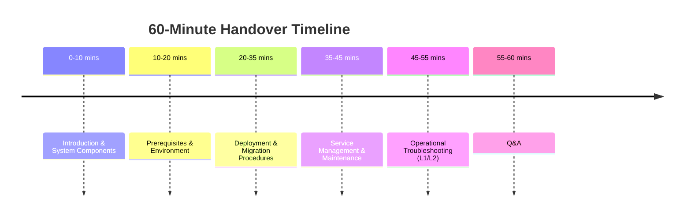
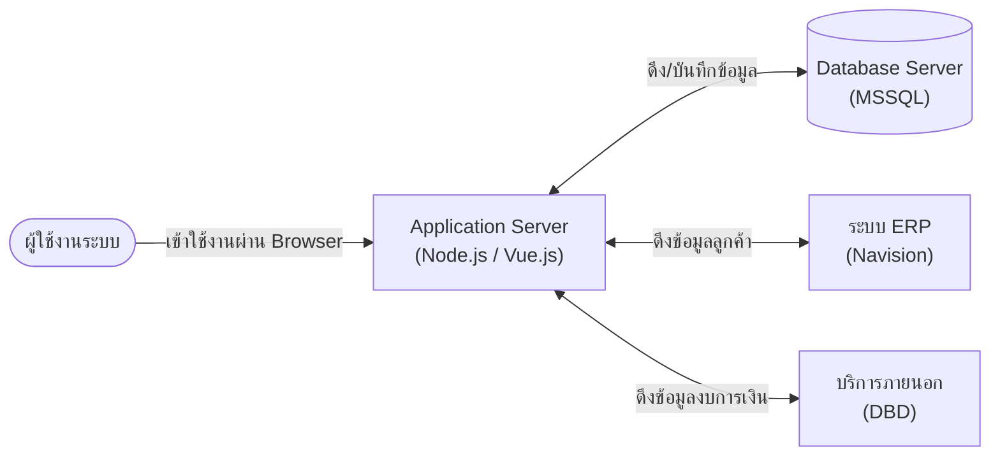
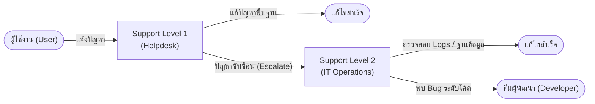
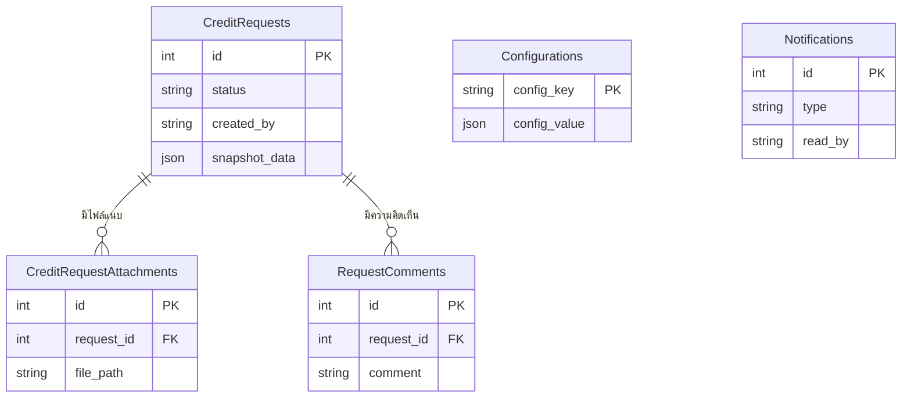

# IT Support & Operations Handover - Slide Storyboard (I&O Focus)

This document serves as a slide storyboard for creating the presentation deck for the IT Support and Operations Handover Session. It outlines the visual elements, text to be displayed on each slide, and the speaker notes (using English technical terms with Thai explanations). 

*Note: This presentation is designed for a 60-minute Infrastructure & Operations (I&O) session, focusing strictly on deployment, maintenance, and troubleshooting.*

---

## Part 1: Introduction & System Components (10 Minutes)

### Slide 1: Title Slide
**[Visual]**: Company Logo / Project Logo on a clean background.
**[Slide Text]**: 
- **IT Support & Operations Handover**
- Credit Request Application System
- Presenter Name | Date
**[Speaker Notes]**: "สวัสดีครับทุกท่าน ยินดีต้อนรับเข้าสู่ช่วง IT Support & Operations Handover ของระบบ Credit Request Application ครับ วันนี้เป้าหมายของเราคือการส่งมอบความรู้ เพื่อให้ทีม Operation สามารถดูแล ติดตั้ง และบำรุงรักษาระบบได้อย่างมั่นใจครับ"

### Slide 2: Objectives of this Session
**[Visual]**: Target/Bullseye Icon.
**[Slide Text]**:
- เข้าใจโครงสร้าง Infrastructure และองค์ประกอบของระบบ
- เข้าใจขั้นตอนการ Deployment และการ Migration ระบบไปยัง Server ใหม่
- สามารถตั้งค่า Environment และจัดการ Services ของระบบได้
- สามารถรับมือและวิเคราะห์ปัญหาเบื้องต้น (Log Analysis) เพื่อแก้ไขปัญหาได้อย่างรวดเร็ว
**[Speaker Notes]**: "วัตถุประสงค์หลักในวันนี้คือเพื่อให้ทีม IT เข้าใจ Infrastructure, สามารถ Deploy และ Migrate ระบบได้, จัดการ Service ต่างๆ ได้ และที่สำคัญคือสามารถวิเคราะห์ Logs เพื่อแก้ปัญหา (Troubleshooting) ให้ User ได้ครับ"

### Slide 3: Agenda
**[Visual]**: 

**[Slide Text]**:
- โครงสร้าง Infrastructure และองค์ประกอบของระบบ (System Components)
- การเตรียมความพร้อมของ Server (Prerequisites & Environment)
- ขั้นตอนการติดตั้งและย้ายระบบ (Deployment & Migration Procedures)
- การจัดการ Service และบำรุงรักษา (Service Management & Maintenance)
- การรับมือและการแก้ปัญหาการใช้งาน (Operational Troubleshooting)
- Q&A ถามตอบ
**[Speaker Notes]**: "สำหรับ Agenda วันนี้เราจะเน้นไปที่งานของ Operation ล้วนๆ ครับ เริ่มตั้งแต่ Infrastructure Topology, การตั้งค่า Environment, การทำ Deployment, งาน Maintenance รายวัน ไปจนถึงการแก้ปัญหา L1/L2 ครับ"

### Slide 4: System Infrastructure Topology
**[Visual]**: 

**[Slide Text]**:
- **Application Server:** Node.js Standalone รันแอปพลิเคชันและ Serve หน้าเว็บ
- **Database Server:** ฐานข้อมูลหลัก (MSSQL)
- **External Connections:** ต้องการ Network/Firewall Rule เพื่อออกไปยัง ERP และ DBD
**[Speaker Notes]**: "ในมุมของ Infrastructure ระบบเราเป็น Standalone Application รันด้วย Node.js ครับ ตัวมันเองจะทำหน้าที่เป็น Web Server ส่งหน้าเว็บ (Frontend Assets) ให้ User และคุยกับ Database (MSSQL) ผ่าน Port 1433 สิ่งที่ IT ต้องระวังคือ Network Firewall ครับ Server ตัวนี้ต้องสามารถออกเน็ตเพื่อคุยกับ API ของ Navision และ DBD ได้"

---

## Part 2: Server Prerequisites & Environments (10 Minutes)

### Slide 5: Server Prerequisites
**[Visual]**: Clean, structured bullet points or table highlighting the three main prerequisite categories.
**[Slide Text]**:
- **OS:** Windows Server 2019+ หรือ Linux
- **Runtime:** รันผ่าน Standalone Node.js (มีไฟล์ `node.exe` แนบมาให้ใน Release แล้ว ไม่ต้อง Install ลงระบบปฏิบัติการ)
- **Network / Firewall:** 
  - **Inbound:** อนุญาต Port 3000 (เพื่อให้ User เข้าเว็บได้) 
  - **Outbound:** อนุญาตเชื่อมต่อไปยัง Port 1433 (Database), 80/443 (DBD API และ ERP)
- **Storage:** ต้องการพื้นที่ว่างอย่างน้อย 50GB สำหรับโฟลเดอร์ `uploads/`
**[Speaker Notes]**: "ก่อนที่เราจะ Deploy สิ่งที่ต้องเตรียมบน Server คือ OS จะเป็น Windows หรือ Linux ก็ได้ครับ ในส่วนของ Runtime เราจำเป็นต้องใช้ Node.js ครับ แต่ทีม IT ไม่ต้องกังวลเรื่องการ Install ลงเครื่อง เพราะเราได้แนบตัวรัน Standalone `node.exe` มาให้ในโฟลเดอร์ Release เรียบร้อยแล้ว ถัดมาสิ่งสำคัญคือเรื่อง Firewall ครับ เครื่องนี้ต้องเปิดพอร์ต 3000 ขาเข้าเพื่อรับ User ส่วนขาออก ต้องตั้งค่าให้เครื่องนี้สามารถทะลุไปคุยกับ Database ผ่านพอร์ต 1433 และเชื่อมต่อไปยัง API ภายนอกอย่าง DBD หรือ ERP ผ่านพอร์ต 80/443 ได้ครับ"

### Slide 6: The `.env` Configuration File
**[Visual]**: Code snippet of `.env` file (masking passwords).
**[Slide Text]**:
- **ไฟล์สำคัญที่สุด:** ใช้ควบคุมพฤติกรรมทั้งหมดของระบบ
- **Database Credentials:** `DB_USER`, `DB_PASSWORD`, `DB_SERVER`, `DB_NAME`
- **Application Settings:** `PORT`, `NODE_ENV` (ต้องเป็น `production`)
- **Upload Limits:** `MAX_FILE_UPLOAD_SIZE_MB`
**[Speaker Notes]**: "หัวใจของระบบอยู่ที่ไฟล์ `.env` ครับ ค่าต่างๆ เช่น Database Connection String, พอร์ตที่แอปจะรัน, หรือขีดจำกัดขนาดไฟล์ จะถูกกำหนดที่นี่ หากมีการเปลี่ยนรหัสผ่าน Database ทีม IT ต้องเข้ามาแก้ไฟล์นี้และ Restart Service ครับ"

---

## Part 3: Deployment & Migration Procedures (15 Minutes)

### Slide 7: Release Generation Process
**[Visual]**: Gear icon / Automation pipeline graphic.
**[Slide Text]**:
- **Script:** `create_release.bat` (ฝั่งทีม Development)
- รวบรวม Source Code (Backend) และ Compiled Assets (Frontend)
- ดาวน์โหลด Standalone Node.js Binary
- แพ็คทุกอย่างรวมเป็นโฟลเดอร์เดียว (`release/`) เตรียมพร้อม Deploy
**[Speaker Notes]**: "ฝั่งทีมพัฒนา เวลาที่จะปล่อยเวอร์ชันใหม่ เขาจะรัน script `create_release.bat` ครับ สคริปต์นี้จะจัดการ Build หน้าเว็บ, เอาโค้ดหลังบ้านมารวมกัน, และดาวน์โหลด Node.exe มาใส่ให้เบ็ดเสร็จ ได้ออกมาเป็นโฟลเดอร์ที่ชื่อว่า release พร้อมส่งให้ทีม IT นำไปใช้งานต่อครับ"

### Slide 8: Release Directory Structure (Deployment Anatomy)
**[Visual]**: 
```text
release/
├── backend/            # โค้ดส่วนประมวลผลทางธุรกิจ
├── dist/               # ไฟล์หน้าเว็บที่ Build แล้ว (HTML/JS/CSS)
├── node.exe            # Standalone Runtime (บน Windows)
├── server.js           # จุดเริ่มต้นของแอปพลิเคชัน
├── logs/               # [สำคัญ] เก็บไฟล์ Log ของระบบ
├── uploads/            # [สำคัญ] ที่เก็บไฟล์เอกสารแนบของผู้ใช้
└── .env                # [สำคัญ] ไฟล์ตั้งค่าระบบ
```
**[Slide Text]**:
- โครงสร้างของโฟลเดอร์ `release/`
- **`logs/`**: ใช้สำหรับวิเคราะห์ปัญหา (Troubleshooting)
- **`uploads/`**: โฟลเดอร์ที่เก็บ State ของไฟล์ (ต้อง Backup)
**[Speaker Notes]**: "นี่คือหน้าตาของโฟลเดอร์ Release ครับ ทีม IT จะสนใจโฟลเดอร์ logs เอาไว้อ่านเวลาโปรแกรมมีปัญหา และโฟลเดอร์ uploads ซึ่งจะเป็นที่เก็บไฟล์ที่ User อัปโหลดเข้ามา โฟลเดอร์ uploads นี้สำคัญมากในกรณีที่มีการย้ายเครื่องครับ"

### Slide 9: Server Migration Guide (ย้าย Server)
**[Visual]**: Server A pointing an arrow to Server B, highlighting `uploads` and `.env`.
**[Slide Text]**:
- **ขั้นตอนการย้าย Server (Migration):**
  1. Copy โฟลเดอร์ `release/` ทั้งหมดไปยัง Server ใหม่
  2. **[Critical]** ตรวจสอบให้แน่ใจว่าโฟลเดอร์ `uploads/` ถูกย้ายมาครบถ้วน
  3. แก้ไขไฟล์ `.env` ให้ชี้ไปยัง Database ตัวใหม่ (ถ้ามีการย้าย DB)
  4. ตั้งค่า Service Manager ใหม่
**[Speaker Notes]**: "คำถามยอดฮิตคือ ถ้า VM เก่าพังหรือต้องย้าย Server ทำอย่างไร? ง่ายมากครับ ให้ Copy โฟลเดอร์ release ไปทั้งก้อนเลย แต่จุดชี้เป็นชี้ตาย (Critical) คือโฟลเดอร์ uploads ต้องมาครบ ไม่งั้นไฟล์แนบคำขอเครดิตจะหายหมดครับ จากนั้นก็แก้ .env ให้ตรงกับเครื่องใหม่ แล้วรันระบบได้เลย"

---

## Part 4: Service Management & Maintenance (10 Minutes)

### Slide 10: Service Management
**[Visual]**: Terminal / Process Manager Icon (PM2 / NSSM).
**[Slide Text]**:
- **Windows:** แนะนำให้ใช้ NSSM (Non-Sucking Service Manager) ผูกเป็น Windows Service
- **Linux:** แนะนำให้ใช้ PM2 หรือ Systemd
- **Command พื้นฐาน:** `node server.js`
- **การอัปเดตระบบ:** เมื่อนำโค้ดเวอร์ชันใหม่มาลง ต้อง Stop Service -> ทับไฟล์ -> Start Service เสมอ
**[Speaker Notes]**: "ในการรันระบบบน Production เราจะไม่กด Double Click รันดื้อๆ ครับ แนะนำให้ทีม IT ใช้ NSSM เพื่อสร้างให้ระบบกลายเป็น Windows Service เพื่อให้มัน Auto-start เวลารีสตาร์ทเครื่องได้ และทุกครั้งที่มีการอัปเดตไฟล์ .env หรืออัปเดตเวอร์ชัน ต้อง Restart Service เสมอครับ"

### Slide 11: Routine Maintenance
**[Visual]**: Hard drive icon with a broom/cleaning symbol.
**[Slide Text]**:
- **Storage Monitoring:** ตรวจสอบพื้นที่ว่างของ Drive ที่เก็บ `uploads/`
- **Log Rotation:** ระบบไม่ได้ลบ Log เก่าทิ้งอัตโนมัติ ทีม IT อาจต้องพิจารณาลบ Log ที่เก่ากว่า 30 วัน
- **Backup:** หมั่นทำ Snapshot ของ VM หรือ Backup โฟลเดอร์ `uploads/`
**[Speaker Notes]**: "สำหรับงาน Maintenance ประจำวัน (Routine) สิ่งที่ต้องทำคือการมอนิเตอร์พื้นที่ Disk ครับ เพราะ User มีการอัปโหลดไฟล์ PDF/Excel เข้ามาเรื่อยๆ พื้นที่อาจจะเต็มได้ นอกจากนี้ทีมควรพิจารณาทำ Log Rotation หรือลบ Log เก่าๆ ทิ้งเพื่อประหยัดพื้นที่ และหมั่น Backup โฟลเดอร์ uploads ไว้นะครับ"

---

## Part 5: Operational Troubleshooting (10 Minutes)

### Slide 12: Defining L1 vs L2 Support
**[Visual]**: 

**[Slide Text]**:
- **L1 (Helpdesk):** ปัญหาการใช้งานทั่วไป (ลืมรหัสผ่าน, ไม่เห็นเมนู) -> แก้โดยเช็ค Permission UI
- **L2 (IT Operations):** ปัญหาระบบทำงานผิดพลาด (เว็บหมุนค้าง, อัปโหลดไฟล์ไม่ผ่าน) -> วิเคราะห์ Logs
**[Speaker Notes]**: "ในระบบเราแบ่งการ Support เป็น 2 ระดับครับ L1 คือ Helpdesk ช่วยเหลือปัญหาหน้าจอทั่วไป เช่น ไม่เห็นปุ่มอนุมัติ ซึ่งแก้ได้ผ่านหน้าจอตั้งค่าสิทธิ์ (Role Management) ส่วนทีม L2 คือพวกเราในห้องนี้ครับ จะลงลึกเรื่องการอ่าน Logs เช็ค Database หากพบว่าเป็น Bug ของโค้ด ค่อย Escalate ไปให้ทีม Developer ครับ"

### Slide 13: Scenario A - UI Loading Freeze (API Timeout)
**[Visual]**: Magnifying glass over a log file snippet showing `ETIMEDOUT` or `ECONNREFUSED`.
**[Slide Text]**:
- **Symptom:** ผู้ใช้แจ้งว่ากดค้นหาลูกค้าแล้วหน้าจอหมุนค้างนาน
- **L2 Action Plan:**
  1. เข้า Server ตรวจสอบ Backend Application Logs (โฟลเดอร์ `logs/`)
  2. ค้นหาคำว่า `Timeout` หรือ `ECONNREFUSED`
  3. ตรวจสอบสถานะการเชื่อมต่อ (Ping/Telnet) ไปยัง Navision ERP หรือเว็บ DBD
**[Speaker Notes]**: "มาดู Scenario แรกครับ User แจ้งว่ากดค้นหาลูกค้าแล้วหมุนค้าง ปัญหานี้มักเกิดจากการที่แอปเราไปดึงข้อมูลจากระบบอื่น (ERP/DBD) แล้วเชื่อมต่อไม่ได้ วิธีแก้ของ L2 คือเปิดไฟล์ Log ดูครับ ถ้าเจอคำว่า Timeout ให้ลอง Ping ไปที่ Server ของ ERP ดูว่าระบบล่มอยู่หรือไม่"

### Slide 14: Scenario B - File Upload Failures
**[Visual]**: Folder write-permission icon or disk space gauge.
**[Slide Text]**:
- **Symptom:** ระบบแจ้งเตือน "เกิดข้อผิดพลาดขณะอัปโหลดไฟล์"
- **L2 Action Plan:**
  1. ตรวจสอบพื้นที่ว่างของฮาร์ดดิสก์บน Server
  2. ตรวจสอบ Max File Size Limit ในการตั้งค่า
  3. ตรวจสอบ Write Permission ของ Service Account บนโฟลเดอร์ `uploads/`
**[Speaker Notes]**: "Scenario B: User อัปโหลดไฟล์ไม่ได้ ให้ L2 เช็ค 3 อย่างครับ: 1. Disk เต็มไหม 2. ไฟล์ใหญ่เกิน Limit ของระบบไหม และ 3. บัญชีที่รัน Service (เช่น Local System) มีสิทธิ์ Write ลงโฟลเดอร์ uploads หรือไม่"

### Slide 15: Scenario C - Database Save Errors
**[Visual]**: Log snippet highlighting `SQL Deadlock` or `Connection Closed`.
**[Slide Text]**:
- **Symptom:** "An error occurred while saving the draft."
- **L2 Action Plan:**
  1. อ่าน Logs หาคำว่า `SQL Deadlock`, `Timeout`, หรือ `Connection Closed`
  2. ตรวจสอบ Network/VPN ระหว่าง App Server และ DB Server
  3. Restart Application Service เพื่อเคลียร์ Connection Pool
**[Speaker Notes]**: "Scenario สุดท้าย เกิด Error ระหว่างบันทึกข้อมูล ให้ L2 เช็ค Logs ก่อนครับ หากเจอ SQL Deadlock หรือ Connection Closed แสดงว่ามีปัญหาการสับรางของฐานข้อมูล หรือ Network กระตุก วิธีแก้ปัญหาเฉพาะหน้าที่ไวที่สุดคือการ Restart Service เพื่อสร้าง Connection Pool ขึ้นมาใหม่ครับ"

### Slide 16: Common HTTP Error Codes & L2 Debugging
**[Visual]**: Table mapping HTTP status codes to meanings and actions.
**[Slide Text]**:
- **200 / 201 OK / Created:** ระบบทำงานปกติ หรือสร้างข้อมูลสำเร็จ -> ไม่ต้องดำเนินการใดๆ
- **304 Not Modified:** ข้อมูลไม่มีการเปลี่ยนแปลง ระบบโหลดจาก Cache สำเร็จ -> ไม่ต้องดำเนินการใดๆ
- **400 Bad Request:** ข้อมูลส่งมาไม่ครบถ้วน (เช่น ขาด Branch Code, VAT No) -> L2 ตรวจสอบว่าระบบส่งข้อมูลมาผิดปกติหรือไม่
- **401 Unauthorized:** Session หมดอายุ หรือ Token ไม่ถูกต้อง -> แนะนำให้ User ทำการ Login ใหม่
- **403 Forbidden:** ฟีเจอร์ถูกปิด (เช่น Auto carry-over) หรือไม่มีสิทธิ์เข้าถึง -> L2 ตรวจสอบการตั้งค่าสิทธิ์หรือ Config ของระบบ
- **404 Not Found:** ไม่พบลูกค้าหรือเอกสาร -> L2 ตรวจสอบข้อมูลใน Database หรือโฟลเดอร์ `uploads/` ว่ามีไฟล์จริงหรือไม่
- **409 Conflict:** ข้อมูลขัดแย้งกัน (เช่น การสร้างคำขอซ้ำ) -> แจ้ง User ว่าข้อมูลอาจซ้ำซ้อน
- **500 Internal Server Error:** ข้อผิดพลาดของเซิร์ฟเวอร์ -> L2 ต้องอ่าน Log หา Error Stack Trace
- **502 / 503 Bad Gateway / Service Unavailable:** เชื่อมต่อ API ภายนอกล้มเหลว (Navision, DBD) -> L2 ตรวจสอบ Network และระบบปลายทาง
**[Speaker Notes]**: "และนี่คือ Error Codes ที่พบบ่อยในระบบครับ หากพบ 200, 201 หรือ 304 ถือว่าระบบปกติ หากเป็น 401 แนะนำให้ผู้ใช้ล็อกอินใหม่ หากเป็น 400 มักเกิดจากข้อมูลส่งมาไม่ครบ ให้เช็คว่า Payload ผิดปกติไหม ส่วน 404 มักจะเกี่ยวกับการหาไฟล์เอกสารไม่เจอ ให้ไปเช็คในโฟลเดอร์ uploads ครับ สำหรับ 500 คือ Error ฝั่งเซิร์ฟเวอร์ ต้องเข้าไปดู Log โดยตรง และถ้าเจอ 502 หรือ 503 แสดงว่าระบบของเราติดต่อกับ Navision หรือ DBD ไม่ได้ ให้ทีม IT รีบเช็ค Network หรือระบบปลายทางทันทีครับ"

---

## Part 6: Database Schema & Reporting (10 Minutes)

### Slide 17: High-Level ERD (Entity-Relationship Diagram)
**[Visual]**:

**[Slide Text]**:
- **ตารางหลัก (Core Table):** `CreditRequests` เก็บข้อมูลคำขอและสถานะ
- **ตารางรอง (Related Tables):** `CreditRequestAttachments` (ไฟล์แนบ) และ `RequestComments` (คอมเมนต์)
- **ตารางระบบ (System Tables):** `Configurations` (ตั้งค่าระบบ) และ `Notifications` (การแจ้งเตือน)
**[Speaker Notes]**: "ในอนาคตหากทีม IT ต้องเขียน Query เพื่อทำรายงาน นี่คือโครงสร้างฐานข้อมูล (ERD) ของเราครับ ศูนย์กลางของระบบคือตาราง CreditRequests ซึ่งจะผูกกับไฟล์แนบและคอมเมนต์ของคำขอนั้นๆ ส่วนตาราง Configurations และ Notifications จะเป็นตารางที่ใช้จัดการการทำงานของระบบครับ"

### Slide 18: Data Dictionary (พจนานุกรมข้อมูลสำหรับทำรายงาน)
**[Visual]**: Table showing key columns in `CreditRequests`.
**[Slide Text]**:
- **ตารางที่สำคัญที่สุดสำหรับการทำ Report:** `CreditRequests`
  - `id`: รหัสอ้างอิงคำขอ (Transaction ID)
  - `customer_no`: รหัสลูกค้า (อ้างอิงกับ Navision)
  - `status`: สถานะปัจจุบัน (เช่น Draft, Approved, Rejected)
  - `created_by` / `created_at`: ผู้สร้างคำขอ และวันที่สร้าง
  - `snapshot_data`: **[สำคัญ]** เก็บข้อมูลรายละเอียดทั้งหมดในรูปแบบ JSON
**[Speaker Notes]**: "หากต้องดึงรายงานคำขอสินเชื่อ ให้ดึงจากตาราง CreditRequests เป็นหลักครับ คอลัมน์ที่สำคัญจะมี id, รหัสลูกค้า, สถานะ, และผู้สร้าง แต่จุดที่อยากให้สังเกตคือ คอลัมน์ snapshot_data ซึ่งเราใช้เก็บรายละเอียดของคำขอทั้งหมดในรูปแบบ JSON เพื่อความยืดหยุ่นของระบบครับ"

### Slide 19: JSON Querying Guide (การคิวรีข้อมูลแบบ JSON)
**[Visual]**: Code snippet showing SQL JSON extraction.
**[Slide Text]**:
- เนื่องจากระบบใช้ **Semi-structured JSON** ในการเก็บข้อมูล (เช่น วงเงินที่ขอเพิ่ม)
- **ตัวอย่างการดึงข้อมูลใน MSSQL:**
  ```sql
  SELECT
      id,
      customer_no,
      status,
      JSON_VALUE(snapshot_data, '$.transaction_data.creditLimit') AS RequestedLimit
  FROM CreditRequests
  WHERE status = 'Approved';
  ```
- **ข้อควรระวัง:** `JSON_VALUE` ดึงค่าออกมาเป็น Text หากต้องการใช้คำนวณต้อง CAST เป็นตัวเลข
**[Speaker Notes]**: "เนื่องจากข้อมูลหลายส่วนถูกเก็บเป็น JSON ในคอลัมน์ snapshot_data เวลาที่ทีม IT จะทำ Report ดึงข้อมูลวงเงินที่ขอเพิ่ม จะไม่สามารถ Select คอลัมน์ตรงๆ ได้ครับ ใน MSSQL เราจะต้องใช้ฟังก์ชัน JSON_VALUE เพื่อเจาะเข้าไปดึงข้อมูลออกมาตามตัวอย่างบนจอครับ และอย่าลืมว่าค่าที่ได้ออกมาจะเป็น Text ถ้าจะเอาไปซัมยอด ต้อง CAST เป็นตัวเลขก่อนเสมอครับ"

---

## Part 7: Wrap-up (5 Minutes)

### Slide 20: Escalation Matrix
**[Visual]**: Arrow graphic pointing upwards (L1 -> L2 -> Dev).
**[Slide Text]**:
- โปรดตรวจสอบ Logs (L2 Checks) ก่อนทำการ Escalate เสมอ
- ข้อมูลที่ต้องแนบให้ Developer: Transaction ID (`txId`), เวลาที่เกิดปัญหา, และไฟล์ Log
**[Speaker Notes]**: "ก่อนส่งเรื่องต่อให้ Developer รบกวนทีม L2 ช่วยวิเคราะห์ Log เบื้องต้นก่อนนะครับ และเวลาส่งเรื่อง ควรแนบ Transaction ID และไฟล์ Log ให้ด้วย จะช่วยให้แก้ปัญหาได้ไวขึ้นมากครับ"

### Slide 21: Q&A
**[Visual]**: Question mark graphic.
**[Slide Text]**:
- **Questions?**
- Open Floor.
**[Speaker Notes]**: "จบเนื้อหาสำหรับ Session วันนี้ครับ มีทีมไหนมีข้อสงสัย หรืออยากให้ผม Demo ขั้นตอนการตั้งค่าในไฟล์ `.env` ประกอบไหมครับ? ช่วงเวลานี้เชิญสอบถามได้เลยครับ"
