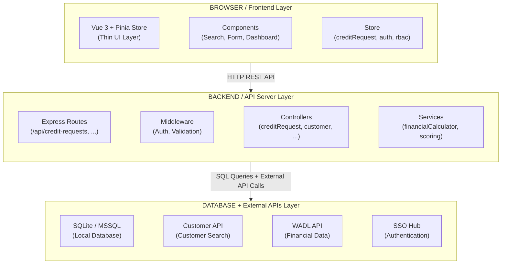
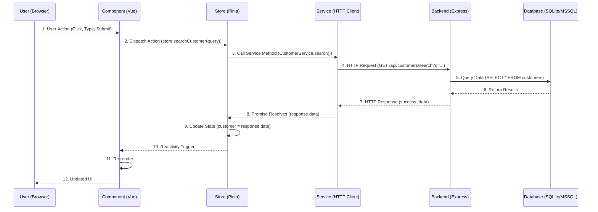
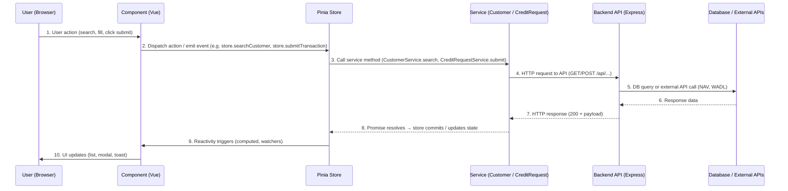
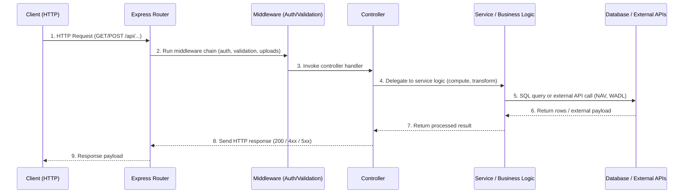
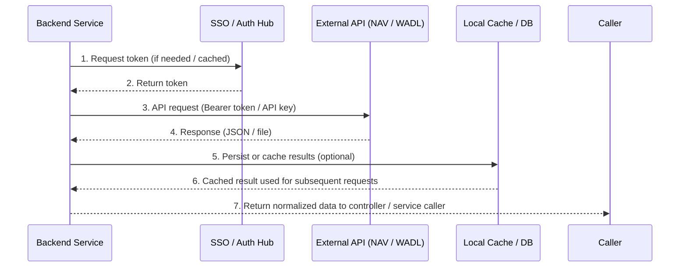

# iNsightDocs — Project Structure Overview

> Comprehensive guide to folder organization, key files, and architectural patterns for code review.

---

## Architecture Overview

### 3-Tier Pattern: System Architecture (Static Structure)



- **Browser (Frontend):** Vue 3 + Pinia provides UI layer, handling user input, local validation, and store actions.
- **API (Backend):** Express routes, middleware, controllers, and services enforce authentication/validation and implement business rules.
- **Data Layer:** Persistent storage (SQLite / MSSQL) and external APIs

### Runtime Data Flow: Complete Request Lifecycle



- **Runtime Data Flow (summary):**
- **User Action → Component:** user inputs or triggers (search, edit, submit); component validates and emits events.
- **Component → Store:** component dispatches Pinia actions (searchCustomer, submitTransaction); store manages state and side-effects.
- **Store → Service:** store calls services (CustomerService, CreditRequestService) which perform HTTP requests.
- **Service → Backend:** HTTP call to Express API; backend applies middleware, controllers, services to process request.
- **Backend → Data:** backend queries database or external APIs (NAV, WADL) and returns results.
- **Response → Store → Component:** service resolves, store commits updates, reactivity triggers component re-render and UI updates.


---

## High-Level Folder Layout

```
iNsightDocs/
├── backend/              ← Node.js + Express server (REST API)
├── src/                  ← Vue 3 frontend (Composition API)
├── tools/                ← Build/utility scripts
├── docs/                 ← Documentation (presentations, guides, specs)
├── package.json          ← Frontend dependencies
├── vite.config.js        ← Vite build config
├── vercel.json           ← Vercel deployment config
└── README.md             ← Project overview
```

---

## Frontend: `/src/` Structure

### Folder Organization

```
src/
├── main.js              ← Entry point — initializes Vue, Pinia, router
├── App.vue              ← Root component
├── style.css            ← Global styles
│
├── assets/              ← Static files (icons, images, fonts)
│
├── components/          ← Reusable Vue components (organized by feature)
│   ├── shared/
│   │   ├── Navbar.vue                    ← Top navigation + auth + notifications
│   │   ├── MultiSelectDropdown.vue       ← Generic dropdown (request type selector)
│   │   └── ...
│   │
│   ├── credit/          ← Credit request feature (most of the app)
│   │   ├── dashboard/   ← Customer/history/header views
│   │   │   ├── CreditRequestHeader.vue   ← Search + action panel orchestrator
│   │   │   ├── CustomerProfileDashboard.vue
│   │   │   ├── CreditHistorySidebar.vue
│   │   │   └── ...
│   │   │
│   │   ├── forms/       ← Main form components
│   │   │   ├── CreditRequestForm.vue     ← Main form orchestrator
│   │   │   ├── ApplicationTabs.vue       ← Customer info tabs
│   │   │   ├── ProjectApplicationTabs.vue
│   │   │   ├── CreditReviewSection.vue
│   │   │   ├── ChangeSummaryModal.vue
│   │   │   └── ...
│   │   │
│   │   ├── workflow/    ← Request status/lifecycle components
│   │   │   ├── RequestStatus.vue         ← Display request ID + status
│   │   │   ├── DocumentChecklist.vue     ← Upload checklist + navigation
│   │   │   └── ...
│   │   │
│   │   ├── scoring/     ← Credit scoring & override UI
│   │   │   ├── CreditScoreSummary.vue    ← Score display + override modal
│   │   │   └── ...
│   │   │
│   │   └── (other subfolders as needed)
│
├── views/               ← Page-level components (routes)
│   ├── CreateCreditRequest.vue  ← Main page (combines all dashboard + form)
│   ├── PendingRequests.vue
│   ├── BatchAutomation.vue
│   ├── SystemConfiguration.vue
│   └── ...
│
├── stores/              ← Pinia state management
│   ├── creditRequest.js ← Central store for credit request flow
│   ├── auth.js          ← User authentication & session
│   ├── rbac.js          ← Role-based access control (permissions)
│   ├── notification.js  ← Notification polling & display
│   └── (other stores)
│
├── router/              ← Vue Router configuration
│   └── index.js         ← Route definitions
│
├── services/            ← HTTP service wrappers (API calls)
│   ├── CustomerService.js
│   ├── CreditRequestService.js
│   ├── (other services)
│   └── ...
│
├── utils/               ← Utility functions & helpers
│   ├── axios.js         ← Configured axios instance (with interceptors)
│   ├── validationLabels.js ← Maps field/doc keys → Thai labels
│   ├── dateUtils.js     ← Date parsing & formatting
│   ├── nameNormalizer.js ← Customer name classification
│   └── ...
│
├── config/              ← App configuration (constants, mappings)
│   ├── mandatoryFields.js ← Required fields/documents per customer type
│   ├── workflow.js       ← Action buttons per status
│   ├── credit_scorecard_existing_v1.json ← Scoring model config
│   └── ...
│
├── composables/         ← Vue 3 composition API helpers
│   ├── useFeatureFlag.js
│   ├── useHighValueThreshold.js
│   └── ...
│
└── data/                ← Static data / mock data (if any)
    └── ...
```

### Key Frontend Files Summary

| File | Purpose | Notes |
|---|---|---|
| `main.js` | App initialization | Sets up Vue, Pinia, router, global config |
| `App.vue` | Root layout | `<router-view>` outlet for pages |
| `stores/creditRequest.js` | Central state store | Manages customer search, form data, files, request detail loading |
| `stores/auth.js` | Authentication | User session, roles, feature flags |
| `stores/rbac.js` | Permissions | `hasPermission()` checks for v-if guards |
| `router/index.js` | Route definitions | Maps URL paths → Vue components |
| `utils/axios.js` | HTTP client | Configured Axios with error handling |
| `services/*.js` | API wrappers | Encapsulate HTTP calls to backend endpoints |
| `views/CreateCreditRequest.vue` | **Main page** | Orchestrates dashboard layout: Navbar, header, sidebar, form, scoring |

### Frontend Data Flow



- **Frontend Flow (summary):**
- **Component → Store:** components dispatch Pinia actions or emit events to modify shared state.
- **Store → Service:** store actions handle side-effects and call services that wrap HTTP requests.
- **Service → API:** services use `axios` to call backend endpoints; responses are normalized before committing to the store.
- **Store → Component:** store commits trigger reactive updates (computed, watchers) causing components to re-render.
- **Common Patterns:** debounced search, FormData for file uploads, optimistic UI for quick feedback, and centralized error handling via interceptors.


---

## Backend: `/backend/` Structure

### Folder Organization

```
backend/
├── server.js                ← Express app initialization + middleware setup
├── db.js                    ← Database adapter (SQLite/MSSQL selector)
├── db-sqlite.js             ← SQLite implementation
├── db-mssql.js              ← MSSQL implementation
├── package.json             ← Dependencies (express, cors, multer, etc.)
│
├── routes/                  ← Express route handlers (URL → controller)
│   ├── authRoutes.js        ← `/api/auth/*` endpoints
│   ├── configRoutes.js      ← `/api/config/*` endpoints
│   ├── creditRequestRoutes.js ← `/api/credit-requests/*`
│   ├── customerRoutes.js    ← `/api/customers/*`
│   ├── financialRoutes.js   ← `/api/financial/*`
│   ├── notificationRoutes.js ← `/api/notifications/*`
│   ├── scorecardRoutes.js   ← `/api/scorecard/*` (scoring models)
│   └── ...
│
├── controllers/             ← Business logic (request handlers)
│   ├── authController.js    ← Auth flow (SSO, logout, session validation)
│   ├── configController.js  ← Config endpoints (RBAC matrix, workflow, flags)
│   ├── creditRequestController.js ← Create/update/validate credit requests
│   ├── customerController.js ← Customer search + profile
│   ├── financialController.js ← Financial data fetching
│   ├── notificationController.js ← Notification CRUD
│   ├── pdfController.js     ← PDF export
│   ├── scorecardController.js ← Scoring model endpoints
│   └── externalController.js ← External API calls (NAV, WADL, etc.)
│
├── middleware/              ← Express middleware (auth, validation, etc.)
│   ├── authMiddleware.js    ← Verify token/session
│   ├── checkIsAdmin.js      ← Admin-only guard
│   ├── apiKeyAuth.js        ← API key validation
│   ├── upload.js            ← File upload (multer config)
│   └── ...
│
├── services/                ← Reusable business logic
│   ├── financialCalculator.js ← Credit scoring computation
│   ├── scoring/             ← Scoring sub-services
│   └── ...
│
├── utils/                   ← Backend utility functions
│   ├── branchCode.js        ← Branch code normalization
│   └── ...
│
├── config/                  ← Scoring & workflow config (JSON)
│   ├── credit_scorecard_v1.json
│   ├── credit_scorecard_existing_v1.json
│   └── ...
│
├── assets/                  ← Static files (fonts, images)
│   └── fonts/
│
└── poppler/                 ← PDF rendering tools (binaries)
```

### Key Backend Files Summary

| File | Purpose | Notes |
|---|---|---|
| `server.js` | App entry | Initializes Express, middleware, routes |
| `db.js` | DB adapter | Selects SQLite or MSSQL implementation |
| `routes/*.js` | URL routing | Maps HTTP endpoints → controller functions |
| `controllers/*.js` | **Business logic** | Handles requests, queries DB, returns responses |
| `services/financialCalculator.js` | Scoring engine | Computes credit score + recommended limit |
| `middleware/authMiddleware.js` | Auth guard | Verifies token on protected routes |
| `config/credit_scorecard_*.json` | Scoring model | Defines weights, factors, thresholds |

### Backend Request Flow

```
HTTP Request (GET/POST/PUT)
     ↓
Express route handler (routes/*.js)
     ↓
Middleware chain (auth, validation)
     ↓
Controller function (controllers/*.js)
     ↓
Service logic (services/*.js) or direct DB query
     ↓
External API call if needed (NAV, WADL, etc.)
     ↓
Response sent back to client
```




- **Backend Flow (summary):**
- **Client → Router:** incoming HTTP request matched to an Express route.
- **Router → Middleware:** apply auth, validation, file-upload, and other cross-cutting concerns.
- **Middleware → Controller:** controller validates/parses input, enforces business rules, and returns proper HTTP codes.
- **Controller → Service:** controllers delegate heavy computation and data access to services for testability.
- **Service → Data:** services run SQL queries or call external APIs (NAV, WADL), normalize results, and handle retries.
- **Response → Client:** controller formats the response; centralized error handling and logging manage failures and observability.


---

## External APIs

### External API Structure

```
external-apis/
├── NAV API         ← Customer master & search endpoints (HTTP REST)
├── WADL API        ← Financial / statement extraction endpoints
├── SSO Hub         ← Authentication / token issuance (SSO)
└── Other third-party services (credit bureaus, tax validation)
```

### External API / Data Summary

- **NAV API:** provides customer master records, tax IDs, and contact/address details; used for search and profile enrichment.
- **WADL API:** returns financial statements and parsed accounting lines used by the scoring engine.
- **SSO Hub:** issues authentication tokens and federates user identity between corporate SSO and the Express API.
- **Data Characteristics:** JSON responses, paginated lists for search, occasional CSV/XLS attachments for reports, and rate limits on heavy endpoints.
- **Auth & Reliability:** APIs use API keys / OAuth2 tokens; implement retries, backoff, and circuit-breaker patterns in services.

### External API — Code Map (dive deep)

**Environment & Configuration (env vars)**
- `CUSTOMER_API_URL`, `CUSTOMER_API_KEY` — customer search/profile endpoints (used in `customerController`).
- `FINANCIAL_API_URL`, `MONTHLY_SUMMARY_API_KEY` — monthly summary / purchasing behavior endpoints (used in `financialController`).
- `LATE_PAYMENT_WADL_API_URL`, `LATE_PAYMENT_WADL_API_KEY` — WADL / late-payment endpoints (used in `financialController`).
- `INVOICE_API_URL`, `INVOICE_API_KEY` — invoice extraction endpoints.
- `ENABLE_LOCAL_FALLBACK`, `MOCK_EXTERNAL_APIS` — toggle mock/local fallbacks for offline or dev testing.

**Backend files & responsibilities**
- `backend/controllers/customerController.js` — core customer-facing external integrations:
     - `searchApiCustomers(query)` — parallelized split-and-merge search strategy against the external `API_URL`, deduplicates results and performs fast fallbacks.
     - `fetchPurchasingBehavior(customerNo, taxId, fetchBy)` — calls `FINANCIAL_API_URL` with `tax_no` or `customer_code`, sets `apikey` header, includes timeouts and fallbacks.
     - `fetchCategorySummary(customerNo)` — calls category endpoints with `apikey` header, supports POST/GET variants and handles response normalization.
     - Route bindings: see `backend/routes/customerRoutes.js` (`/api/customers/search`, `/api/customers/suggestions`, `/api/customers/check-credit-by-vat`, etc.).

- `backend/controllers/financialController.js` — WADL & financial processing:
     - `fetchLatePaymentData(customerNo)` and `fetchWADLData(customerNo)` — call late-payment/WADL endpoints, sanitize, deduplicate invoices, and compute WADL via `calculateWADL()`.
     - `analyzeFinancials(req,res)` — orchestrates uploaded Excel/PDF parsing, optional local file fallback, calls WADL/financial APIs, and persists audit files.
     - Routes: `backend/routes/financialRoutes.js` (`/api/financial/analyze`, `/api/financial/late-payment-benchmark`, `/api/financial/remaining-credit`, etc.).

- `backend/controllers/externalController.js` — special external integrations and scrapers:
     - `streamDBDProfile(req,res)` — SSE-based DBD profile scraping using `puppeteer`, downloads PDF, extracts registration date, and updates the `Customers` table (`extractAndProcessDBDData`).
     - `downloadDBDProfile` — immediate download endpoint used by other services.
     - Routes: `backend/routes/externalRoutes.js` (`/api/external/dbd-stream`, `/api/external/dbd-profile`).

- `src/services/CustomerService.js` — frontend HTTP wrapper for customer endpoints (`/api/customers/*`) used by components and stores.
- `src/services/CreditRequestService.js` — frontend wrapper for `/api/credit-requests/*` used when submitting transactions and loading request details.

**Utility & supporting code**
- `backend/utils/mockData.js` — provides mock payloads when `MOCK_EXTERNAL_APIS` is enabled (used across controllers).
- `backend/utils/pdfExtractor.js` / `externalController.extractAndProcessDBDData` — PDF parsing logic (uses `pdf-parse`) and update heuristics for `years_in_business` and `registered_capital`.
- `src/utils/axios.js` — client-side `axios` instance with interceptors, centralized error handling, and retry logic patterns (frontend side).

**Integration patterns & behaviors**
- All external calls use timeouts (mostly 5s) and API key headers; controllers log masked API keys for debugging.
- Fallback strategy: try higher-confidence parameter (tax_no) first, then fallback to `customer_code`; if all external calls fail and `ENABLE_LOCAL_FALLBACK` is set, controllers attempt to use local cached files.
- Caching: controllers optionally persist or cache heavy payloads (financial extracts, PDFs) under `customers/{customer_no}/{YYYYMMDD}/` to reduce repeated external calls.
- Error handling: controllers catch errors and either return `null`/default objects or propagate errors upstream depending on endpoint semantics; WADL fetch returns safe defaults when unavailable.
- Resilience: WADL/financial calls implement deduplication and sanitization (handle SQL 1753 dates, future check dates) before calculations.

**Files to inspect for implementation details**
- `backend/controllers/customerController.js`
- `backend/controllers/financialController.js`
- `backend/controllers/externalController.js`
- `backend/routes/customerRoutes.js`
- `backend/routes/financialRoutes.js`
- `backend/routes/externalRoutes.js`
- `src/services/CustomerService.js`
- `src/services/CreditRequestService.js`
- `backend/utils/mockData.js`
- `backend/utils/pdfExtractor.js`


### External API Data Flow



- **External Flow (summary):**
- **Auth First:** backend services obtain and cache tokens from the SSO or present API keys.
- **Request → External:** services call NAV/WADL endpoints, handle paging and attachments, and normalize payloads.
- **Cache & Persist:** normalize and optionally cache responses to reduce load and improve latency.
- **Resilience:** services implement retries, exponential backoff, and fallbacks when external APIs are unavailable.


## Data Models & Key Interfaces

### Customer (from search)
```javascript
{
  id: string,              // Customer ID
  name: string,            // Company name
  tax_id: string,          // VAT/tax number
  current_credit_limit: number,
  payment_terms_code: string,
  customer_since: string,  // Date
  is_company: boolean,     // Computed from name
  address_company: string,
  address_*.* : string,    // Street, city, etc.
  // ... more fields from NAV API
}
```

### CreditRequest (in store)
```javascript
{
  requestId: string,                    // Unique ID
  requestStatus: 'Opened' | 'Submitted' | 'Approved' | ...,
  customer: { /* Customer object */ },
  transactionData: {
    requestType: string,                // 'เครดิตใหม่', 'เครดิตเพิ่ม', etc.
    customFields: { /* filled form data */ },
    custom_weights?: object,            // Optional scoring override
    max_score_factors?: array,          // Optional factor override
  },
  files: { [key]: File | RemoteFile },  // Uploaded documents
  uploadedDocuments: { [key]: boolean },// Flags for uploaded
  creditScore: {
    totalScore: number,
    grade: 'A' | 'B' | 'C',
    recommendedLimit: number,
    breakdown: { /* score components */ },
    can_request_credit: boolean,
    badges: array,
    suggestions: array,
  },
  history: [],                          // Previous requests
  comments: [],
  financialSummary: { /* financial data */ },
}
```

---

## Common Workflows

### 1. Customer Search → Form → Submit
```
User enters customer name
     ↓ (debounced) fetch from /api/customers/search
Suggestions dropdown displays
     ↓
User selects customer
     ↓ emit 'search' → parent calls store.searchCustomer()
Store state updated (customer, hasSearched=true)
     ↓
Dashboard shows customer profile + score
     ↓
User clicks "+ Add request" button
     ↓ emit 'start-request' → parent sets isRequestStarted=true
Form appears with tabs
     ↓
User fills in and submits
     ↓ store.submitTransaction() posts FormData to /api/credit-requests
Response: new txId or approval message
```

### 2. Load Existing Request (from history)
```
User clicks history item
     ↓
store.loadRequestDetail(txId)
     ↓ fetch /api/credit-requests/:txId
Store receives full request details
     ↓
Form re-renders with populated data (read-only if submitted)
```

### 3. Score Override Flow
```
User clicks "Override" in score panel
     ↓
Modal opens, loads default weights from /api/scorecard/:modelType
     ↓
User adjusts weights (must sum to 200)
     ↓
User clicks "Preview" → component emits 'recalculate' with callback
     ↓ parent handles scoring computation
New score displayed in modal
     ↓
User saves → store.transactionData updated with custom_weights
     ↓ On submit, custom weights sent to backend
```

---

## Common Files to Check During Review

### Must-Read (Core Logic)
- [src/stores/creditRequest.js](src/stores/creditRequest.js) — Main state store
- [src/views/CreateCreditRequest.vue](src/views/CreateCreditRequest.vue) — Main page layout
- [src/components/credit/forms/CreditRequestForm.vue](src/components/credit/forms/CreditRequestForm.vue) — Form orchestrator
- [backend/controllers/creditRequestController.js](backend/controllers/creditRequestController.js) — Request creation/update logic
- [backend/services/financialCalculator.js](backend/services/financialCalculator.js) — Scoring engine

### Should-Know (Key Components)
- [src/components/credit/dashboard/CreditRequestHeader.vue](src/components/credit/dashboard/CreditRequestHeader.vue) — Search + action panel
- [src/components/credit/scoring/CreditScoreSummary.vue](src/components/credit/scoring/CreditScoreSummary.vue) — Score display + override
- [src/components/shared/Navbar.vue](src/components/shared/Navbar.vue) — Navigation + auth
- [src/stores/auth.js](src/stores/auth.js) — Authentication flow
- [src/stores/rbac.js](src/stores/rbac.js) — Permission checks

### Reference (Configuration & Utilities)
- [src/utils/axios.js](src/utils/axios.js) — HTTP client setup
- [backend/config/credit_scorecard_v1.json](backend/config/credit_scorecard_v1.json) — Scoring model definition
- [src/config/mandatoryFields.js](src/config/mandatoryFields.js) — Required fields per customer type

---

## Environment & Deployment

### Frontend
- **Framework**: Vue 3 (Composition API)
- **Build tool**: Vite
- **State**: Pinia
- **Routing**: Vue Router
- **HTTP**: Axios
- **UI**: vanilla CSS + SweetAlert2
- **Deployment**: Vercel (via `vercel.json`)

### Backend
- **Runtime**: Node.js
- **Framework**: Express
- **Database**: SQLite (dev) or MSSQL (prod)
- **Authentication**: SSO + JWT/session tokens
- **File upload**: Multer
- **External APIs**: NAV API, WADL, SSO Hub

---

## Next Steps for Code Review

1. **Familiarize yourself** with the project structure above.
2. **Review component presentations** in `docs/presentations/create-credit-request/` (one component at a time).
3. **Trace a workflow** from search → submit to understand data flow.
4. **Check edge cases** noted in each component's review checklist.
5. **Test the app** (search customer, fill form, submit) to see real behavior.
6. **Ask questions** about design choices, trade-offs, or unclear logic.

---

**Updated**: May 15, 2026  
**Scope**: Full-stack credit request system (frontend + backend)
