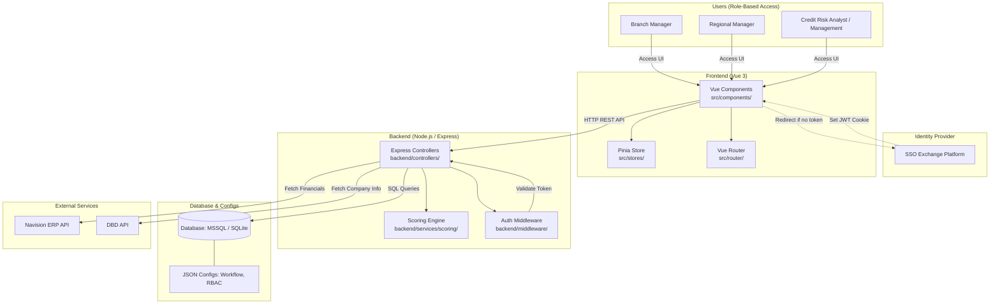

# สรุปโครงสร้างระบบและ Business Rules (BR) Mapping

เอกสารฉบับนี้ถูกจัดทำขึ้นเพื่อช่วยในการนำเสนอ (Presentation) ให้กับอาจารย์ โดยเน้นการอธิบาย **ความเข้าใจในตัว Code**, **โครงสร้างของระบบ**, **การทำงานร่วมกันของแต่ละส่วน**, และ **การพิสูจน์ว่า Business Rules (BR) ถูกนำไปเขียนใน Code จริงๆ ตรงไหนบ้าง** เพื่อให้อาจารย์เห็นว่าระบบทำงานได้จริงและครอบคลุมทุก Requirements

---

## 1. โครงสร้างของระบบทั้งหมด (System Architecture)

ระบบ Credit Request Application (Insight Docs) ถูกออกแบบด้วยสถาปัตยกรรมแบบ **Client-Server (SPA & RESTful API)** โดยแยกส่วนการทำงานชัดเจนเพื่อให้ง่ายต่อการดูแลรักษา (Maintainability)

### 1.1 Tech Stack & Components
*   **Frontend (ฝั่ง Client):** พัฒนาด้วย **Vue 3** (Composition API) จัดการ State ด้วย **Pinia** และ Routing ด้วย **Vue Router** โค้ดทั้งหมดอยู่ในโฟลเดอร์ `src/`
*   **Backend (ฝั่ง Server):** พัฒนาด้วย **Node.js** และ **Express.js** ให้บริการ RESTful API โค้ดอยู่ในโฟลเดอร์ `backend/`
*   **Database (ฐานข้อมูล):** รองรับทั้ง **SQLite** (สำหรับ Development/Local) และ **MSSQL** (สำหรับ Production) การสลับฐานข้อมูลใช้ Environment Variables (`backend/.env`)
*   **Authentication (การเข้าสู่ระบบ):** ใช้ระบบ **SSO (Single Sign-On)** ร่วมกับ Exchange Platform โดยตรวจสอบสิทธิ์ผ่าน **JWT Token ใน Cookie**

### 1.2 Diagram โครงสร้างระบบและการเชื่อมโยง

### 1.3 โครงสร้างไฟล์และองค์ประกอบของระบบ (System Components & Grouping)

เพื่อให้เห็นภาพว่าโค้ดถูกจัดการอย่างไร สามารถแบ่งกลุ่มการทำงานของ **Views (หน้าจอ)**, **Stores (จัดการ State)**, และ **Controllers (API)** ออกเป็น 4 กลุ่มหลักตามการใช้งานดังนี้:

#### กลุ่มที่ 1: ระบบจัดการคำขอเครดิตและการอนุมัติ (Credit Workflow & Processing)
กลุ่มนี้คือหัวใจหลักของระบบ จัดการตั้งแต่เริ่มเปิดบิลจนถึงการอนุมัติ
*   **Views (หน้าจอ):**
    *   `CreateCreditRequest.vue`: หน้าหลักสำหรับสร้างคำขอ, แสดงรายละเอียด, และให้ผู้อนุมัติกด Approve/Reject
    *   `PendingRequests.vue`: หน้าแสดงรายการคำขอที่รอการพิจารณา (Dashboard)
*   **Stores (ตัวจัดการ State):**
    *   `creditRequest.js`: เก็บข้อมูลคำขอที่กำลังเปิดอยู่ เพื่อป้องกันข้อมูลหายและใช้เปรียบเทียบข้อมูล (Snapshot)
    *   `notification.js`: เก็บสถานะการแจ้งเตือนต่างๆ ให้ User
*   **Controllers (API):**
    *   `creditRequestController.js`: บันทึก/แก้ไขคำขอ, จัดการสถานะ, และเก็บประวัติการแก้ไข (Audit Trail)
    *   `notificationController.js`: จัดการส่งการแจ้งเตือนไปยังผู้เกี่ยวข้องเมื่อเอกสารถูกอนุมัติหรือตีกลับ

#### กลุ่มที่ 2: ระบบข้อมูลลูกค้าและการวิเคราะห์ทางการเงิน (Customer & Financial Analysis)
กลุ่มนี้เน้นเรื่องการดึงข้อมูลจากภายนอก (ERP, กรมพัฒน์ฯ) มาประเมินหาเกรดและความเสี่ยง
*   **Views (หน้าจอ):**
    *   `CustomerSearch.vue`: หน้าค้นหาลูกค้าก่อนเริ่มขอเครดิต
    *   `CreditAnalysisReport.vue`: หน้าดูรายงานและผลการวิเคราะห์คะแนน
*   **Stores (ตัวจัดการ State):**
    *   `scorecard.js`: เก็บเกณฑ์การประเมินคะแนน (Scoring Factors) ไว้แสดงผล
*   **Controllers (API):**
    *   `customerController.js`: ดึงประวัติลูกค้า, Blacklist, และหนี้เสีย
    *   `financialController.js`: จัดการข้อมูลงบการเงิน DBD, ประวัติการจ่ายเงิน, และคำนวณวันจ่ายช้า (WADL)
    *   `scorecardController.js`: ดึงเกณฑ์คะแนนและให้ Scoring Engine ประเมินระดับความเสี่ยง
    *   `externalController.js`: ตัวกลางในการเชื่อมต่อกับระบบภายนอก (เช่น ERP)
    *   `pdfController.js`: สร้างและจัดการไฟล์ PDF เอกสาร

#### กลุ่มที่ 3: ระบบจัดการสิทธิ์และการตั้งค่า (System Administration & Security)
สำหรับผู้ดูแลระบบหรือผู้บริหารเพื่อปรับแต่งระบบโดยไม่ต้องแก้โค้ด
*   **Views (หน้าจอ):**
    *   `SystemConfiguration.vue`: หน้าตั้งค่าระบบ (ปรับเกณฑ์, จัดการ Role, จัดการ Workflow)
*   **Stores (ตัวจัดการ State):**
    *   `auth.js`: เก็บข้อมูล User และจัดการ Token การเข้าระบบ
    *   `rbac.js`: จัดการสิทธิ์การใช้งาน (Dynamic RBAC) ตรวจสอบว่า User มีสิทธิ์เห็นข้อมูลหรือกดปุ่มใดบ้าง
    *   `config.js`: เก็บการตั้งค่าระบบในฝั่ง Client
*   **Controllers (API):**
    *   `configController.js`: บันทึกและดึง Configuration แบบ JSON จาก Database

#### กลุ่มที่ 4: ระบบทำงานอัตโนมัติ (Automation & Batch)
*   **Views (หน้าจอ):**
    *   `BatchAutomation.vue`: หน้าสำหรับสั่งการระบบให้ทบทวนวงเงินเครดิตของลูกค้าตามรอบเวลาแบบอัตโนมัติ

### 1.4 การติดตั้งและรันระบบ (Deployment & Setup)
*   **Local Development:** ฝั่ง Backend รันด้วย `npm run start` (Port 3000) และ Frontend รันด้วย `npm run dev` (Vite Port 5173) โดย Frontend จะ Proxy API calls ไปหา Backend
*   **Production Build & Deployment:**
    *   **การสร้าง Release Package:** สามารถรันคำสั่ง `create_release.bat` (หรือรันสคริปต์ที่เทียบเท่า) ที่ Root ของ Repository ระบบจะทำการ Build โค้ดฝั่ง Frontend ให้เป็น Static files และรวบรวมโค้ดฝั่ง Backend พร้อมกับนำเอา `node.exe` (Standalone) มาแพ็กรวมกันเป็นโฟลเดอร์ Release เดียว
    *   **Zero-dependency deployment:** จากโฟลเดอร์ Release ที่ได้ สามารถนำไปวางบน Server ปลายทาง และรันระบบได้ทันทีผ่าน `.bat` หรือ PowerShell โดยที่ Server ปลายทาง**ไม่จำเป็น**ต้องติดตั้ง Node.js หรือ Dependencies อื่นๆ ให้ยุ่งยาก

---

## 2. โครงสร้างของ Code และ Flow การทำงาน (Code Structure & Flow)

เพื่อให้เห็นภาพรวมเวลาอธิบาย Code ให้กับอาจารย์ นี่คือลำดับการไหลของข้อมูลเมื่อ User ทำการ "บันทึกคำขอเครดิต":

1.  **[Frontend] UI Component:** `src/views/CreateCreditRequest.vue` รับข้อมูลจากผู้ใช้
2.  **[Frontend] State Management:** ส่งข้อมูลไปเก็บชั่วคราวที่ `src/stores/creditRequest.js` (Pinia)
3.  **[Frontend] API Call:** ยิง HTTP Request ไปที่ `/api/credit-requests`
4.  **[Backend] Router:** `backend/routes/creditRequestRoutes.js` รับ Request
5.  **[Backend] Middleware:** `backend/middleware/authMiddleware.js` ตรวจสอบ Token ว่า User คนนี้มีสิทธิ์หรือไม่
6.  **[Backend] Controller:** `backend/controllers/creditRequestController.js` ทำการ Validate ข้อมูล, บันทึก Snapshot Data (JSON), และ Insert ลง Database ผ่าน `backend/db-mssql.js` หรือ `db-sqlite.js`

---

## 3. Business Rules (BR) Traceability Matrix

ตารางนี้ใช้เพื่อ **"พิสูจน์"** ให้อาจารย์เห็นว่า Business Rules ทั้งหมดที่เก็บความต้องการมา ได้ถูกนำไปเขียนเป็น Code เรียบร้อยแล้วในส่วนไหนของระบบ

| รหัส BR | รายละเอียด Business Rule (สรุปย่อ) | ไฟล์/ฟังก์ชันใน Codebase ที่อ้างอิงได้ (Proof of Implementation) |
| :--- | :--- | :--- |
| **BR-01** | ข้อมูลพิจารณาต้องมาจากแหล่งกลางและมาตรฐานเดียวกัน | `backend/controllers/customerController.js` (ดึงข้อมูลลูกค้ากลาง) |
| **BR-02** | เอกสารประกอบต้องครบถ้วน แบ่งตามประเภทลูกค้า | `backend/controllers/financialController.js`, `src/components/credit/tabs/DocumentUploadTab.vue` (ระบบจัดการอัปโหลด e-doc) |
| **BR-03** | ประเมินวงเงิน 2 มิติ: Size Score, Grade Score (Convex function) | `backend/services/scoring/ScoringEngine.js` (คำนวณคะแนนตามมิติ), `backend/controllers/scorecardController.js` |
| **BR-04** | แยกประเภทประเมินลูกค้าใหม่/ลูกค้าเดิม/โครงการ น้ำหนักอิงพฤติกรรม | `backend/services/scoring/ScoringEngine.js`, `src/components/credit/tabs/StoreStatementTab.vue` (เลือกว่าเป็น `model_type=new` หรือ `existing`) |
| **BR-05** | กำหนดเงื่อนไขเครดิตแยกตามกลุ่มสินค้า | `backend/controllers/creditRequestController.js`, `src/components/credit/RequestSidebar.vue` |
| **BR-06** | ตรวจสอบยอดค้างชำระ (Outstanding) และประวัติผิดนัดชำระย้อนหลัง | `backend/controllers/financialController.js` (ดึง Invoice/Payment), `backend/controllers/externalController.js` |
| **BR-07** | ลำดับอำนาจอนุมัติ (Workflow) และการแจ้งเตือน (Notifications) | `src/utils/workflowUtils.js` (คำนวณ State อนุมัติ), `backend/controllers/notificationController.js` |
| **BR-08** | หากวงเงินอนุมัติต่างจากประเมิน ต้องระบุเหตุผล (Audit Trail) | `src/components/credit/WorkflowActionBar.vue` (บังคับกรอก comment เมื่อแก้ไขค่า), `backend/controllers/creditRequestController.js` |
| **BR-09** | ใช้ข้อมูลลูกค้าจากแหล่งกลาง ลดความซ้ำซ้อน | `backend/controllers/customerController.js` |
| **BR-10** | ลูกค้า 1 รายอ้างอิง 1 บัญชีหลัก ป้องกันอนุมัติซ้ำซ้อน | `backend/controllers/customerController.js` |
| **BR-11** | ข้อมูลบริษัทต้องใช้ข้อมูลนิติบุคคล/งบการเงินที่เป็นปัจจุบัน | `backend/controllers/financialController.js` (เช็คปีงบการเงิน) |
| **BR-12** | แจ้งเตือนลูกค้ากลุ่มความเสี่ยงสูง (NPL/Blacklist) | `src/components/credit/CreditScoreSummary.vue` (แสดงแถบเตือนสีแดง), `backend/controllers/customerController.js` |
| **BR-13** | แสดงเปรียบเทียบวงเงินเดิม, การใช้จริง, ยอดชำระ, Credit Terms เดิม | `src/components/credit/CreditScoreSummary.vue` (เปรียบเทียบ "เดิม" vs "ขอใหม่") |
| **BR-14** | ปรับเปลี่ยนเกณฑ์ประเมินได้โดยไม่กระทบระบบเดิม | `backend/controllers/scorecardController.js` (เก็บเกณฑ์เป็น JSON) |
| **BR-15** | Dynamic RBAC (สิทธิ์การเข้าถึงข้อมูลตามบทบาท) | `src/stores/rbac.js` (เช็คสิทธิ์), `backend/middleware/authMiddleware.js` |
| **BR-16** | ตรวจสอบย้อนหลังได้ (Audit Trail ไม่สามารถลบ/แก้ไขได้) | `backend/controllers/creditRequestController.js` (บันทึก Snapshot ไว้เป็น JSON ไม่แก้ไขทับของเดิม) |
| **BR-17** | เก็บข้อมูลเป็นระบบเพื่อวิเคราะห์ภาพรวมธุรกิจ | โครงสร้าง Database ใน `backend/db-sqlite.js` และ `backend/db-mssql.js` |
| **BR-18** | ทบทวนวงเงินตามรอบระยะเวลา (ทุก 6 เดือน) | `src/views/BatchAutomation.vue` (หน้าจอสั่งรัน Batch ทบทวน) |
| **BR-19** | เงื่อนไขข้อมูล DBD (งบย้อนหลังไม่เกิน 3 ปี, ข้อมูลหมดอายุ 1 ปี) | `backend/controllers/financialController.js` |
| **BR-20** | การบันทึกและติดตามข้อมูลหลักประกัน (Collateral) | ส่วนของการบันทึก Transaction Data ใน `backend/controllers/creditRequestController.js` |

---

## คำแนะนำในการนำเสนออาจารย์ (Presentation Tips)

1.  **เริ่มจาก "ปัญหา" และ "ภาพรวม":** อธิบายให้อาจารย์ฟังก่อนว่าระบบนี้เกิดมาเพื่อแก้ปัญหาอะไร (เช่น ลดกระดาษ, รวมข้อมูลให้พิจารณาง่ายขึ้น) และใช้ภาพ Diagram ในหัวข้อ 1.2 เป็นตัวอธิบายโครงสร้างกว้างๆ
2.  **อธิบายว่า โค้ดเชื่อมกันอย่างไร (Show the Flow):** เปิดสไลด์หัวข้อ 2 (Code Structure & Flow) อธิบายว่าเวลา User กดเซฟข้อมูล 1 ครั้ง โค้ดมันวิ่งจากหน้าจอ (Vue) ไปหา Backend (Express) และลง Database ได้อย่างไร
3.  **โชว์ความโปร่งใสและตรวจสอบได้ (Highlight Key Features):** อาจารย์มักจะชอบระบบที่สามารถ "ตรวจสอบได้ (Audit)" ให้เน้นพูดถึง **BR-08 และ BR-16** ว่าเราใช้เทคนิคการเก็บข้อมูลแบบ Snapshot (JSON) เพื่อให้เห็นว่าใครแก้ไขอะไรไปบ้างโดยที่ข้อมูลเก่าไม่หาย
4.  **ใช้ตาราง BR Mapping เป็นตัวจบ:** เปิดตาราง BR Matrix ให้ดู เพื่อยืนยันว่าเราไม่ได้แค่เขียนโค้ดขึ้นมาลอยๆ แต่ทุกหน้าจอ ทุกฟังก์ชันในระบบ ถูกสร้างขึ้นมาเพื่อตอบโจทย์ Business Rule ของฝั่ง Business จริงๆ
