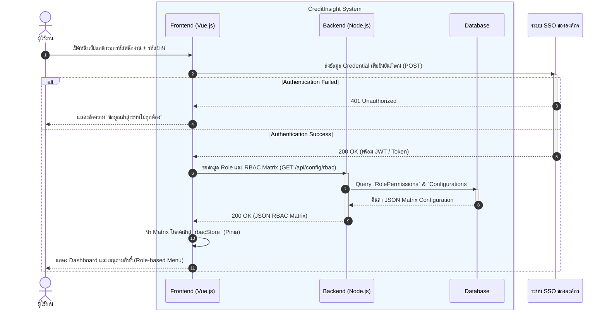
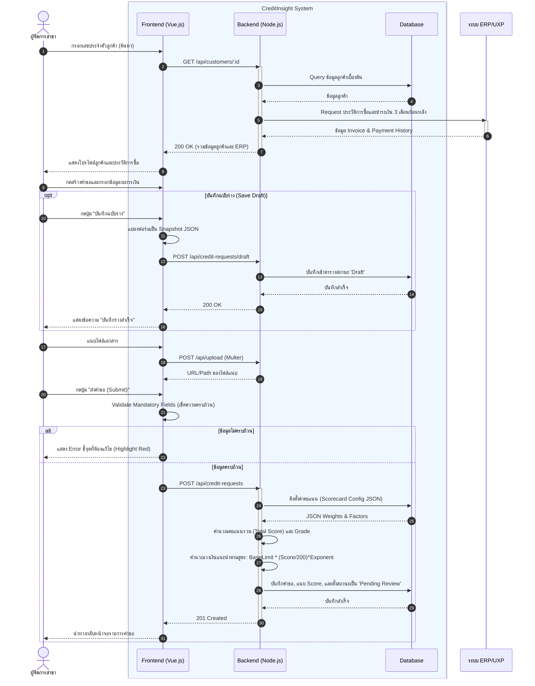
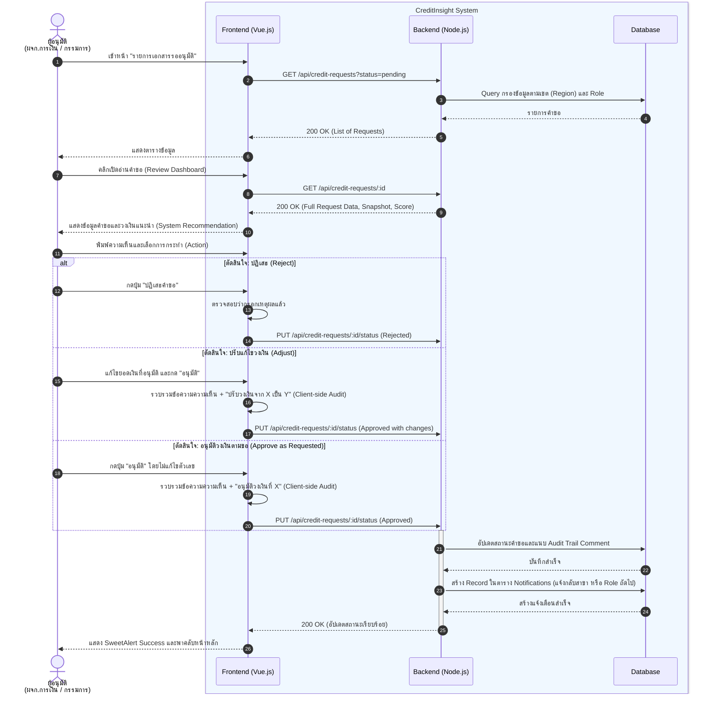

# Sequence Diagrams: ระบบ CreditInsight

เอกสารนี้แสดง Sequence Diagrams ของระบบ CreditInsight ตามมาตรฐาน **UML 2.0** เพื่อใช้อธิบายลำดับการโต้ตอบระหว่าง Object หรือ Component ต่างๆ ในระบบตามเส้นเวลา (Timeline)

เนื่องจากระบบมีการทำงานที่ซับซ้อน จึงได้ทำการแบ่ง Diagram ออกเป็น 3 ส่วนหลักตาม Business Workflow โดยนำเสนอในระดับ Technical Architecture (Frontend, Backend API, Database, External Systems)

**Participants (องค์ประกอบหลักในระบบ):**
* `Actor`: ผู้ใช้งานระบบ (เช่น ผู้จัดการสาขา, ผู้อนุมัติ)
* `Frontend (Vue.js)`: ระบบหน้าบ้านที่ทำงานบน Browser (Pinia Store, Vue Components)
* `Backend (Node.js/Express)`: ระบบหลังบ้านที่จัดการ Business Logic และ API
* `Database (MSSQL/SQLite)`: ฐานข้อมูลของระบบ
* `External System`: ระบบภายนอก (SSO, ERP, DBD)

---

## 1. Authentication & Authorization Flow
แสดงกระบวนการเมื่อผู้ใช้งานเข้าสู่ระบบผ่าน SSO และระบบทำการดึงข้อมูลสิทธิ์ (RBAC Matrix) เพื่ออนุญาตการเข้าถึง

---

## 2. Request Creation & Automated Scoring Flow
แสดงกระบวนการสร้างคำขอเครดิตของผู้จัดการสาขา เริ่มตั้งแต่ค้นหาลูกค้า (ดึง ERP), บันทึกแบบร่าง (Draft), จนถึงส่งคำขอ (ประมวลผล Scoring อัตโนมัติ)

---

## 3. Review & Approval Workflow
แสดงกระบวนการผู้ตรวจสอบ/ผู้อนุมัติทำการเปิดอ่านคำขอ ตรวจสอบวงเงินแนะนำ และทำการตัดสินใจ (อนุมัติ/ปรับแก้/ปฏิเสธ) พร้อมระบบ Audit Trail และแจ้งเตือน

