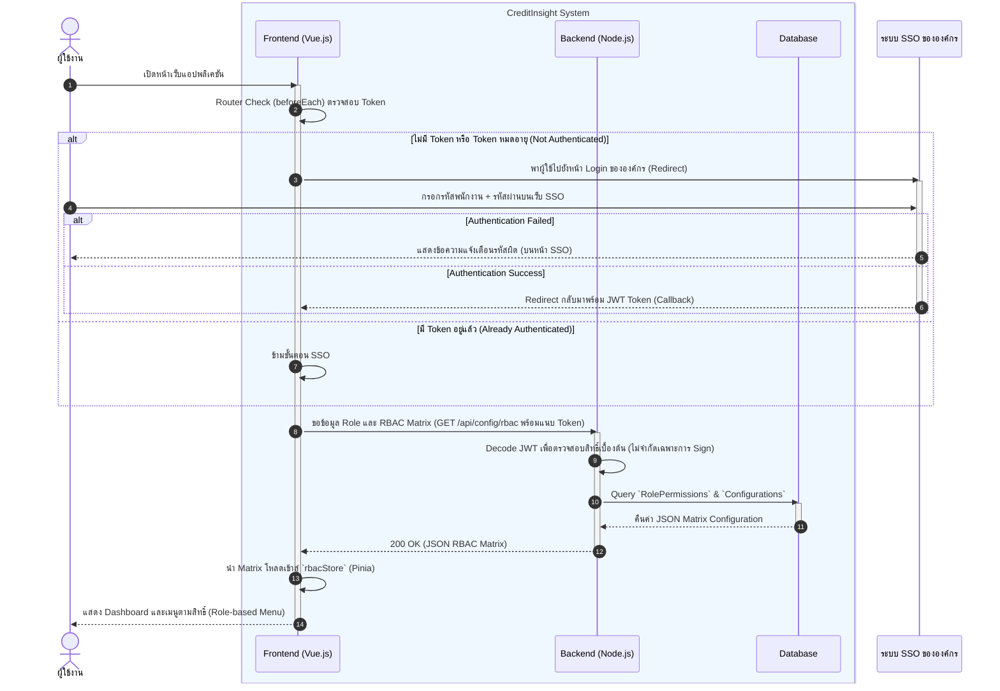
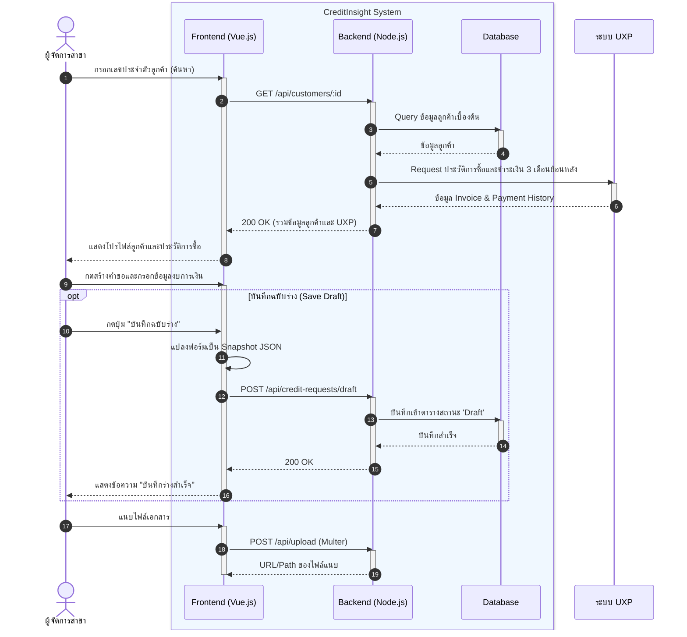
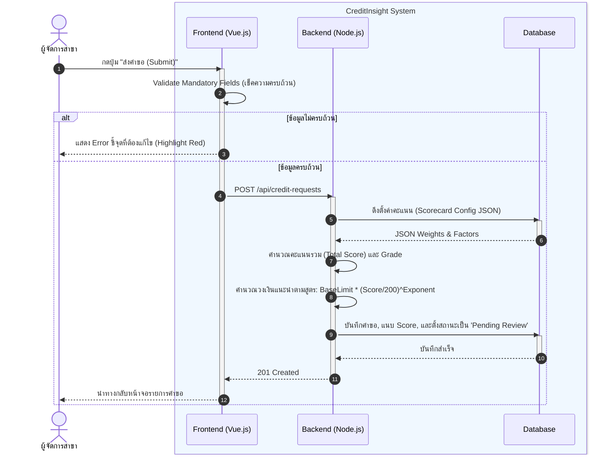
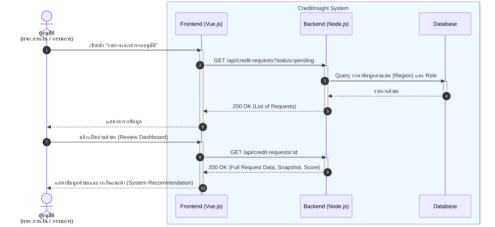
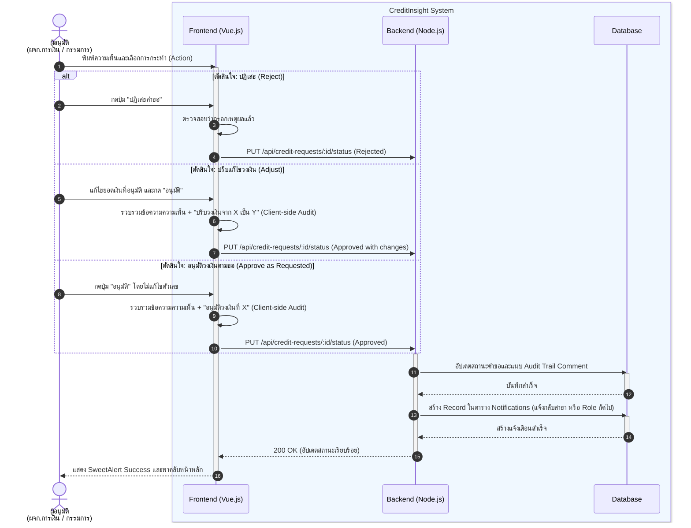

# Sequence Diagrams: ระบบ CreditInsight

เพื่ออธิบายลำดับการแลกเปลี่ยนข้อมูลระหว่างผู้ใช้งาน ระบบส่วนติดต่อผู้ใช้ (Frontend) ระบบประมวลผล (Backend) ฐานข้อมูล (Database) และระบบภายนอก โดยแสดงลำดับการเรียกใช้งาน การประมวลผล และการตอบกลับของแต่ละองค์ประกอบในกระบวนการหลักของระบบ CreditInsight เพื่อให้เห็นภาพการทำงานของระบบตั้งแต่การเข้าสู่ระบบ การสร้างคำขอ การประเมินความเสี่ยง ไปจนถึงกระบวนการอนุมัติ

**Participants (องค์ประกอบหลักในระบบ):**
* `Actor`: ผู้ใช้งานระบบ (เช่น ผู้จัดการสาขา, ผู้อนุมัติ)
* `Frontend (Vue.js)`: ระบบหน้าบ้านที่ทำงานบน Browser (Pinia Store, Vue Components)
* `Backend (Node.js/Express)`: ระบบหลังบ้านที่จัดการ Business Logic และ API
* `Database (MSSQL/SQLite)`: ฐานข้อมูลของระบบ
* `External System`: ระบบภายนอก (SSO, UXP, DBD)

---

## 1. กระบวนการยืนยันตัวตนและจัดการสิทธิ์ (Authentication & Authorization Flow)
แสดงขั้นตอนการเข้าสู่ระบบ โดยระบบจะตรวจสอบ Token และ Redirect ไปยัง SSO ภายนอกหากยังไม่ได้ยืนยันตัวตน จากนั้น Backend จะทำการ Decode JWT และดึงสิทธิ์ (RBAC Matrix) ส่งกลับให้ Frontend เพื่อแสดงเมนูตามบทบาท

---

## 2. กระบวนการสร้างคำขอ (Request Creation Flow)
อธิบายลำดับตั้งแต่ผู้จัดการสาขาค้นหาลูกค้าผ่าน UXP การดึงประวัติการซื้อขาย การบันทึกแบบร่าง ไปจนถึงการแนบไฟล์เอกสารต่างๆ เพื่อเตรียมพร้อมสำหรับการส่งประเมิน

---

## 3. กระบวนการประเมินความเสี่ยง (Automated Scoring Flow)
อธิบายลำดับการทำงานเมื่อผู้ใช้งานกดส่งคำขอ ระบบจะทำการตรวจสอบความถูกต้องของข้อมูลเบื้องต้น (Validation) ก่อนให้ Backend คำนวณคะแนนความเสี่ยงและวงเงินแนะนำอัตโนมัติตาม Scorecard

---

## 4. กระบวนการพิจารณาคำขอ (Review Process Flow)
แสดงการทำงานของผู้อนุมัติที่เข้ามาดูรายการคำขอ เปิดอ่านรายละเอียด และตรวจสอบวงเงินแนะนำที่ระบบคำนวณไว้ให้ เพื่อใช้ประกอบการตัดสินใจ

---

## 5. กระบวนการอนุมัติและแจ้งเตือน (Approval & Notification Flow)
อธิบายลำดับเมื่อผู้อนุมัติตัดสินใจอนุมัติ ปรับแก้ หรือปฏิเสธ ระบบจะบันทึก Audit Trail เปลี่ยนสถานะในฐานข้อมูล และแจ้งเตือนกลับไปยังผู้สร้างหรือส่งต่อในลำดับถัดไป

