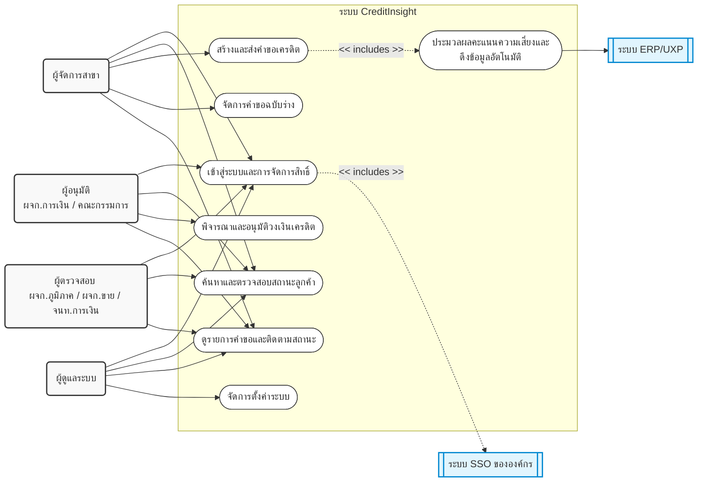
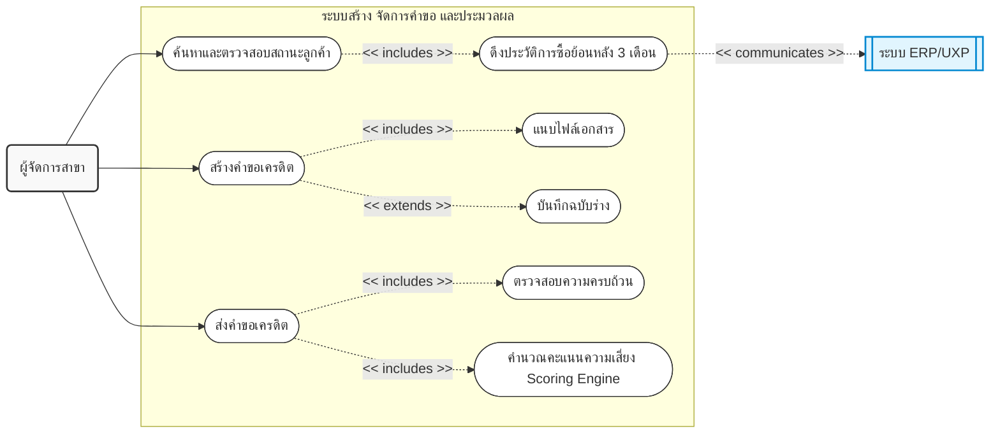
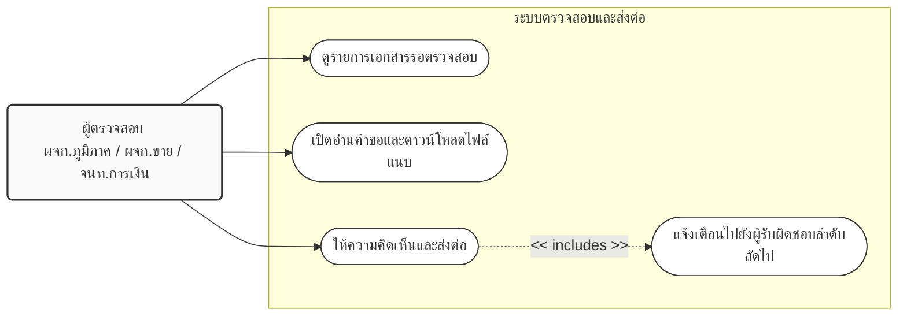
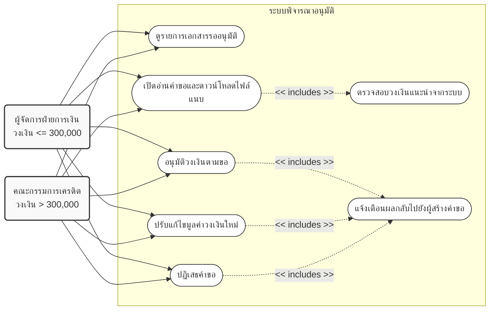
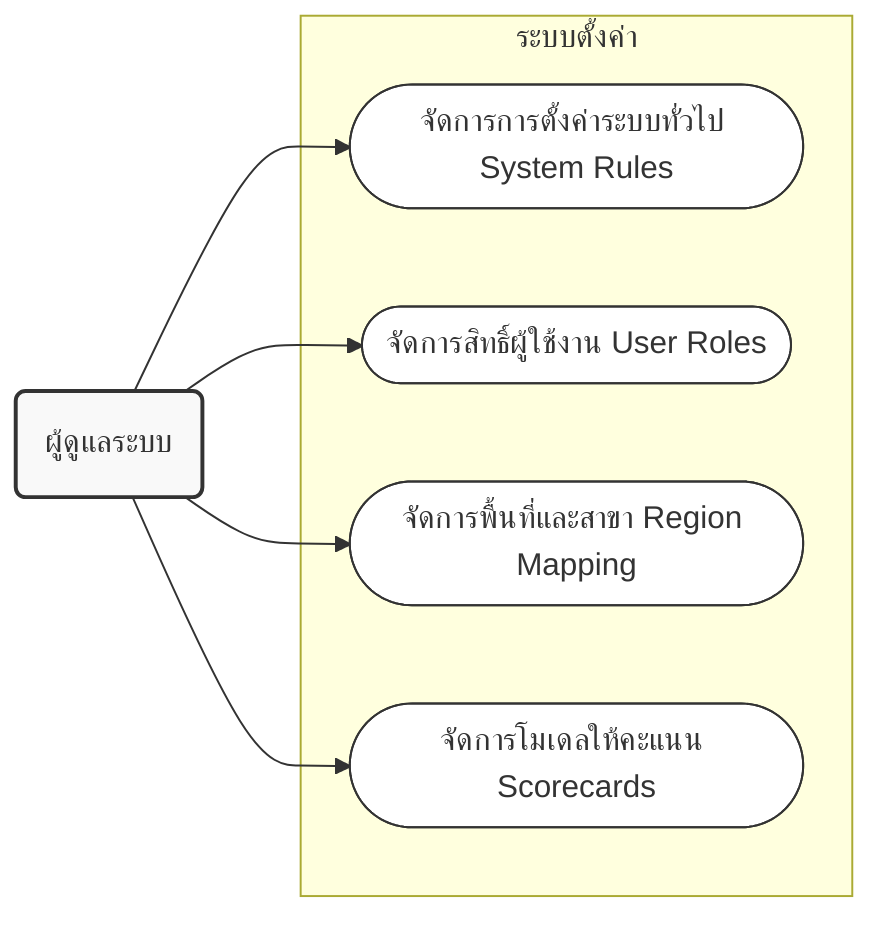

# Use Case Diagram: ระบบ CreditInsight

เอกสารนี้แสดง Use Case Diagram ของระบบ CreditInsight โดยอ้างอิงจาก Business Requirements (BR.txt) ซึ่งจัดทำขึ้นตามมาตรฐานการออกแบบ (Industry Standard) โดยแบ่งออกเป็นภาพรวมระดับสูง (High-Level Context Diagram) และแบ่งย่อยตามระบบย่อย (Sub-systems) จำนวน 5 ส่วน เพื่อความชัดเจนในการทำความเข้าใจ

---

## 1. ภาพรวมระดับสูง (High-Level Context Diagram)
แสดงภาพรวมของระบบย่อย (Use Cases หลัก), Actors ที่โต้ตอบกับระบบ CreditInsight และการเชื่อมต่อไปยังระบบภายนอก

---

## 2. ระบบย่อยที่ 1: ระบบจัดการสิทธิ์เข้าใช้งาน (Authentication & Authorization)
อ้างอิง FR 1.1 - 1.2

**คำอธิบาย Diagram:**
ภาพนี้แสดงกระบวนการเมื่อ "ผู้ใช้งานทุกบทบาท" ทำการเข้าสู่ระบบ โดยมีกระบวนการที่ถูกบังคับทำ (`<<includes>>`) หรือเป็นขั้นตอนย่อยที่ขาดไม่ได้ 2 ส่วน ได้แก่:
1. **การยืนยันตัวตน (`<<includes>>` ระบบ SSO):** การเข้าสู่ระบบจะพึ่งพาระบบภายนอก คือ SSO ขององค์กรในการยืนยันตัวตนผู้ใช้งาน
2. **การกำหนดสิทธิ์ (`<<includes>>` ตรวจสอบสิทธิ์และแสดงเมนูตามบทบาท):** หลังจากยืนยันตัวตนผ่าน SSO สำเร็จ ระบบจะบังคับตรวจสอบบทบาท (Role) ของผู้ใช้งานทันที เพื่อนำไปแสดงหน้าจอและเมนูการใช้งานที่สอดคล้องกับบทบาทนั้น ๆ ตามกฎความปลอดภัย

---

## 3. ระบบย่อยที่ 2: ระบบสร้างและจัดการคำขอ (Request Creation & Management)
อ้างอิงการทำงานจริงของระบบ (Actual Codebase Implementation)

**คำอธิบาย Diagram:**
ภาพนี้แสดงลำดับและเงื่อนไขในการจัดการคำขอของผู้จัดการสาขา:
1. **การค้นหาลูกค้า:** ผู้จัดการสาขาเริ่มต้นจาก `ค้นหาและตรวจสอบสถานะลูกค้า` ซึ่งในขั้นตอนนี้ระบบจะบังคับทำการ `ดึงประวัติการซื้อย้อนหลัง 3 เดือน` จากระบบ ERP/UXP มาแสดงผลประกอบทันที (`<<includes>>`)
2. **การสร้างคำขอ:** ผู้จัดการสาขาสามารถ `สร้างคำขอเครดิต` โดยผู้ใช้ต้องทำการ `แนบไฟล์เอกสาร` งบการเงินหรือเอกสารอื่นๆ ด้วยตนเอง (`<<includes>>`) และมีทางเลือกให้พักการทำงานโดย `บันทึกฉบับร่าง` (`<<extends>>`) ได้
3. **การส่งคำขอ:** เมื่อกรอกข้อมูลเสร็จสิ้นและกด `ส่งคำขอเครดิต` ระบบจะบังคับ `ตรวจสอบความครบถ้วน` ของฟอร์ม และทำการ `คำนวณคะแนนความเสี่ยง Scoring Engine` โดยอัตโนมัติก่อนส่งเข้าระบบ (`<<includes>>`)

---

## 4. ระบบย่อยที่ 3: ระบบตรวจสอบและส่งต่อ (Review & Forward Process)
อ้างอิง FR 4.1 - 4.2 และกระบวนการ Workflow

**คำอธิบาย Diagram:**
ภาพนี้แสดงกระบวนการทำงานของกลุ่ม "ผู้ตรวจสอบ" (ประกอบด้วย ผู้จัดการภูมิภาค, ผู้จัดการฝ่ายขาย, และเจ้าหน้าที่ฝ่ายการเงิน) เมื่อได้รับคำขอเครดิตที่ส่งมาจากสาขา ผู้ตรวจสอบมีหน้าที่พิจารณากลั่นกรองข้อมูล ให้ความคิดเห็นเพิ่มเติม และส่งต่อคำขอไปยังผู้อนุมัติในลำดับถัดไป โดยไม่มีสิทธิ์ในการตัดสินใจอนุมัติหรือปฏิเสธคำขอโดยตรง

---

## 5. ระบบย่อยที่ 4: ระบบพิจารณาอนุมัติ (Approval Process)
อ้างอิง FR 4.1 - 4.5

**คำอธิบาย Diagram:**
ระบบแบ่งระดับ "ผู้อนุมัติ" ตามมูลค่าวงเงินที่ร้องขอ (อ้างอิง FR 4.4):
* **ผู้จัดการฝ่ายการเงิน:** อนุมัติวงเงินมูลค่า **ไม่เกิน 300,000 บาท**
* **คณะกรรมการเครดิต:** อนุมัติวงเงินมูลค่า **มากกว่า 300,000 บาทขึ้นไป**

---

## 6. ระบบย่อยที่ 5: ระบบตั้งค่า (System Configuration)
อ้างอิงการทำงานจริงของระบบ (Actual Codebase Implementation)

**คำอธิบาย Diagram:**
ภาพนี้แสดงการทำงานของ "ผู้ดูแลระบบ (Admin)" ในการจัดการตั้งค่าพารามิเตอร์และกฎเกณฑ์ต่างๆ ของระบบ (System Configuration) เพื่อให้ระบบมีความยืดหยุ่นและปรับเปลี่ยนได้โดยไม่ต้องแก้ไขโค้ด

---

> **📝 หมายเหตุถึงผู้อ่าน / Note to the User:**
> เพื่อให้เอกสาร Use Case Diagram สอดคล้องและตรงกันกับไฟล์ **`docs/presentations/BR.txt`** โปรดอย่าลืมกลับไปลบข้อความที่ระบุถึง "ระบบอัตโนมัติ" ในไฟล์ BR.txt ดังนี้:
> 1. ลบคำว่า **"ระบบอัตโนมัติ"** ออกจากข้อ **FR 1.2.3**
> 2. ลบหัวข้อ **NFR 9.1** (เรื่องระบบทำงานประมวลผลข้อมูลแบบชุดอัตโนมัติ Batch Automation Process) ออกทั้งข้อ
