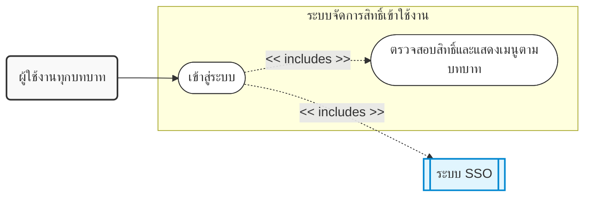
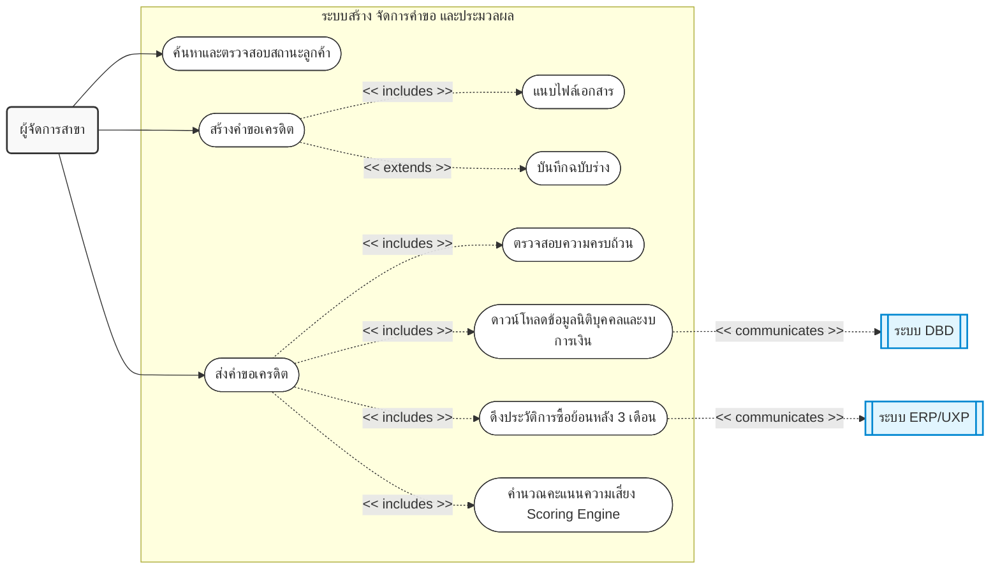
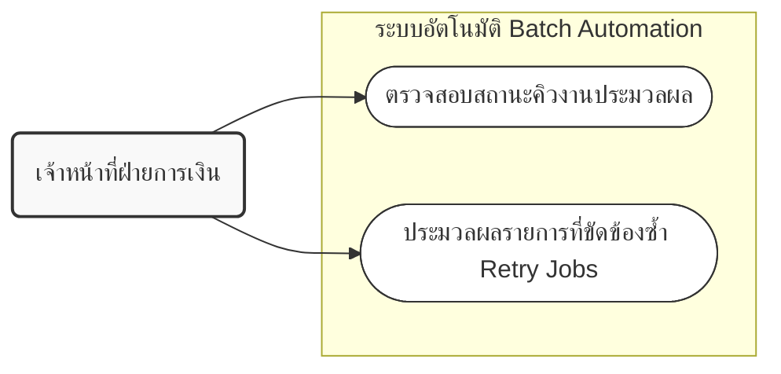
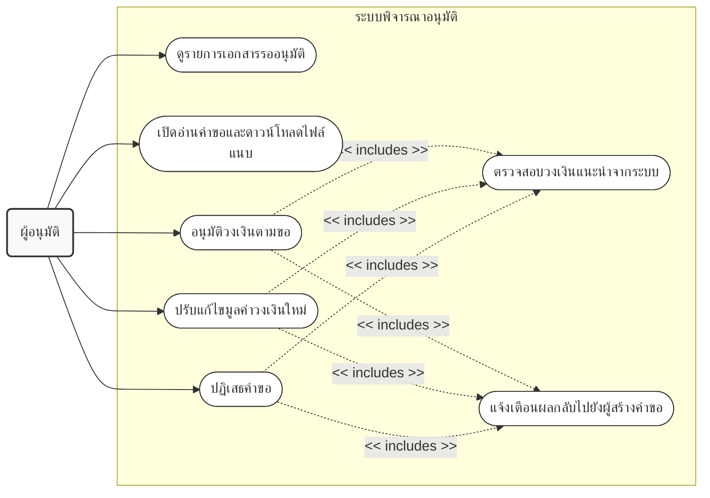
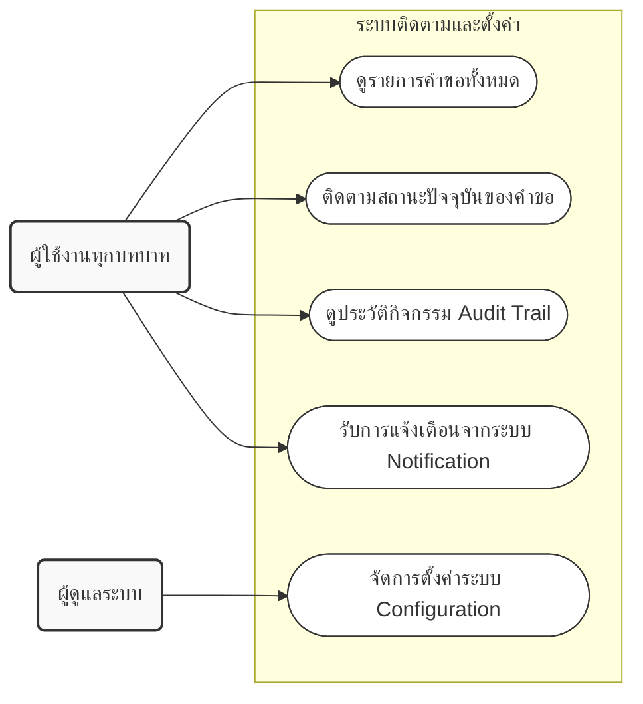

# Use Case Diagram: ระบบ CreditInsight

เอกสารนี้แสดง Use Case Diagram ของระบบ CreditInsight โดยอ้างอิงจาก Business Requirements (BR.txt) ซึ่งจัดทำขึ้นตามมาตรฐานการออกแบบ (Industry Standard) โดยแบ่งออกเป็นภาพรวมระดับสูง (High-Level Context Diagram) และแบ่งย่อยตามระบบย่อย (Sub-systems) จำนวน 5 ส่วน เพื่อความชัดเจนในการทำความเข้าใจ

---

## 1. ภาพรวมระดับสูง (High-Level Context Diagram)
แสดงภาพรวมของระบบย่อย (Use Cases หลัก), Actors ที่โต้ตอบกับระบบ CreditInsight และการเชื่อมต่อไปยังระบบภายนอก

---

## 2. ระบบย่อยที่ 1: ระบบจัดการสิทธิ์เข้าใช้งาน (Authentication & Authorization)
อ้างอิง FR 1.1 - 1.2

**คำอธิบาย Diagram:**
ภาพนี้แสดงกระบวนการเมื่อ "ผู้ใช้งานทุกบทบาท" ทำการเข้าสู่ระบบ โดยมีกระบวนการที่ถูกบังคับทำ (`<<includes>>`) หรือเป็นขั้นตอนย่อยที่ขาดไม่ได้ 2 ส่วน ได้แก่:
1. **การยืนยันตัวตน (`<<includes>>` ระบบ SSO):** การเข้าสู่ระบบจะพึ่งพาระบบภายนอก คือ SSO ขององค์กรในการยืนยันตัวตนผู้ใช้งาน
2. **การกำหนดสิทธิ์ (`<<includes>>` ตรวจสอบสิทธิ์และแสดงเมนูตามบทบาท):** หลังจากยืนยันตัวตนผ่าน SSO สำเร็จ ระบบจะบังคับตรวจสอบบทบาท (Role) ของผู้ใช้งานทันที เพื่อนำไปแสดงหน้าจอและเมนูการใช้งานที่สอดคล้องกับบทบาทนั้น ๆ ตามกฎความปลอดภัย

---

## 3. ระบบย่อยที่ 2: ระบบสร้างและจัดการคำขอ (Request Creation & Management)
อ้างอิง FR 2.1 - 2.6 และ FR 3.1 - 3.5

**คำอธิบาย Diagram:**
ภาพนี้แสดงลำดับและเงื่อนไขในการจัดการคำขอของผู้จัดการสาขา รวมถึงกระบวนการอัตโนมัติที่เกิดขึ้นต่อเนื่องกัน:
1. **การเริ่มต้น:** ผู้จัดการสาขาสามารถ `ค้นหาและตรวจสอบสถานะลูกค้า` และเริ่มต้น `สร้างคำขอเครดิต` ได้
2. **การจัดการระหว่างสร้างคำขอ:** ในขณะที่สร้างคำขอ ระบบบังคับให้ต้อง `แนบไฟล์เอกสาร` (`<<includes>>`) ให้ครบถ้วนตามประเภทลูกค้า และมีทางเลือกให้พักการทำงานโดย `บันทึกฉบับร่าง` (`<<extends>>`) ได้
3. **การส่งคำขอและประมวลผลอัตโนมัติ:** เมื่อกรอกข้อมูลเสร็จสิ้นและกด `ส่งคำขอเครดิต` ระบบจะบังคับกระบวนการต่อเนื่องอัตโนมัติ 4 ขั้นตอนตามลำดับ (`<<includes>>`):
   - `ตรวจสอบความครบถ้วน` ของฟอร์ม
   - `ดาวน์โหลดข้อมูลนิติบุคคลและงบการเงิน` จากระบบ DBD (ถ้าเป็นนิติบุคคล)
   - `ดึงประวัติการซื้อย้อนหลัง 3 เดือน` จากระบบ ERP/UXP
   - นำข้อมูลทั้งหมดเข้าสู่ `คำนวณคะแนนความเสี่ยง Scoring Engine`

---

## 4. ระบบย่อยที่ 3: ระบบอัตโนมัติ (Batch Automation Process)
อ้างอิง FR 1.2.3 และ NFR 9.1

**คำอธิบาย Diagram:**
ภาพนี้สะท้อนบทบาทของ **เจ้าหน้าที่ฝ่ายการเงิน** ที่สามารถเข้าถึงเมนู "ระบบอัตโนมัติ" ได้ โดยหน้าที่ในส่วนนี้ไม่ได้เป็นการกดดึงข้อมูลลูกค้าใหม่แบบรายบุคคล (ซึ่งเกิดขึ้นอัตโนมัติไปแล้วตอนสาขาส่งคำขอ) แต่เป็นการเข้าไป **จัดการคิวงาน (Queue)** ของการประมวลผลข้อมูลแบบกลุ่ม (Batch) เช่น:
1. การ `ตรวจสอบสถานะคิวงานประมวลผล` ว่ามีรายการไหนดึงข้อมูลจาก ERP หรือ DBD ไม่สำเร็จบ้าง
2. การสั่ง `ประมวลผลรายการที่ขัดข้องซ้ำ (Retry Failed Jobs)` เพื่อให้ระบบกู้คืนและไปดึงข้อมูลใหม่โดยไม่กระทบรายการอื่นในคิว

---

## 5. ระบบย่อยที่ 4: ระบบพิจารณาอนุมัติ (Approval Process)
อ้างอิง FR 4.1 - 4.5

---

## 6. ระบบย่อยที่ 5: ระบบติดตามและตั้งค่า (Tracking & Configuration)
อ้างอิง FR 5.1 - 5.2, 6.1 - 6.3, 8.2

