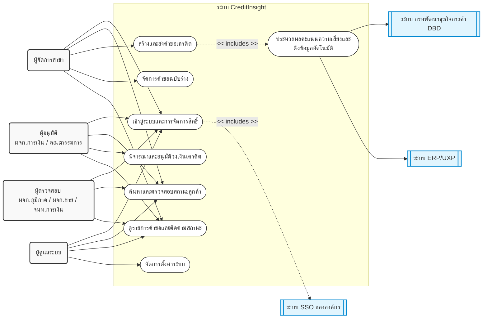

# Use Case Diagram: ระบบ CreditInsight

เอกสารนี้แสดง Use Case Diagram ของระบบ CreditInsight โดยอ้างอิงจาก Business Requirements (BR.txt) ซึ่งจัดทำขึ้นตามมาตรฐานการออกแบบ Use Case เพื่อให้เห็นภาพรวมของ Actor (ผู้ใช้งานและระบบภายนอก) รวมถึง Use Case (ฟังก์ชันการทำงานหลักของระบบ)

## Mermaid Diagram

## คำอธิบาย Use Case และ Actor
### 1. Actors (ผู้กระทำ)
*   **Primary Actors (ผู้ใช้งานหลัก):**
    *   **ผู้จัดการสาขา (Branch Manager):** ผู้ริเริ่มกระบวนการ มีหน้าที่ค้นหาลูกค้า สร้างคำขอ แนบเอกสาร และติดตามสถานะ
    *   **ผู้อนุมัติ (Approver - ผู้จัดการฝ่ายการเงิน / คณะกรรมการเครดิต):** ผู้มีอำนาจในการพิจารณาอนุมัติ ปฏิเสธ หรือปรับแก้ไขวงเงิน
    *   **ผู้ตรวจสอบ (Reviewer - ผู้จัดการภูมิภาค / ผู้จัดการฝ่ายขาย / เจ้าหน้าที่ฝ่ายการเงิน):** ผู้ที่สามารถดูคำขอทั้งหมดและตรวจสอบสถานะได้
    *   **ผู้ดูแลระบบ (System Administrator):** ผู้จัดการตั้งค่าระบบ
*   **Secondary Actors (ระบบภายนอก):**
    *   **ระบบ SSO ขององค์กร:** ใช้สำหรับพิสูจน์ตัวตนผู้ใช้งาน
    *   **ระบบ DBD:** ระบบกรมพัฒนาธุรกิจการค้า เพื่อดึงข้อมูลงบการเงินและเอกสารนิติบุคคล
    *   **ระบบ ERP/UXP:** ระบบภายในองค์กรเพื่อดึงประวัติการซื้อสินค้าย้อนหลัง

### 2. Use Cases (ฟังก์ชันหลักของระบบ)
*   **เข้าสู่ระบบและการจัดการสิทธิ์ (Login):** ทุกบทบาทต้องเข้าสู่ระบบผ่าน SSO (FR 1.1)
*   **ค้นหาและตรวจสอบสถานะลูกค้า (Search Customer):** ผู้จัดการสาขาต้องค้นหาเพื่อตรวจสอบสถานะก่อนสร้างคำขอ (FR 8.2) และบทบาทอื่นๆ ใช้เพื่อค้นหาข้อมูลลูกค้า
*   **สร้างและส่งคำขอเครดิต (Create & Submit Request):** การกรอกฟอร์ม แนบไฟล์ และส่งคำขอ (FR 2.1 - 2.5, 3.1)
*   **จัดการคำขอฉบับร่าง (Manage Draft):** การบันทึกข้อมูลชั่วคราวเพื่อทำต่อในภายหลัง (FR 2.6)
*   **ประมวลผลคะแนนความเสี่ยงและดึงข้อมูลอัตโนมัติ (Automated Data Fetch & Scoring):** ระบบทำการประมวลผลคะแนนความเสี่ยงอัตโนมัติ โดยดึงข้อมูลจาก DBD และ ERP ประกอบการพิจารณา (FR 3.3, 3.4, 3.5)
*   **พิจารณาและอนุมัติวงเงินเครดิต (Approve/Reject Request):** การพิจารณาอนุมัติตามระดับอำนาจ (FR 4.4)
*   **ดูรายการคำขอและติดตามสถานะ (View All Requests):** การดูสถานะและติดตามประวัติการทำรายการ (FR 5.1, 5.2)
*   **จัดการตั้งค่าระบบ (System Configuration):** สำหรับผู้ดูแลระบบเพื่อปรับแต่งระบบ
